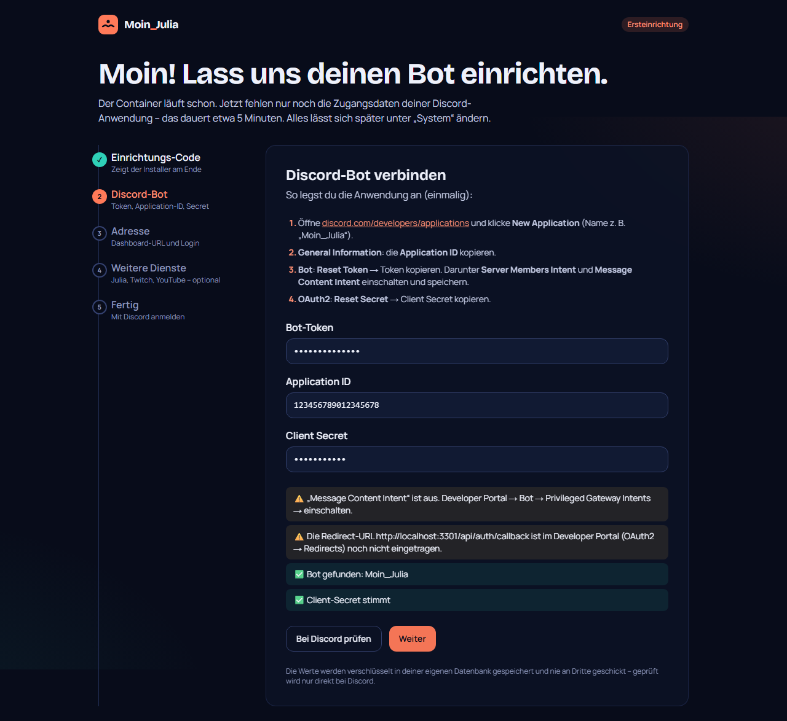

# Moin_Julia – Quickstart für Proxmox VE

Discord-Bot mit Web-Dashboard für Streamer und Creator, installiert mit einem einzigen Befehl als LXC-Container (Standard) oder als VM.

## Install-Einzeiler

In der **Proxmox-Shell** (Weboberfläche → Node → Shell) als root:

```bash
getent hosts raw.githubusercontent.com >/dev/null || printf 'nameserver 1.1.1.1\nnameserver 9.9.9.9\n' >> /etc/resolv.conf; bash -c "$(curl -fsSL https://raw.githubusercontent.com/MoinMornhart/Moin_Julia/main/proxmox/install.sh)"
```

Der erste Teil prüft, ob der Host Namen auflösen kann. Wenn nicht, trägt er `1.1.1.1` und `9.9.9.9` als DNS-Server ein, damit der Download nicht mit `Could not resolve host` scheitert. Das Repo ist öffentlich, deshalb ist kein GitHub-Token nötig.

Kurzform, wenn DNS sicher funktioniert:

```bash
bash -c "$(curl -fsSL https://raw.githubusercontent.com/MoinMornhart/Moin_Julia/main/proxmox/install.sh)"
```

## Schritt 0: Netzwerk des Proxmox-Hosts prüfen

```bash
ping -c2 1.1.1.1                     # Internet erreichbar?
getent hosts github.com              # DNS funktioniert? (zeigt eine IP)
```

| Ergebnis | Lösung |
|---|---|
| `ping 1.1.1.1` scheitert | Dem Host fehlt das Gateway: **Node → System → Netzwerk → vmbr0 → Gateway** = IP deines Routers (z. B. `192.168.178.1`) |
| `getent` zeigt nichts / `Could not resolve host` | DNS fehlt: **Node → System → DNS** → DNS-Server 1 = Router-IP oder `1.1.1.1`. Der Einzeiler oben repariert das auch automatisch. |

Der Installer prüft beides noch einmal selbst, bevor er etwas anlegt, und gibt dem Container einen funktionierenden DNS-Server mit.

## Ressourcen

| | LXC (Standard) | VM (optional) |
|---|---|---|
| Betriebssystem | Debian 13 (Trixie) | Debian 13 Cloud-Image |
| CPU | 2 Kerne | 2 Kerne |
| RAM | 3072 MB | 3072 MB |
| Festplatte | 16 GB | 16 GB |
| Netzwerk | vmbr0, DHCP | vmbr0, DHCP |
| Proxmox | VE 8.x oder 9.x | VE 8.x oder 9.x |

Im Modus **Erweitert** lassen sich alle Werte ändern: ID, Hostname, CPU, RAM, Disk, Bridge, feste IP, Gateway, VLAN, DNS und Dashboard-Port.

## Ablauf

Der Installer fragt **keine Tokens** ab – er legt nur den Container bzw. die VM an. Eingerichtet wird danach bequem im Browser.

1. Den Einzeiler ausführen. Der Installer prüft Proxmox-Version, Internet und DNS.
2. **LXC** oder **VM** wählen, dann **Standard** oder **Erweitert**.
3. Wenn es mehrere Storages gibt: Storage für Festplatte und Template wählen.
4. Zusammenfassung prüfen und bestätigen.
5. Den Rest erledigt der Installer, mit einem ✓ pro Schritt:
   Debian-Template → Container anlegen → Netzwerk → Docker → Repo klonen → `.env` mit Zufallswerten → Images bauen (5–10 Minuten) → Migrationen → Start → Healthcheck.
6. Am Ende stehen da: **URL, Einrichtungs-Code, IP, Port, Redirect-URL und DNS-Hinweise.**

So sieht das Ende einer Installation aus:

```
 ✓ Moin_Julia ist installiert!

 Jetzt einrichten – im Browser:
   1. Öffnen ........... http://192.168.178.50:3000
   2. Einrichtungs-Code  MOIN-7K4P-2QXB
   3. Der Assistent führt dich durch Discord-Bot, Adresse und optionale Schlüssel.

 Erreichbarkeit
   IP-Adresse ........ 192.168.178.50
   Dashboard-Port .... 3000
   Dashboard-URL ..... http://192.168.178.50:3000
   Discord-Redirect .. http://192.168.178.50:3000/api/auth/callback  (zeigt dir auch der Assistent)
```

## Einrichtung im Browser (ca. 5 Minuten)



1. **URL öffnen** und den **Einrichtungs-Code** eingeben. Vergessen? Im Container: `moin-julia setup-code`.
2. **Discord-Bot:** Der Assistent zeigt Schritt für Schritt, wo du im [Developer Portal](https://discord.com/developers/applications) Token, Application-ID und Secret findest und welche Intents du einschalten musst. **„Bei Discord prüfen“** testet alles sofort.
3. **Adresse:** vorbelegt mit der Adresse, über die du gerade im Browser bist. Die angezeigte **Redirect-URL** kopierst du ins Developer Portal (OAuth2 → Redirects); **„Redirect prüfen“** bestätigt, dass sie dort steht.
4. **Weitere Dienste (optional):** Anthropic (Julia), Twitch und YouTube – jeweils mit „Prüfen“-Knopf. Kann leer bleiben.
5. **„Speichern & Bot starten“** → **„Mit Discord anmelden“**. Du wirst automatisch **Instanz-Admin** und kannst den Bot auf deinen Server einladen.
6. **Testen:** In Discord `/ping` eingeben.

Alle Zugangsdaten liegen **verschlüsselt** in deiner Datenbank und lassen sich jederzeit unter **System** (oben rechts im Dashboard) ändern.

**Eigene Domain (optional):**
- DNS: A-Record `bot.deine-domain.de` → öffentliche IP / Reverse-Proxy
- Reverse-Proxy: `bot.deine-domain.de` → `http://<IP>:3000` (HTTPS am Proxy)
- Dashboard → **System** → Adresse auf `https://bot.deine-domain.de` ändern
- Redirect im Developer Portal auf `https://bot.deine-domain.de/api/auth/callback` ändern

## Update

Im Container (`pct enter <ID>`) bzw. in der VM:

```bash
update
```

Der Befehl macht Folgendes:
1. Er sichert die Datenbank.
2. Er holt den neuesten Stand aus Git.
3. Er baut die Images neu.
4. Er führt die Datenbank-Migrationen aus.
5. Er startet die Dienste neu.
6. Er prüft per Healthcheck, ob alles läuft.

Schlägt ein Schritt fehl, wird automatisch die vorherige Version wiederhergestellt, bei Bedarf samt Datenbank. Am Ende siehst du die alte und die neue Versionsnummer. Mit `update --force` baust du neu, auch wenn es keinen neuen Stand gibt.

## Pfade

| Was | Wo |
|---|---|
| Programm | `/opt/moin-julia` |
| Technische Konfiguration | `/opt/moin-julia/.env` (nur root lesbar) |
| Tokens & API-Schlüssel | verschlüsselt in der Datenbank – ändern im Dashboard unter **System** |
| DB-Backups | `/opt/moin-julia/backups` (die letzten 10) |
| Install-/Update-Logs | `/var/log/moin-julia/` |
| Befehle | `/usr/bin/moin-julia`, `/usr/bin/update` |

## Fehlerbehebung

| Problem | Lösung |
|---|---|
| Oben steht „Bot wartet auf Einrichtung“ | Einrichtungs-Assistent im Dashboard abschließen |
| „Bot-Token ungültig“ | Dashboard → **System** → neuen Token eintragen |
| Einrichtungs-Code vergessen | Im Container: `moin-julia setup-code` |
| „Discord verweigert die Intents“ | Developer Portal → Bot → Privileged Gateway Intents einschalten |
| Login: „Discord-Login fehlgeschlagen“ | Redirect-URL im Portal muss **exakt** `<Dashboard-URL>/api/auth/callback` sein (System-Seite zeigt die Adresse). Client-Secret prüfen. |
| `moin-julia: command not found` | Einmalig: `ln -sf /opt/moin-julia/scripts/moin-julia /usr/bin/moin-julia` (ab v0.6.1 erledigt das der Installer bzw. `update`) |
| `curl: (6) Could not resolve host` | DNS des Proxmox-Hosts fehlt: den langen Einzeiler oben nehmen oder **Node → System → DNS** setzen (siehe Schritt 0) |
| Container bekommt kein Netzwerk | Bridge, VLAN und DHCP prüfen. Im Modus Erweitert eine feste IP setzen. |
| Build bricht ab (Speicher) | RAM auf mindestens 3072 MB setzen: `pct set <ID> --memory 3072` |
| Installation fehlgeschlagen | Der Installer bietet an, den halb fertigen Container zu löschen. Das Log liegt unter `/var/log/moin-julia/install.log` im Container. |

## Falls das Repo einmal privat wird

Das Repo ist öffentlich, der Einzeiler funktioniert deshalb ohne Anmeldung. Bei einem privaten Repo bräuchten der Einzeiler, der Download von `setup-app.sh`, `git clone` und `update` einen GitHub-Token: einen Fine-grained PAT, beschränkt auf dieses Repo mit **Contents: Read**. Das ist im Installer derzeit **nicht** eingebaut und müsste bei Bedarf nachgerüstet werden. Den Token dabei nie in Skripte oder in `/usr/bin/update` schreiben, sondern mit `read -rs` abfragen.

---
Verfasst mit Claude 🤖
