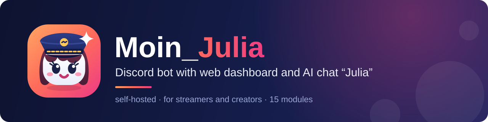
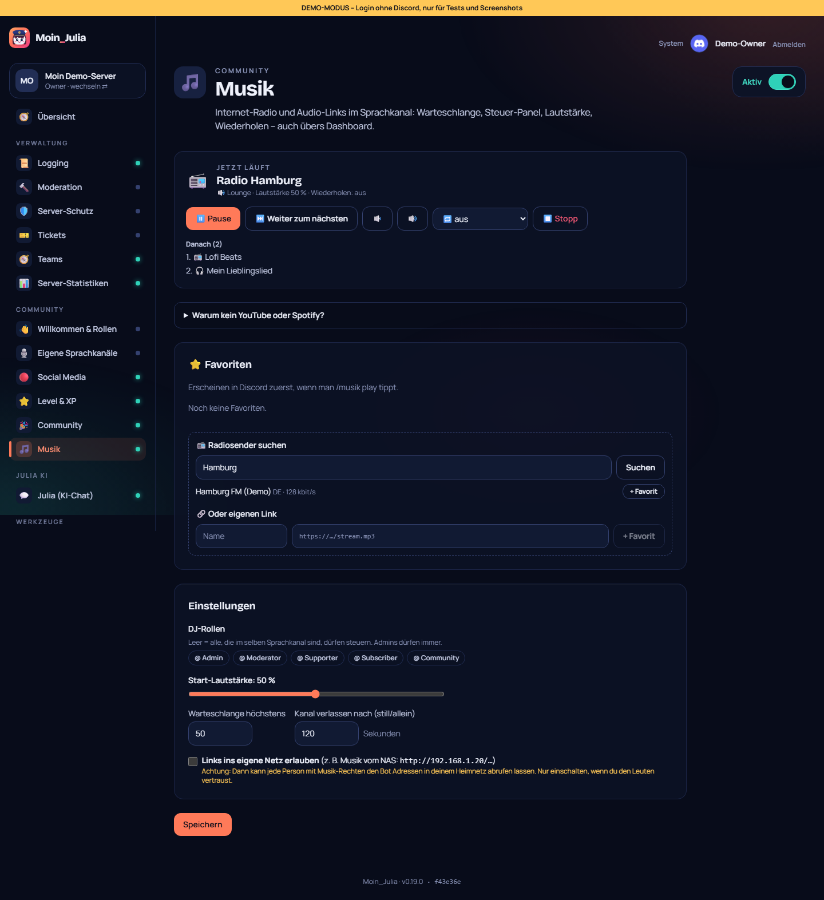
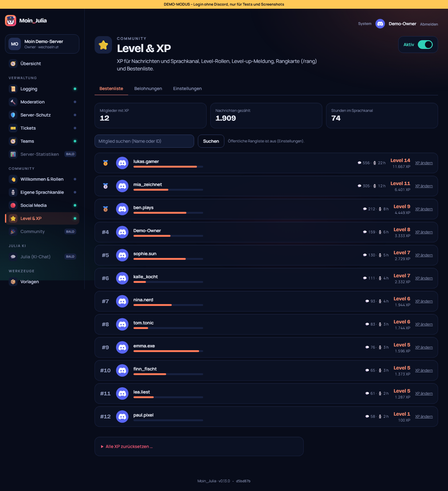

<p align="center">
  
</p>

<p align="center">
  <a href="README.md">🇩🇪 Deutsch</a> · <b>🇬🇧 English</b>
</p>

<p align="center">
  
  
  
  
  
  
  
</p>

**Moin_Julia** is a self-hosted multi-purpose Discord bot for streamers and content creators, similar to GalaxyBot. It comes with a web dashboard where you configure everything with a few clicks, and with **Julia**, an AI that joins the conversation on your server. You install it with a single command on Proxmox or with Docker, and your data stays with you.

- 🧩 **15 modules**, each can be switched on or off; slash commands only appear where the module is active
- 🖱️ **Dashboard instead of commands:** setup wizard, templates, import from GalaxyBot, update button
- 🤖 **Julia:** her own persona and modes, powered by Claude (API key) or Ollama (local, free), with a budget limit
- 🔐 **Secure:** credentials encrypted in the database, per-server permissions, bot only gets the permissions it needs, updates with automatic rollback – checked in a [security audit](SECURITY_AUDIT.md) (German)
- 🌍 Bot replies in **German and English** (set per server)

> **Note:** The dashboard itself is in German. The bot's replies in Discord are available in German and English.

## Contents

[Screenshots](#screenshots) · [Features](#features) · [Quick start](#quick-start) · [Discord application](#create-the-discord-application) · [Configuration](#configuration) · [Docker](#run-with-docker-without-proxmox) · [Management](#management) · [Reachability](#reachability-dns-and-reverse-proxy) · [Development](#development)

## Screenshots

<table>
  <tr>
    <td width="50%"><br><sub><b>Overview</b> – all modules at a glance</sub></td>
    <td width="50%"><br><sub><b>Julia</b> – AI chat with persona and budget</sub></td>
  </tr>
  <tr>
    <td><br><sub><b>Music</b> – internet radio, queue, controls</sub></td>
    <td><br><sub><b>Statistics</b> – growth and activity</sub></td>
  </tr>
  <tr>
    <td><br><sub><b>Levels & XP</b> – leaderboard and rewards</sub></td>
    <td><br><sub><b>Teams</b> – applications like GalaxyBot</sub></td>
  </tr>
  <tr>
    <td><br><sub><b>/rank</b> – rank card right in Discord</sub></td>
    <td><br><sub><b>Setup</b> – the wizard checks everything live</sub></td>
  </tr>
</table>

More pictures and the story of how each module was built: see the [build log](docs/bauprotokoll/README.md) (German).

## Features

| Module | What it does |
|---|---|
| ⚙️ **General** | Basic commands like `/ping`, language of the bot's replies per server |
| 📜 **Logging** | Deleted and edited messages, joins, role and channel changes |
| 🔨 **Moderation** | Ban, kick, timeout and warns with case numbers, mod log and automod |
| 🛡️ **Server protection** | Anti-raid, anti-nuke, join verification, filter for new accounts |
| 👋 **Welcome & roles** | Welcome images, auto roles, button roles, embed builder |
| 🔊 **Custom voice** | Join “➕ Create channel” → your own voice channel with a control panel; empty channels clean themselves up |
| 🎫 **Tickets** | Panels with form questions, claiming, transcripts, ratings, auto-close |
| 🧑‍🤝‍🧑 **Teams** | Application system: positions, application page, inbox, accept with roles and probation |
| 📣 **Social media** | Twitch, YouTube and Kick: live alerts, new videos and shorts, live role, “was live” |
| ⭐ **Levels & XP** | XP for messages and voice, level roles, rank card, leaderboard |
| 🎉 **Community** | Birthdays, counting, suggestions, starboard, polls, giveaways, reminders |
| 💬 **Julia (AI chat)** | Replies to @Julia, in chat channels and via `/julia`, with persona editor, modes, profiles and budget |
| 📊 **Server stats** | Charts for growth and activity, stats channels like “👥 Members: 1,284” |
| 🎵 **Music** | Like Euphony: internet radio (50,000+ stations), audio links and optionally YouTube/SoundCloud/Spotify links, effects, autoplay, 24/7, playlists, lyrics |
| 🔒 **Owner area** | Channels only for the server owner and the bots; Moin_Julia keeps them locked |

Also included: **import from GalaxyBot** (welcome, roles, panels), **templates and backups** of the whole configuration, your own **images** for embeds, **bot profile** (name, avatar), a public **leaderboard**, an **update indicator** with a button and a changelog in the dashboard.

## Quick start

Run this as root in the **Proxmox shell**:

```bash
getent hosts raw.githubusercontent.com >/dev/null || printf 'nameserver 1.1.1.1\nnameserver 9.9.9.9\n' >> /etc/resolv.conf; bash -c "$(curl -fsSL https://raw.githubusercontent.com/MoinMornhart/Moin_Julia/main/proxmox/install.sh)"
```

1. The installer creates an LXC container (or a VM) and shows the **URL** and a **setup code** at the end.
2. Open the URL in your browser and enter the code. The **setup wizard** guides you through creating the Discord bot and checks everything live.
3. Sign in with Discord, invite the bot and type `/ping` in Discord.

The first part of the command fixes missing DNS on the host. All steps, resources and troubleshooting are in [QUICKSTART.en.md](QUICKSTART.en.md).

---

## Create the Discord application

> If you install via Proxmox, the **setup wizard in the dashboard** guides you through these steps and checks the values live. You don't have to edit any files.

1. Open https://discord.com/developers/applications and click **New Application**. Use a name like “Moin_Julia”.
2. **General Information:** Copy the **Application ID**. This is `DISCORD_CLIENT_ID`.
3. **Bot:**
   - Click **Reset Token** and copy the token. This is `DISCORD_TOKEN`; it is only shown once.
   - Under **Privileged Gateway Intents**, turn on **Server Members Intent** and **Message Content Intent**. Logging, welcome, levels, statistics and Julia need them.
   - Turn off **Public Bot** if only you should be able to invite the bot.
4. **OAuth2:**
   - Click **Reset Secret** and copy the secret. This is `DISCORD_CLIENT_SECRET`.
   - Under **Redirects**, add `<DASHBOARD_URL>/api/auth/callback`, for example `http://192.168.1.50:3000/api/auth/callback` or later `https://bot.your-domain.com/api/auth/callback`.
5. Invite the bot. The easiest way is **Bot einladen** (invite bot) in the dashboard after your first login.

## Configuration

- **Discord credentials and API keys** go into the setup wizard, and later under **System** in the dashboard. They are stored encrypted in the database.
- **Technical settings** live in `.env` (template: [.env.example](.env.example)) and can be changed with `moin-julia config`. Discord values in `.env` still work as a fallback.

| `.env` variable | Meaning |
|---|---|
| `DASHBOARD_PORT` | Port on the host, default **3000** |
| `DASHBOARD_URL` | Suggested address in the wizard (otherwise the address you opened) |
| `SETUP_CODE` | Code for the setup wizard (`moin-julia setup-code`) |
| `SECRETS_KEY` | Key used to encrypt tokens in the DB – **never change it** |
| `POSTGRES_PASSWORD` | Generated randomly by the installer |
| `DISCORD_TOKEN`, `DISCORD_CLIENT_ID`, `DISCORD_CLIENT_SECRET`, `ANTHROPIC_API_KEY`, `TWITCH_*`, `YOUTUBE_API_KEY` | Optional, only without the wizard. Values from the dashboard take precedence. |
| `DASHBOARD_DEMO` | For tests only: login without Discord. **Always `false` in production.** |

## Run with Docker (without Proxmox)

You need Docker Engine and Docker Compose v2.

```bash
git clone https://github.com/MoinMornhart/Moin_Julia.git /opt/moin-julia
cd /opt/moin-julia
cp .env.example .env && nano .env        # set POSTGRES_PASSWORD, SECRETS_KEY (openssl rand -hex 32) and SETUP_CODE
docker compose up -d --build
```

Then open `http://<IP>:3000`. The setup wizard asks for the `SETUP_CODE`. For management (update, backup, status) you can link the command:

```bash
ln -s /opt/moin-julia/scripts/moin-julia /usr/bin/moin-julia
ln -s /opt/moin-julia/scripts/moin-julia /usr/bin/update
```

## Management

| Command | What it does |
|---|---|
| `moin-julia setup-code` | Show the setup code for the wizard |
| `update` | Backup → fetch new version → build images → migrations → restart → health check. If anything fails, the previous version is restored automatically. Also available as a button in the dashboard (**System → Update**). |
| `moin-julia status` | Status of all services, IP, port and URL |
| `moin-julia logs [bot\|dashboard]` | Live logs |
| `moin-julia config` | Edit `.env` and restart |
| `moin-julia backup` / `restore <file>` | Back up or restore the database |

## Reachability, DNS and reverse proxy

- **Only the dashboard** needs to be reachable. The bot needs no open port; it only makes an outgoing connection to Discord.
- **DNS:** Point an A record `bot.your-domain.com` to your public IP or reverse proxy.
- **Reverse proxy** (Nginx Proxy Manager, Caddy, Traefik …): forward `bot.your-domain.com` → `http://<container-IP>:3000`; the proxy handles HTTPS.
- Then change the address to `https://bot.your-domain.com` under **System** in the dashboard and update the redirect in the Developer Portal.

## Development

The project is a monorepo with pnpm workspaces and Node 24:

```
apps/bot          discord.js bot (TypeScript), one folder per module under src/modules/
apps/dashboard    Next.js dashboard (App Router, Tailwind)
packages/db       Prisma schema, migrations, DB client
packages/shared   module catalog, translations (de/en), changelog, shared types
proxmox/          installer (host) and setup (container/VM)
scripts/          moin-julia (management), screenshots, tests
docs/bauprotokoll build log with screenshots
```

```bash
corepack enable && pnpm install
pnpm build                         # build everything
pnpm dev:bot / pnpm dev:dashboard  # development mode (reads ../../.env)
pnpm test                          # unit and wiring tests (vitest)
pnpm --filter @moin/bot exec tsx ../../scripts/embed-preview.ts --module logging --out ../../docs/bauprotokoll/img/x   # Discord preview images
bash scripts/tests/update-sim.sh   # update/rollback simulation
node scripts/smoke-test.mjs --url http://localhost:3000   # click test (demo mode)
node scripts/tests/sweep.mjs --url http://localhost:3000  # quality sweep across all pages (axe, mobile)
```

**Adding a new module:** add an entry to the catalog `packages/shared/src/modules.ts` → create `apps/bot/src/modules/<id>/` → register it in `apps/bot/src/modules/index.ts`. The bot only registers a module's commands on servers where the module is active.

---
<sub>Verfasst mit Claude 🤖</sub>
