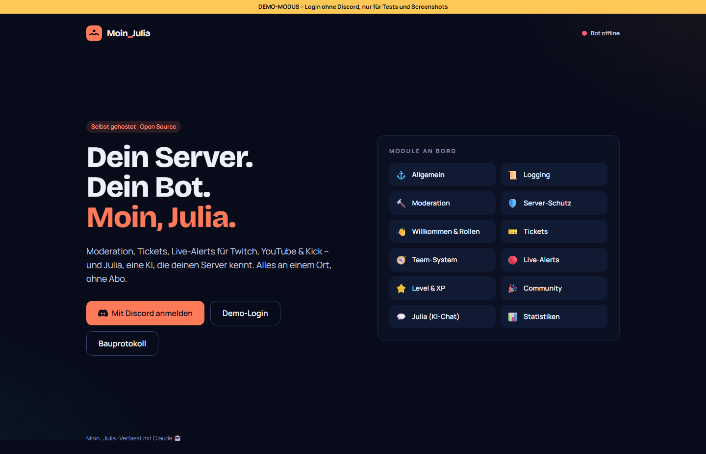
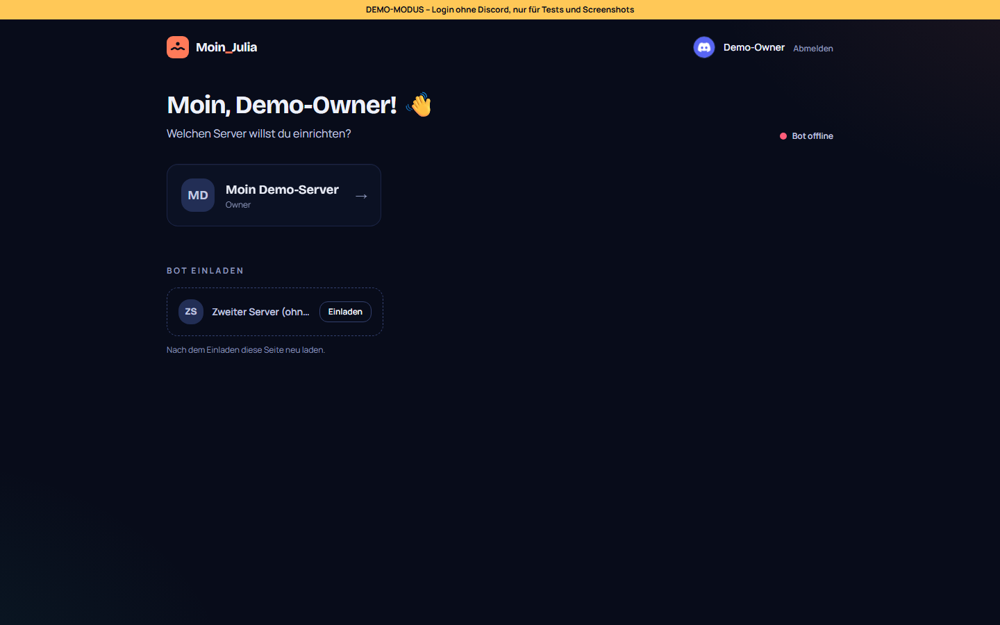
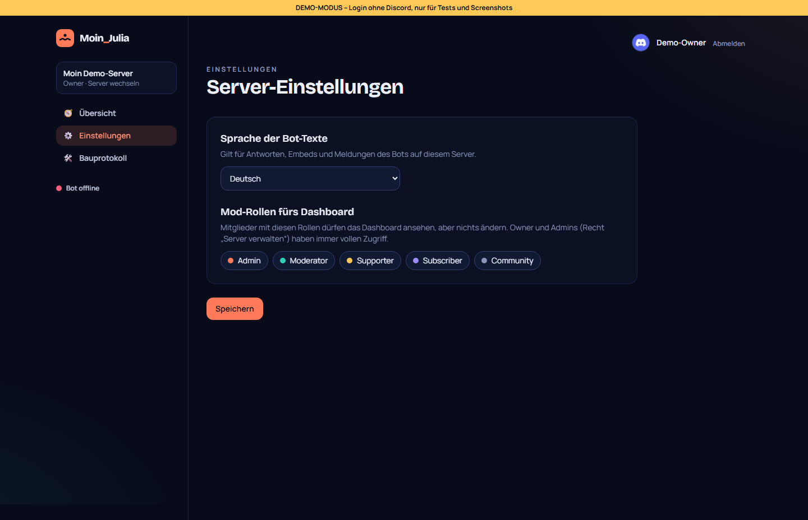
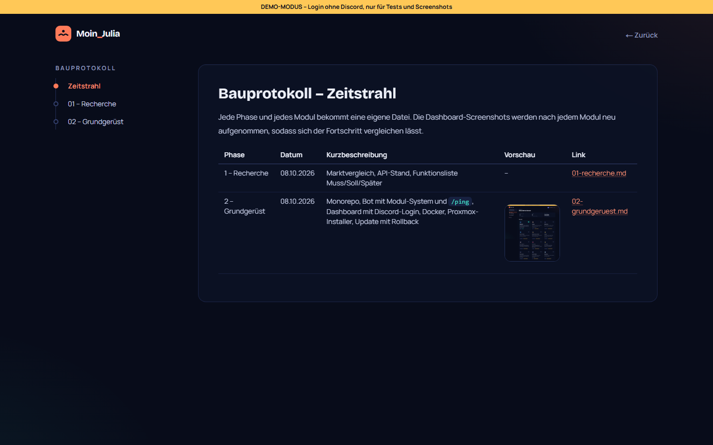
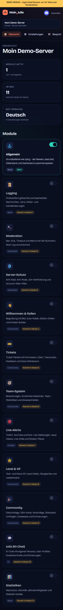
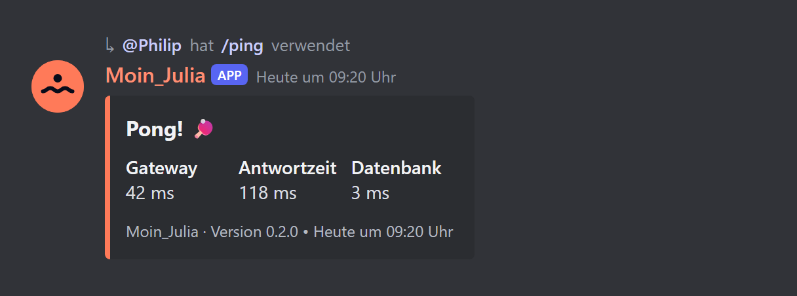
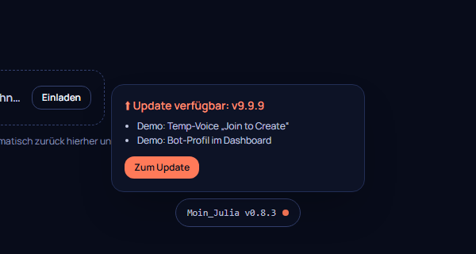

# 02 – Grundgerüst

**Datum:** 08.10.2026 · **Version:** 0.2.0 · **Status:** gebaut und lokal getestet, Proxmox-Test durch Philip steht aus


## Was gebaut wurde

| Teil | Inhalt |
|---|---|
| **Monorepo** | pnpm-Workspaces: `apps/bot`, `apps/dashboard`, `packages/db`, `packages/shared`; Node 24, TypeScript 6 |
| **Bot** | discord.js 14.27: Modul-Kern mit Registry, Slash-Commands pro Server, Abgleich der Server mit der DB, Healthcheck-Endpunkt (intern), Heartbeat in Redis, geordnetes Herunterfahren bei SIGTERM, klare Fehlermeldung bei falschem Token |
| **Modul-System** | Katalog in `@moin/shared` (12 Module, 1 verfügbar, 11 geplant). Pro Server an/aus in der DB. Die Befehle eines Moduls werden nur auf Servern registriert, auf denen es aktiv ist. Events lassen sich über `on(...)` modulgebunden abonnieren. |
| **/ping** | Modul „Allgemein“: Embed mit Gateway-Latenz, Antwortzeit, DB-Latenz und Version, auf Deutsch oder Englisch je nach Server-Sprache |
| **Datenbank** | PostgreSQL 17 + Prisma 7 (Driver-Adapter `pg`): Tabellen `Guild`, `GuildModule`, `Session`; erste Migration `20261008120000_init` |
| **Dashboard** | Next.js 16 + Tailwind 4: Discord-Login (OAuth2 mit `state`-Schutz), Server-Auswahl inkl. „Bot einladen“, Modul-Kacheln mit Schaltern, Einstellungen (Sprache, Mod-Rollen), Bauprotokoll-Seite, Bot-Status-Anzeige |
| **Rechte** | Owner → Admin (Recht „Administrator“ oder „Server verwalten“) → Mod (im Dashboard festgelegte Rollen, nur lesen). Jede Server-Action prüft die Rechte serverseitig erneut. |
| **Echtzeit** | Ein Schalter im Dashboard sendet ein Redis-Event. Der Bot leert daraufhin seinen Cache und registriert die Befehle neu, ganz ohne Neustart. |
| **Docker** | Ein Dockerfile mit den Zielen `bot`, `dashboard` und `migrate`; Compose mit Healthchecks; Migrationen laufen automatisch vor dem Start |
| **Proxmox-Installer** | `proxmox/install.sh` (Host): Whiptail-Menüs, LXC oder VM, Standard oder Erweitert, Storage-Auswahl, Spinner mit ✓/✗, Aufräumen bei Fehlern. `proxmox/setup-app.sh` (Gast): Docker, Repo, `.env`, Build, Start |
| **Update** | `moin-julia update` bzw. `update`: Backup → Git → Build → Migrationen → Neustart → Healthcheck → bei Fehler Rollback (Code, Images, DB) |
| **Tests** | `scripts/smoke-test.mjs` (Klick-Test), `scripts/tests/update-sim.sh` (Update/Rollback-Simulation), `scripts/screenshots.mjs` |

## Warum so

- **Ein Dockerfile, drei Ziele:** Bot und Dashboard teilen sich Abhängigkeiten und Build-Cache, und das Update muss nur einen Build anstoßen.
- **Migrationen als eigener Dienst:** `docker compose up` startet Bot und Dashboard erst, wenn die Migration durchgelaufen ist. Beim Update laufen die Migrationen bewusst einzeln, damit ein Fehler klar zugeordnet und zurückgerollt werden kann.
- **Schneller Rollback über Image-Tags:** Vor jedem Update werden die laufenden Images als `:previous` markiert. Ein Rollback braucht deshalb keinen erneuten Build.
- **Nur der Intent `Guilds`:** Das Grundgerüst braucht nichts weiter. Privilegierte Intents kommen erst mit den Modulen dazu, die sie benötigen.
- **Eigener Installer statt Community-Script-Engine:** Deren `build.func` lädt Installationsskripte fest aus dem eigenen Repo und ändert sich häufig (siehe [Recherche](01-recherche.md#5-proxmox-installer)).
- **Demo-Modus:** Damit Screenshots und Klick-Tests ohne echten Discord-Login automatisch laufen. Im Demo-Modus erscheint ein deutliches gelbes Banner. Installer und `setup-app.sh` erzwingen `DASHBOARD_DEMO=false`.
- **Design „Hafen bei Nacht“:** Tinten-Blau, Koralle als Akzent (Julia), Türkis für „aktiv“. Eigene Schriften (Bricolage Grotesque, Manrope) statt Template-Optik.

## Wie getestet

Auf dem Entwicklungsrechner gibt es kein Docker (Virtualisierung im BIOS aus). Deshalb so getestet:

| Test | Ergebnis |
|---|---|
| TypeScript-Prüfung und Build aller Pakete | ✓ fehlerfrei |
| Migration gegen echtes PostgreSQL 17 (portabel) | ✓ angewendet |
| Dashboard als **Standalone-Build** (genau wie im Container) gegen PostgreSQL + Redis | ✓ läuft |
| Routen: Login-Redirect zu Discord, Schutz ohne Login, fremder Server → 404, Pfad-Ausbruch bei Bildern → 404 | ✓ |
| Klick-Test (`smoke-test.mjs`): Demo-Login, Modul aus/an, Zustand nach Reload, geplante Module gesperrt | ✓ 7/7 |
| Redis-Events beim Schalten (mitgelesen per `SUBSCRIBE`) | ✓ kommen an |
| `pnpm deploy` des Bots (wie im Dockerfile) + Start bis zum Discord-Login | ✓ Start ok, falscher Token → klare Meldung |
| Update-Simulation (`update-sim.sh`, echtes Git + simuliertes Docker) | ✓ 20/20: kein Update, Erfolg, Build-Fehler, Migrations-Fehler, Healthcheck-Fehler mit Rollback |
| ShellCheck + `bash -n` für `install.sh`, `setup-app.sh`, `moin-julia` | ✓ keine Warnungen |
| **Bot live in Discord (`/ping`)** | ⏳ braucht echten Token → Test auf Proxmox |
| **Installer und echtes Docker** | ⏳ Test durch Philip auf Proxmox |

### Update – erfolgreicher Durchlauf (Simulation)

```
 Moin_Julia Update – aktuell v0.1.0 (66b6251)

 … Suche nach Updates (origin/main)
 ✓ Neuer Stand gefunden: 975206d
 … Sichere Datenbank
 ✓ Backup: /opt/moin-julia/backups/moin-julia-20261008-091616-v0.1.0-vor-update.dump
 … Hole neuen Stand
 ✓ Code aktualisiert auf v0.2.0 (975206d)
 … Baue Images neu (dauert ein paar Minuten, Log: /var/log/moin-julia/update-20261008-091615.log)
 ✓ Images gebaut
 … Führe Datenbank-Migrationen aus
 ✓ Migrationen angewendet
 … Starte Dienste neu
 ✓ Dienste gestartet
 … Warte auf Healthcheck (max. 240s)
 ✓ Alle Dienste gesund (bot dashboard)

 ✓ Update erfolgreich: v0.1.0 (66b6251)  →  v0.2.0 (975206d)

 Erreichbarkeit
   IP-Adresse ........ 192.168.178.50
   Dashboard-Port .... 3000
   Lokale URL ........ http://192.168.178.50:3000
```

### Update – Healthcheck schlägt fehl → automatischer Rollback (Simulation)

```
 … Warte auf Healthcheck (max. 240s)
 ✗ bot: unhealthy
 ✗ dashboard: unhealthy
 ! Rolle zurück auf v0.1.0 (66b6251) …
 … Spiele Datenbank-Backup zurück
 ✓ Datenbank wiederhergestellt
 … Warte auf Healthcheck (max. 240s)
 ✓ Alle Dienste gesund (bot dashboard)
 ✓ Rollback erfolgreich – es läuft wieder v0.1.0
 ✗ Update fehlgeschlagen. Details: /var/log/moin-julia/update-20261008-091626.log
```

## Screenshots

| Start | Server-Auswahl |
|---|---|
|  |  |
| **Einstellungen** | **Bauprotokoll** |
|  |  |

Mobil:



### Bot-Antwort `/ping` (Vorschau)

Nachgebaute Vorschau mit Beispielwerten. Den echten Screenshot aus Discord ergänze ich nach dem Proxmox-Test.



**Bitte nach dem Test als Screenshot schicken:** deine `/ping`-Antwort in Discord. Darauf sollten zu sehen sein: der Titel „Pong! 🏓“, drei Felder (Gateway, Antwortzeit, Datenbank) und die Fußzeile „Moin_Julia · Version 0.2.0“.

## Bekannte Grenzen

- Installer, Docker-Build und Bot live sind noch nicht auf echter Hardware gelaufen, das ist der nächste Schritt (Philip, Proxmox).
- Der VM-Weg braucht ein Proxmox-Storage mit „snippets“. Der Installer bietet an, das bei `local` freizuschalten.
- Mod-Rollen sehen das Dashboard nur lesend. Feinere Rechte pro Modul kommen bei Bedarf später.
- Die Dashboard-Oberfläche ist vorerst nur auf Deutsch, die Bot-Texte sind schon zweisprachig.
- Ein privates Repo würde im Installer Token-Unterstützung brauchen (aktuell nicht nötig, das Repo ist öffentlich).

## Nachtrag v0.8.3 – Update hing in der Rollback-Schleife (Rückmeldung von Philip)

**Was passiert ist:** `update` brach mit „relation ConfigBackup already exists“ ab und rollte zurück. Dahinter stecken zwei Fehler:
1. **Rollback ließ Reste liegen.** `pg_restore --clean` löscht nur Tabellen, die im Backup vorkommen. Ein früher gescheitertes Update hatte die Tabelle `ConfigBackup` schon angelegt. Sie blieb nach dem Rollback stehen, während Prisma die Migration als „nicht angewendet“ führte. Ab da scheiterte jede Migration.
2. **Der Healthcheck verlangte eine Discord-Verbindung.** Kann sich der Bot nicht mit Discord verbinden (falscher Token, Netz), galt er als „ungesund“, und jedes Update wurde zurückgerollt. Diesen Fehler kann aber kein Update beheben.

**Behoben:**
- Der Rollback leert vor dem Zurückspielen das ganze Datenbank-Schema. Danach sieht die DB exakt wie das Backup aus.
- Migrationen ab den Rollen-Panels nutzen `IF NOT EXISTS` und laufen deshalb auch auf einer DB mit solchen Resten durch.
- Der Bot gilt als gesund, wenn sein Prozess läuft und die Datenbank antwortet. Den Discord-Zustand zeigt das Dashboard mit Grund an (seit v0.8.1).
- Das Docker-Image enthält jetzt OpenSSL, damit die Prisma-Warnung „failed to detect libssl“ bei den Migrationen verschwindet.

| Test | Ergebnis |
|---|---|
| Philips DB-Zustand nachgestellt (ConfigBackup vorhanden, nicht eingetragen) → `prisma migrate deploy` | ✓ beide Migrationen angewendet |
| Bereits angewendete Migrationen mit geänderter Checksumme → `migrate deploy` | ✓ „No pending migrations“, kein Fehler |
| Update-Simulation inkl. neuer Prüfung „Schema wird vor dem Zurückspielen geleert“ | ✓ 22/22 |
| Bot-Tests | ✓ 80/80 |

## Nachtrag v0.8.4 – Version unten und Update-Knopf (Wunsch von Philip)

- **Version unten mittig auf jeder Seite.** Fährt man mit der Maus darüber (oder tippt am Handy darauf), prüft das Dashboard bei GitHub, ob es eine neuere Version gibt. Gibt es eine, zeigt es die letzten Änderungen und einen Link „Zum Update“. Ein kleiner Punkt am Versionsfeld weist schon vorher darauf hin. Das Ergebnis der Prüfung wird 10 Minuten zwischengespeichert.
- **System → Update.** Die Seite zeigt die laufende und die neueste Version samt Änderungen. Der Knopf **„Jetzt auf vX updaten“** startet das ganz normale `update` mit Backup und automatischem Rollback. Das Protokoll erscheint live auf der Seite. Startet das Dashboard dabei neu, fragt die Seite einfach weiter nach, bis es wieder erreichbar ist.
- **So funktioniert die Brücke:** Das Dashboard bekommt **keinen** Zugriff auf Docker oder den Host.
  1. Es legt nur eine Anfrage-Datei in `/opt/moin-julia/control/` ab.
  2. Ein systemd-Dienst (`moin-julia-update.path`) sieht die Datei und startet `moin-julia dashboard-update`.
  3. Dieser Dienst schreibt Status und Protokoll in denselben Ordner zurück.
- **Rechte:** Starten darf nur der Instanz-Admin. Ohne Anmeldung antwortet die Schnittstelle mit 403.
- **Einrichtung:**
  - Neue Installationen richten den Knopf automatisch ein.
  - Bestehende Installationen brauchen **einmalig** `moin-julia update-knopf`. Danach richtet jedes Update ihn selbst neu ein.
  - Ohne systemd zeigt die Seite eine Anleitung, und das Update geht wie gewohnt im Terminal.
- Außerdem: Ist Discord die Anmeldung verweigert, weil Intents fehlen („Used disallowed intents“, wie bei Philip), steht das jetzt eindeutig im Dashboard. Der Hinweis verlinkt direkt die Bot-Seite der eigenen Anwendung im Developer Portal.




| Test | Ergebnis |
|---|---|
| Versionsvergleich (0.8.10 > 0.8.9, gleich/älter, kaputte Antworten) | ✓ 3/3 |
| Klick-Test: Version unten, Drüberfahren zeigt Update, Anleitung ohne Host-Dienst, Knopf legt Anfrage ab, gesperrt während des Updates, Live-Protokoll ohne Farbcodes, Erfolgsmeldung, ohne Anmeldung 403 | ✓ 8/8 |
| Update-Simulation, Host-Dienst: ohne Anfrage passiert nichts, Anfrage wird abgeholt, Status „success“ mit neuer Version, Protokoll im Austausch-Ordner, Fehlschlag gibt „failed“ und rollt zurück | ✓ 27/27 gesamt |
| Anmeldefehler einordnen (Intents ohne Code, ungültiger Token, Rest) | ✓ 3/3 |

## Nachtrag v0.9.6 – Sicherheits-Updates (Issues #2, #3)

- **deepmerge-ts 7.1.5 → 8.0.2** ([GHSA-ggr8-5vv4-36mx](https://github.com/advisories/GHSA-ggr8-5vv4-36mx), hoch): Absturz bei kreisförmigen Objekten.
- **mysql2 3.15.3 → 3.24.5** ([GHSA-3f6p-5ww8-9rcr](https://github.com/advisories/GHSA-3f6p-5ww8-9rcr), hoch): Passwort-Leck bei MySQL-Verbindungen. Wir nutzen PostgreSQL, die Lücke hätte uns also praktisch nicht getroffen.
- **Wie behoben:** Beide stecken nur indirekt in Prisma 7.10.0, der neuesten stabilen Version, die die Fixes noch nicht mitbringt. Darum gibt es `overrides` in `pnpm-workspace.yaml`. Prisma nutzt von deepmerge-ts nur `deepmerge()`, das in Version 8 unverändert ist.
- **Geprüft:**
  - `pnpm audit` findet keine bekannten Lücken mehr.
  - Prisma-Client erzeugt, alle 7 Migrationen auf frischer Datenbank.
  - Alle Builds, Bot 92, Shared 26, DB 4.
  - Klick-Test zweimal mit frisch gestartetem Server 59/59, Einrichtung und Admin-Übernahme bestanden.
- **Dabei gefunden und behoben:** Klickte man direkt nach dem Laden, bevor die Seite fertig war, schickte der Browser ein Formular auf die alte Art ab. Die Einstellungen landeten dann in der Adresszeile. Jetzt gilt: immer POST, und die Felder sind gesperrt, bis die Seite bereit ist.
- **Issue #1** (TypeScript 7, @types/node 26) bleibt bewusst offen.
  - `@types/node` muss zur Node-Version passen, wir laufen auf Node 24 LTS.
  - TypeScript 7 ist der neue, in Go geschriebene Compiler. Den prüfen wir gesondert, sobald Next.js ihn offiziell unterstützt.
