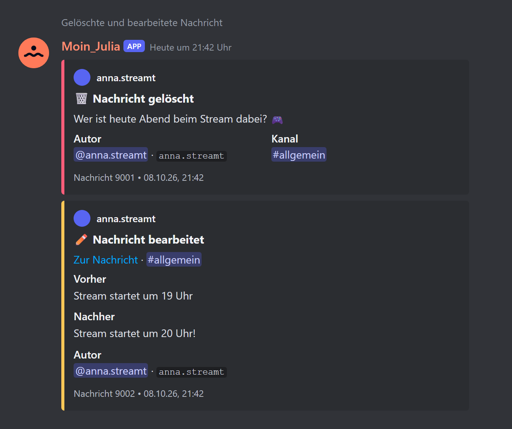
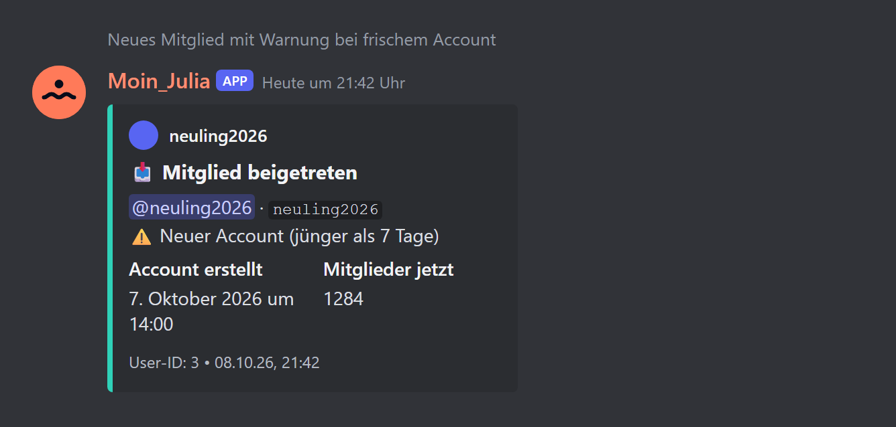
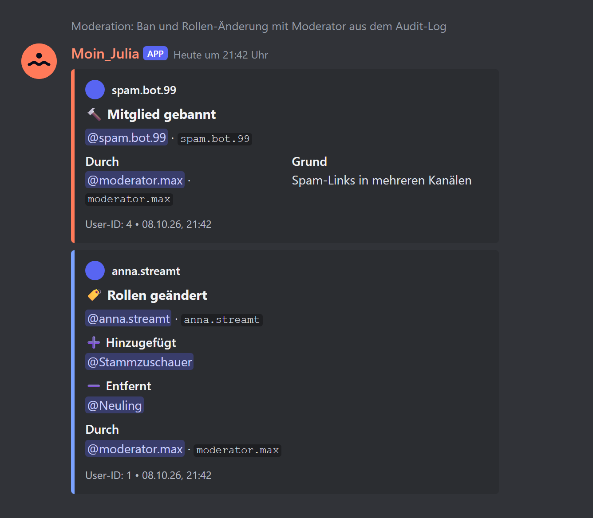
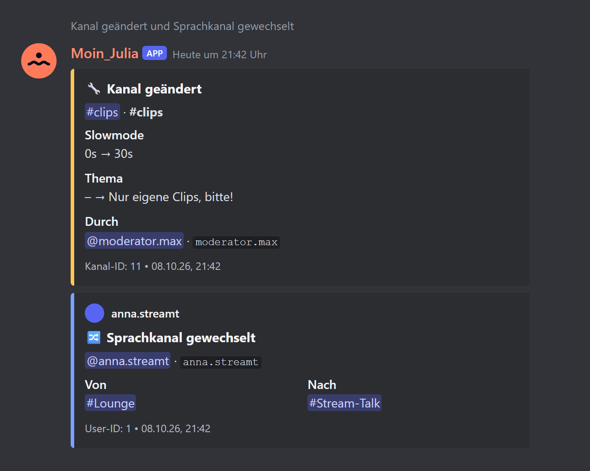

# 03 – Modul 1: Logging

**Datum:** 08.10.2026 · **Version:** 0.3.0 · **Status:** gebaut und getestet (ohne echten Discord-Server)


## Was das Modul kann

Der Bot protokolliert Ereignisse auf dem Server als übersichtliche Meldungen. Es gibt acht Kategorien, jede ist einzeln schaltbar und kann einen eigenen Kanal bekommen:

| Kategorie | Ereignisse |
|---|---|
| 💬 Nachrichten | gelöscht (mit Inhalt und Anhängen), bearbeitet (vorher/nachher + Sprunglink), Massenlöschung (alle Nachrichten als `.txt`-Datei) |
| 🚪 Beitritte & Austritte | Beitritt mit Account-Alter und **Warnung bei Accounts unter 7 Tagen**, Austritt mit Rollen und Beitrittsdatum |
| 🏷️ Mitglieder-Änderungen | Rollen vergeben/entzogen, Nickname geändert, Timeout gesetzt/aufgehoben |
| 🔨 Bans & Kicks | Bans, Entbannungen, Kicks – mit Moderator und Grund aus dem Audit-Log |
| #️⃣ Kanäle | erstellt, gelöscht, geändert (Name, Thema, Altersbeschränkung, Slowmode, Kategorie) |
| 🎭 Rollen | erstellt, gelöscht, geändert (Name, Farbe, Rechte, Anzeige, Erwähnbar) |
| 🔊 Sprachkanäle | betreten, verlassen, gewechselt |
| 🏠 Server & Einladungen | Servername/-bild/-banner/-beschreibung/Verifizierung geändert, Einladungen erstellt/gelöscht |

Wer etwas getan hat („Durch …“), holt der Bot aus dem Audit-Log, sofern er das Recht dazu hat. Ein Kick wird dadurch von einem normalen Austritt unterschieden, und ein Ban erscheint nicht doppelt.

## Dashboard-Einstellungen

- **Standard-Log-Kanal** für alles ohne eigenen Kanal
- pro Kategorie: **an/aus** und **eigener Kanal**
- **Bots ignorieren** (Standard: an)
- **Kanäle ausnehmen**, z. B. Spam- oder Bot-Kanäle. Log-Kanäle selbst werden automatisch ausgelassen, damit keine Schleifen entstehen.
- Hinweis, welche Rechte und Intents der Bot braucht

Änderungen greifen sofort: Das Dashboard schickt ein Redis-Event, und der Bot leert seinen Einstellungs-Cache.

## Wie es gebaut ist

```
packages/shared/src/config/logging.ts     Kategorien + Einstellungs-Schema (zod), von Bot und Dashboard genutzt
packages/shared/src/locales/logging.ts    alle Texte auf Deutsch und Englisch
apps/bot/src/modules/logging/embeds.ts    reine Funktionen: Ereignis-Daten → Embed (ohne Discord testbar)
apps/bot/src/modules/logging/send.ts      Zielkanal bestimmen, Rechte prüfen, senden (ohne Pings), Audit-Log
apps/bot/src/modules/logging/index.ts     18 Discord-Ereignisse → Embeds
apps/dashboard/src/app/g/[guildId]/logging/  Einstellungsseite + Server-Action
```

Neu als Bausteine für alle weiteren Module:
- **Modul-Einstellungen** in der DB (`GuildModule.config`), im Bot zwischengespeichert, im Dashboard mit `getModuleRow` / `saveModuleConfig`
- **Modul-Seiten** erscheinen automatisch in der Seitenleiste (`hasSettings` im Katalog)
- **Kanalauswahl** gruppiert nach Discord-Kategorien
- **Übersetzungen pro Modul** in `packages/shared/src/locales/<modul>.ts`
- **Discord-Vorschaubilder:** `scripts/embed-preview.ts` zeichnet die Beispiel-Embeds eines Moduls (`preview.ts`) als PNG
- **vitest** für Unit- und Verdrahtungs-Tests

**Bot-Intents ab jetzt:** Guilds, GuildMembers*, GuildMessages, MessageContent*, GuildModeration, GuildVoiceStates, GuildInvites (*privilegiert, im Developer Portal einschalten). Dazu kommt ein Nachrichten-Cache (300 pro Kanal, 6 Stunden), damit gelöschte Nachrichten ihren Inhalt behalten.

## Wie getestet

| Test | Ergebnis |
|---|---|
| Unit-Tests der Embeds (Texte, Kürzung, Diffs, Zeitstempel, Voice-Fälle, Massenlösch-Datei) | ✓ 16/16 |
| Verdrahtungs-Test mit nachgebauten Discord-Objekten (richtiger Kanal, keine Pings, ignorierte Kanäle/Bots, Kategorie aus, fehlende Rechte → Warnung statt Absturz, alle 18 Ereignisse registriert) | ✓ 7/7 |
| Einstellungs-Schema (Standardwerte, kaputte Daten, Teil-Konfiguration, Zielkanal-Logik) | ✓ 5/5 |
| Klick-Test im Dashboard: Kanal wählen, Kategorie-Kanal, Voice aus, speichern, neu laden, Modul einschalten | ✓ 12/12 (inkl. Grundgerüst) |
| Update-Simulation (Regression) | ✓ 20/20 |
| ShellCheck aller Skripte | ✓ |
| **Live auf einem echten Discord-Server** | ⏳ braucht Bot-Token → nach der Installation auf Proxmox |

## So sieht es in Discord aus (Vorschau)

Nachgebaute Vorschau aus den echten Embed-Funktionen. Namen und Werte sind erfunden.



| | |
|---|---|
|  |  |



**Bitte nach dem Test als Screenshot schicken:**
- eine gelöschte Nachricht im Log-Kanal. Zu sehen sein sollten Titel „🗑️ Nachricht gelöscht“, der Text, Autor und Kanal.
- einen Beitritt mit „Account erstellt“.

## Bekannte Grenzen

- Nachrichten, die vor dem letzten Bot-Neustart geschrieben wurden oder älter als 6 Stunden sind, kennt der Bot nicht mehr. Die Meldung sagt dann ehrlich „Inhalt unbekannt“. Dauerhaft speichern wir Nachrichten bewusst nicht (Datenschutz).
- Wer eine fremde Nachricht gelöscht hat, steht im Discord-Audit-Log nicht verlässlich. Deshalb gibt es bei gelöschten Nachrichten keine Angabe „Durch …“.
- Ohne das Recht „Audit-Log anzeigen“ fehlen die Moderator-Angaben, und Kicks erscheinen dann als normaler Austritt.
- Rechte-Änderungen an Kanälen (Overwrites) werden noch nicht im Detail aufgeschlüsselt (→ IDEEN.md).
