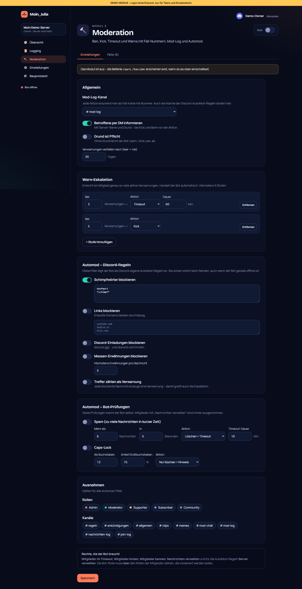
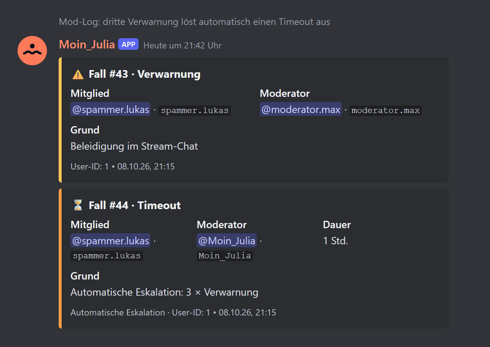
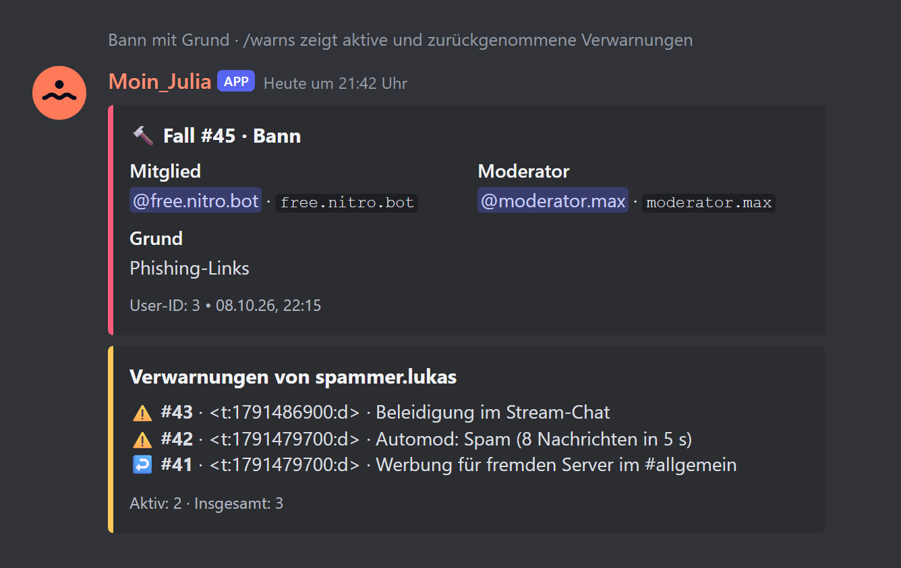

# 04 – Modul 2: Moderation

**Datum:** 08.10.2026 · **Version:** 0.4.0 · **Status:** gebaut und getestet (ohne echten Discord-Server)

## Was das Modul kann

### Befehle
| Befehl | Was er tut | Discord-Recht |
|---|---|---|
| `/warn` | Verwarnung, zählt für die Eskalation | Mitglieder im Timeout |
| `/timeout` | Timeout mit Dauer (`10m`, `1h30m`, `2d`, `1w`, max. 28 Tage) | Mitglieder im Timeout |
| `/untimeout` | Timeout aufheben | Mitglieder im Timeout |
| `/kick` | Kick, die DM geht **vor** dem Rauswurf raus | Mitglieder kicken |
| `/ban` | Bann per Mitglied oder User-ID, optional Nachrichten der letzten Stunde/24 h/7 Tage löschen | Mitglieder bannen |
| `/unban` | Bann aufheben | Mitglieder bannen |
| `/warns` | Verwarnungen eines Mitglieds (aktiv und zurückgenommen) | Mitglieder im Timeout |
| `/case show / reason / pardon` | Fall anzeigen, Grund ändern, Verwarnung zurücknehmen | Mitglieder im Timeout |
| `/clear` | bis zu 100 Nachrichten löschen, optional nur von einem Mitglied | Nachrichten verwalten |

- **Fortlaufende Fall-Nummern** pro Server, atomar vergeben (auch bei gleichzeitigen Aktionen keine doppelten Nummern)
- **Rangprüfung:** Niemand kann sich selbst, den Owner, den Bot oder Mitglieder mit gleich hoher oder höherer Rolle moderieren. Wenn die Bot-Rolle zu niedrig steht, sagt der Bot das.
- **Antworten sind nur für den Moderator sichtbar** (ephemer). Die öffentliche Spur ist der Mod-Log.
- **Mod-Log:** jede Aktion als Fall-Karte. Ändert sich ein Grund oder wird eine Verwarnung zurückgenommen, wird die Karte aktualisiert.
- **DM an Betroffene** mit Server-Name und Grund (abschaltbar). Bei geschlossenen DMs sagt der Bot das dem Moderator.

### Warn-Eskalation
Bis zu 5 Stufen, zum Beispiel **3 Verwarnungen → Timeout 1 Stunde**, **5 → Kick**. Eine Stufe greift genau beim Erreichen der Zahl, also nicht bei jeder weiteren Verwarnung erneut. Verwarnungen verfallen nach einstellbaren Tagen (Standard 30). Zurückgenommene zählen nicht.

### Automod
| Filter | Technik | Warum |
|---|---|---|
| Schimpfwörter (mit Wildcards) | Discord-AutoMod-Regel | wirkt beim Senden, auch wenn der Bot offline ist |
| Links mit erlaubten Domains | Discord-AutoMod-Regel (Regex + Allow-List) | dto. |
| Discord-Einladungen | Discord-AutoMod-Regel | dto. |
| Massen-Erwähnungen | Discord-AutoMod (Mention-Spam + Raid-Schutz) | dto. |
| Spam (X Nachrichten in Y Sekunden) | Bot | Discord bietet das nicht einstellbar |
| Caps-Lock (Mindestlänge, Anteil) | Bot | dto. |

- Der Bot legt seine Discord-Regeln unter dem Namen **„Moin_Julia · …“** an und gleicht sie nach jeder Dashboard-Änderung ab. Eigene Regeln des Servers bleiben unangetastet.
- Optional zählt jeder Treffer einer Discord-Regel als Verwarnung, damit greift auch die Eskalation.
- Bei Spam und Caps ist die Aktion wählbar: nur löschen (mit kurzem Hinweis, der nach 6 s verschwindet), löschen + Verwarnung oder löschen + Timeout.
- Ausnahmen für Rollen und Kanäle. Mitglieder mit „Nachrichten verwalten“ sind immer ausgenommen.

## Dashboard
- **Einstellungen:** Mod-Log-Kanal, DM, Grund-Pflicht, Verfall, Eskalations-Editor (Stufen hinzufügen/entfernen), alle Automod-Filter, Ausnahmen, Rechte-Hinweis
- **Fälle:** Tabelle mit Suche (Name, User-ID, Fall-Nr., Grund), Filter nach Art, Seitenweise (50 pro Seite). Automod und Eskalation sind als Quelle markiert, zurückgenommene Verwarnungen ausgegraut.

## Neu im Kern
- Datenbank: Tabelle `ModCase`, Spalte `Guild.caseCounter` (Migration `20261008130000_moderation`)
- Modul-Hooks `onReady` und `onConfigChange` (z. B. zum Abgleich der AutoMod-Regeln)
- Bot-Intents: `AutoModerationConfiguration`, `AutoModerationExecution`
- Dashboard-Bausteine: `ModuleTabs`, `ToggleRow`, `ChipPicker`, `NumberField`, `SectionCard`
- Demo-Modus legt erfundene Beispielfälle an (nur für Screenshots)

## Wie getestet

| Test | Ergebnis |
|---|---|
| Logik: Dauer-Parser, Eskalation, Rangprüfung, Fall-Karten, DM-Texte, Spam-Fenster, Caps-Erkennung, AutoMod-Regel-Bau | ✓ 21/21 |
| Ablauf mit nachgebauter DB und Server: Fall #1 + DM + Mod-Log, **3. Verwarnung → automatischer Timeout 60 Min.**, Rangprüfung blockt Kick, Grund-Pflicht, DM vor Kick | ✓ 5/5 |
| Alle Slash-Befehle bauen gültig (Namen, Längen, Rechte, Übersetzungen), keine doppelten Befehle über alle Module | ✓ 2/2 |
| Logging (Regression) | ✓ 23/23 |
| Klick-Test Dashboard inkl. Moderation (Mod-Log-Kanal, Schimpfwörter, 3. Eskalationsstufe, Fall-Liste, Suche, Filter) | ✓ 19/19 |
| Update-Simulation (Regression) | ✓ 20/20 |
| **Live auf echtem Discord** | ⏳ nach der Installation |

## So sieht es in Discord aus (Vorschau)

**Bitte nach dem Test als Screenshot schicken:** den Mod-Log nach `/warn @jemand Test`. Zu sehen sein sollte eine gelbe Karte „⚠️ Fall #1 · Verwarnung“ mit Mitglied, Moderator und Grund.

## Bekannte Grenzen
- Zeitlich begrenzte Banns (z. B. „7 Tage“) fehlen noch, dafür braucht es einen Zeitplaner (kommt mit den Erinnerungen in Modul 9) → IDEEN.md.
- Discord erlaubt pro Server nur **eine** Mention-Spam-Regel. Hat der Server schon eine eigene, kann der Bot seine nicht anlegen und schreibt eine Warnung ins Log.
- `/clear` kann nur Nachrichten löschen, die jünger als 14 Tage sind (Discord-Grenze).
