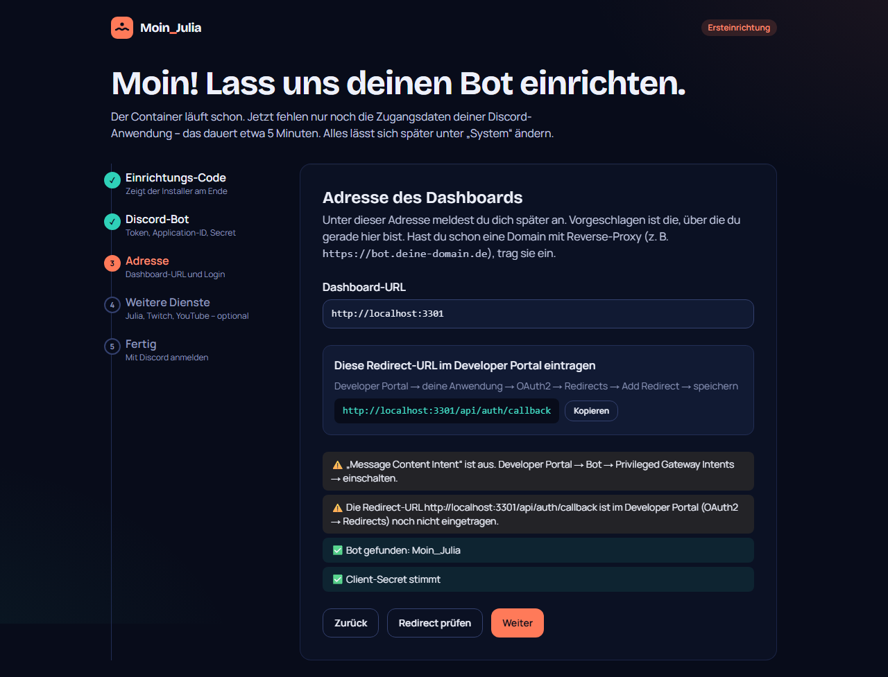
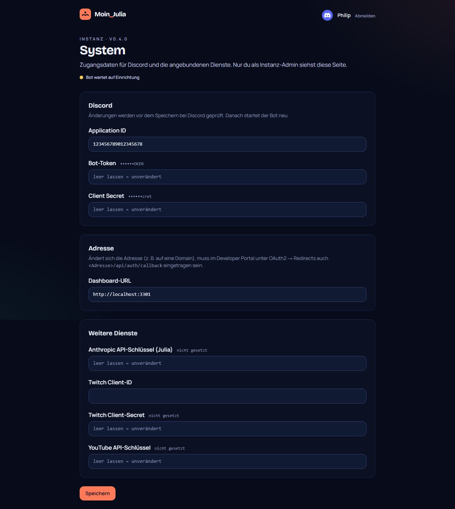
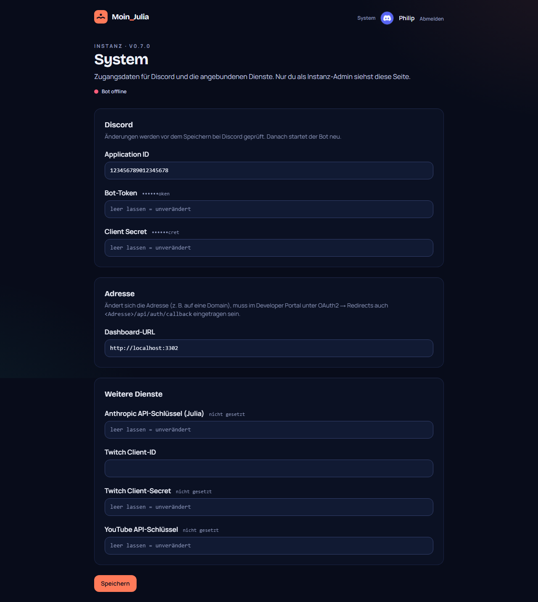

# 05 – Einrichtung über die Webseite

**Datum:** 08.10.2026 · **Version:** 0.5.0 · **Status:** gebaut und Ende-zu-Ende getestet

## Warum

Wunsch von Philip: Der Quickstart soll **nur noch den Container bzw. die VM installieren**. Discord-Token, Client-ID, Secret und alle API-Schlüssel werden danach bequem im Browser eingetragen – statt in Whiptail-Fenstern in der Proxmox-Shell.

## Was gebaut wurde

### Installer
- fragt keine Tokens mehr, nur noch LXC/VM, Ressourcen und Netzwerk
- erzeugt zufällig: Datenbank-Passwort, **Verschlüsselungs-Schlüssel** (`SECRETS_KEY`) und **Einrichtungs-Code** (`SETUP_CODE`, z. B. `MOIN-7K4P-2QXB`)
- zeigt am Ende **URL + Einrichtungs-Code**
- `moin-julia setup-code` zeigt den Code jederzeit wieder; `update` ergänzt Code und Schlüssel bei älteren Installationen automatisch

### Einrichtungs-Assistent (`/setup`)
| Schritt | Inhalt |
|---|---|
| 1 · Code | schützt die Einrichtung, damit niemand anderes im Netzwerk sie übernimmt (falscher Code → kurze Bremse) |
| 2 · Discord-Bot | Anleitung fürs Developer Portal; **Live-Prüfung** bei Discord: Token gültig? passt er zur Application-ID? Secret richtig? Intents an? |
| 3 · Adresse | vorbelegt mit der aufgerufenen Adresse, Redirect-URL zum Kopieren, Prüfung ob sie im Developer Portal eingetragen ist |
| 4 · Weitere Dienste | Anthropic, Twitch, YouTube – optional, jeweils mit „Prüfen“ |
| 5 · Fertig | Speichern → Bot startet neu → „Mit Discord anmelden“ → du wirst **Instanz-Admin** |

### Sicherheit
- Tokens und Schlüssel liegen **verschlüsselt (AES-256-GCM)** in der Datenbank, angezeigt werden sie nur maskiert (`••••••abcd`)
- der Einrichtungs-Code wird zeitkonstant verglichen; nach Eingabe gilt ein signiertes 2-Stunden-Ticket im Browser
- **Instanz-Admin** wird nur, wer die Einrichtung mit Code abgeschlossen hat; nach Abschluss ist `/setup` gesperrt
- Werte aus der `.env` gelten weiter als Rückfall – bestehende Installationen funktionieren ohne Änderung

### System-Seite (`/system`)
Nur für den Instanz-Admin (Link oben rechts): Discord-Zugang, Adresse und API-Schlüssel ändern. Discord-Änderungen werden vor dem Speichern live geprüft; danach startet der Bot neu.

### Bot
- **Einrichtungsmodus:** ohne Zugangsdaten wartet der Bot (gilt als gesund, damit Installation und Updates nicht scheitern) und startet von selbst neu, sobald der Assistent speichert
- ungültiger Token oder fehlende Intents → **kein Absturz-Kreislauf** mehr; das Dashboard zeigt „Bot-Token ungültig – unter System ändern“ bzw. „Intents fehlen“
- Bot-Status oben im Dashboard: online / wartet auf Einrichtung / Token ungültig / Intents fehlen

## Wie getestet

| Test | Ergebnis |
|---|---|
| **Ende-zu-Ende mit nachgebauter Discord-API** (`scripts/tests/fake-discord.mjs` + `setup-e2e.mjs`): Weiterleitung zum Assistenten, falscher/richtiger Code, falscher Token/Secret erkannt, fehlender Intent gemeldet, Redirect-Prüfung, Speichern, **echter OAuth-Login-Ablauf** bis zur Server-Liste, Instanz-Admin, Assistent danach gesperrt, System-Seite nur für Admin, Token maskiert | ✓ 20/20 |
| Bot gegen leere DB: Einrichtungsmodus, Healthcheck `200 {state: "setup"}`, Heartbeat in Redis, nach dem Speichern **geordneter Neustart** (Exit 0) | ✓ |
| Datenbank-Inhalt nach der Einrichtung: Token und Secret nur als `v1:…` (verschlüsselt) | ✓ |
| Verschlüsselung: Roundtrip, Manipulation erkannt, falscher Schlüssel erkannt | ✓ 4/4 |
| Update-Simulation inkl. „ergänzt Einrichtungs-Code in alter .env“ | ✓ 21/21 |
| Regression: Bot 51/51, Shared 5/5, Klick-Test Dashboard 19/19, ShellCheck | ✓ |

## Für bestehende Installationen (ab v0.7.1)

Installationen mit Tokens in der  funktionieren weiter. Um Instanz-Admin zu werden, braucht es keinen zweiten Login mehr:

1. Im Container: , danach  (zeigt den Code bzw. legt ihn an)
2. Im Dashboard oben rechts **System** → Code eingeben → **Admin werden**
3. Direkt danach Bot-Token, Adresse und Schlüssel ändern

Getestet Ende zu Ende (, 7/7): Hinweis auf der Server-Seite, falscher Code abgelehnt, richtiger Code → Admin, ungültiger Token vor dem Speichern abgelehnt, gültiger gespeichert und maskiert angezeigt.

## Bekannte Grenzen
- Der Einrichtungs-Code steht im Klartext in der `.env` (nur root lesbar) – er ist nach Abschluss der Einrichtung ohne Wirkung.
- `SECRETS_KEY` darf nie geändert werden, sonst sind gespeicherte Tokens unlesbar (der Assistent kann sie dann einfach neu speichern).
