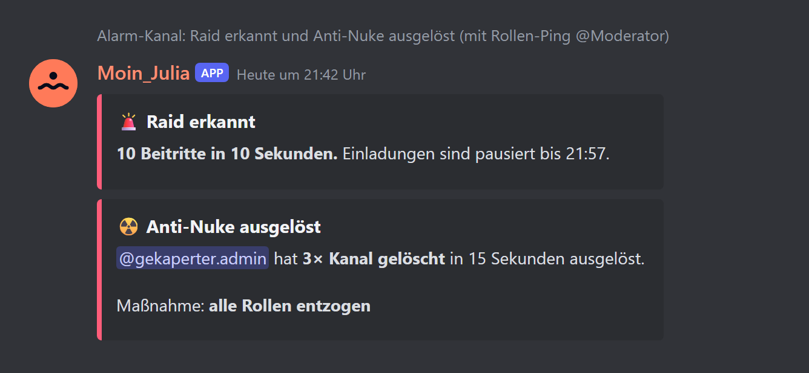
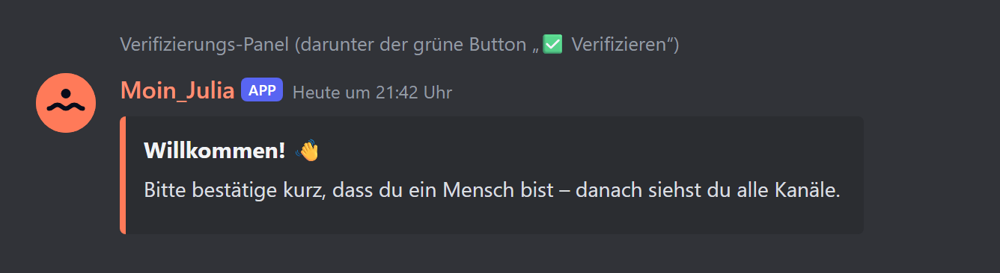

# 06 – Modul 3: Server-Schutz

**Datum:** 08.10.2026 · **Version:** 0.6.0 · **Status:** gebaut und getestet (ohne echten Discord-Server)

## Was das Modul kann

### Anti-Raid
- erkennt Beitritts-Wellen, z. B. **10 Beitritte in 10 Sekunden** (einstellbar)
- **pausiert dann alle Einladungen** (Discord-Funktion „Einladungen pausieren“) für X Minuten und hebt die Pause danach selbst auf
- optional werden alle, die während des Raids beitreten, gekickt
- Alarm mit Rollen-Ping; im Dashboard erscheint ein roter Hinweis „Raid-Modus aktiv“ mit Knopf **„jetzt beenden“**
- der Raid-Modus übersteht einen Bot-Neustart (Ende in Redis gespeichert)

### Anti-Nuke
- beobachtet das **Audit-Log** live: Kanäle löschen, Rollen löschen, Bannen, Kicken, Webhooks erstellen, **Admin-Rechte vergeben**
- erreicht eine Person die Schwelle (Standard: 3 gleiche Aktionen in 15 s), greift der Bot sofort ein: **alle Rollen entziehen** (Standard), kicken oder bannen
- Admin-Rechte zu vergeben (an ein Mitglied oder eine Rolle) löst schon **beim ersten Mal** aus
- ausgenommen: Owner, der Bot selbst, eine Whitelist aus Rollen und User-IDs (z. B. andere Bots)
- schlägt die Maßnahme fehl (Bot-Rolle zu niedrig), sagt der Alarm das deutlich

### Verifizierung
- Panel mit Titel, Text und grünem Button **„✅ Verifizieren“** – per Knopf im Dashboard in den gewählten Kanal gesendet
- Modus **Button** (sofort Rolle) oder **Button + Rechenaufgabe** (Formular „Wie viel ist 7 + 5?“, eine Aufgabe pro Versuch, 5 Minuten gültig, Lösung bleibt auf dem Server)

### Account-Alter
- Accounts jünger als X Tage: nur melden, Timeout (1 Tag) oder kicken mit freundlicher DM („komm später gerne wieder“)

## Neu im Kern (für alle weiteren Module)
- **Buttons, Auswahlmenüs und Formulare** werden über die `customId` (`<modul>:<aktion>:…`) automatisch an das richtige Modul geleitet – inklusive Prüfung, ob das Modul an ist
- **Aufträge aus dem Dashboard an den Bot** (`module-action`), z. B. „Panel senden“, „Raid beenden“ – genutzt später für Ticket-Panels, Rollen-Panels usw.
- Dashboard-Bausteine `RoleSelect`, `ActionButton`

## Wie getestet

| Test | Ergebnis |
|---|---|
| Logik: Raid-Erkennung (genau ein Alarm pro Welle, langsame Beitritte nicht, nach Ende wieder scharf, Server getrennt), Nuke-Zähler, Ausnahmen, Audit-Log-Codes gegen discord.js, Account-Alter, Captcha (richtig/falsch/einmalig/Ablauf), Standardwerte | ✓ 13/13 |
| Ablauf mit nachgebautem Server: 3× Kanal löschen → Rollen weg + Alarm mit Ping; Owner darf alles; abgeschaltete Beobachtung ignoriert, Bann als Strafe; Raid-Welle → Einladungen pausiert + Alarm; Verifizierung per Button; Captcha richtig → Rolle, falsch → keine | ✓ 6/6 |
| **Gefundener und behobener Fehler:** Die Raid-Erkennung hätte bei schnellen Wellen mehrfach alarmiert, weil zwischen Erkennung und Start des Raid-Modus ein `await` lag. Jetzt sperrt sich der Detektor sofort selbst. | ✓ |
| Klick-Test Dashboard inkl. Server-Schutz (Alarm-Kanal, Anti-Nuke-Schwelle, Captcha-Modus, „Panel senden“) | ✓ 24/24 |
| Regression: alle Bot-Tests 68/68, Einrichtung, Update-Simulation 21/21 | ✓ |

## So sieht es in Discord aus (Vorschau)

**Bitte nach dem Test als Screenshot schicken:** das Verifizierungs-Panel im Kanal (nach „Panel jetzt in den Kanal senden“) und die Antwort nach dem Klick auf „Verifizieren“.

## Bekannte Grenzen
- Gelöschte Kanäle/Rollen werden **nicht automatisch wiederhergestellt** – der Bot stoppt den Angreifer, das Aufräumen bleibt Handarbeit (→ IDEEN.md: Snapshot & Wiederherstellung).
- Ein Angreifer mit höherer Rolle als der Bot kann nicht gestoppt werden – deshalb muss die Bot-Rolle ganz oben stehen (steht im Dashboard).
- Discord meldet Audit-Log-Einträge mit wenigen Sekunden Verzögerung; sehr schnelle Angriffe richten bis zum Eingreifen etwas Schaden an.
