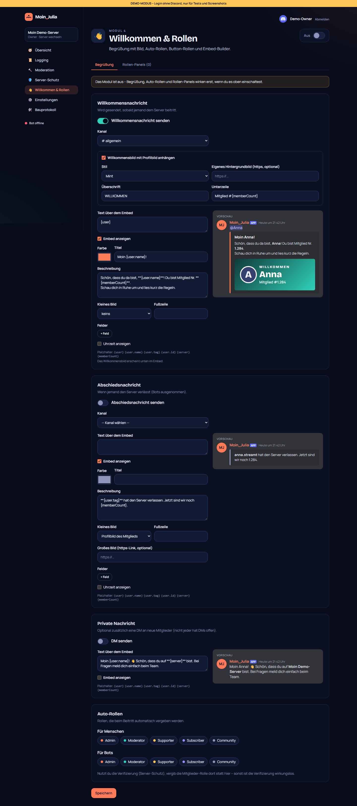
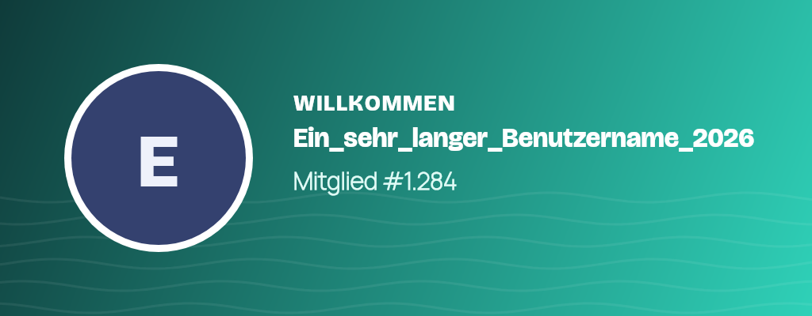
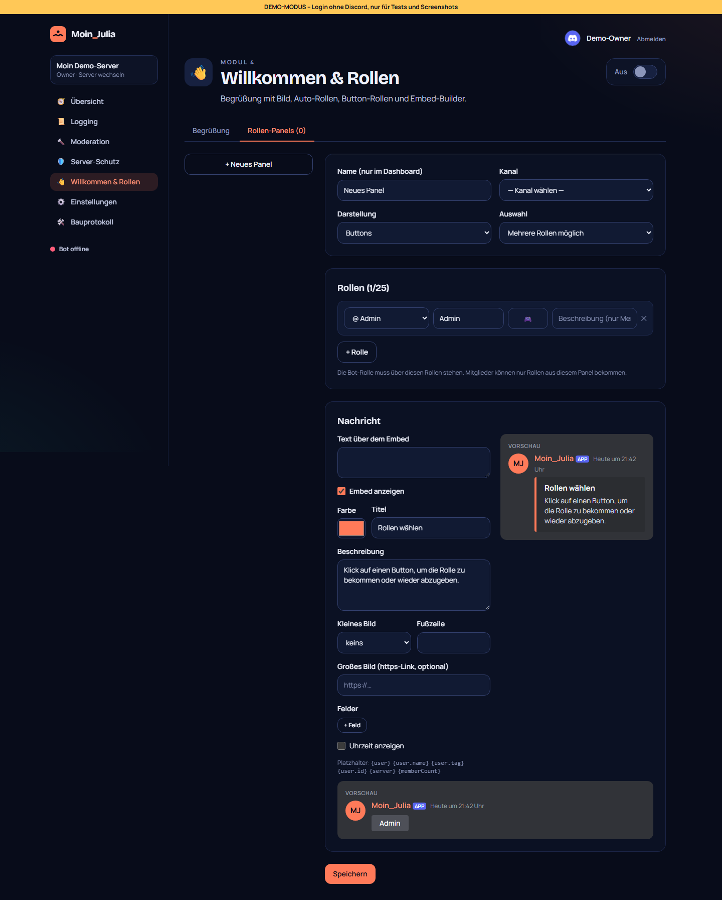
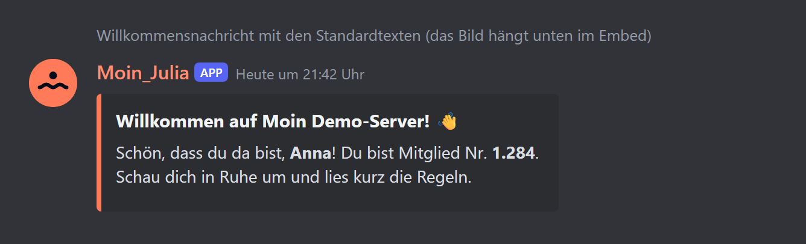
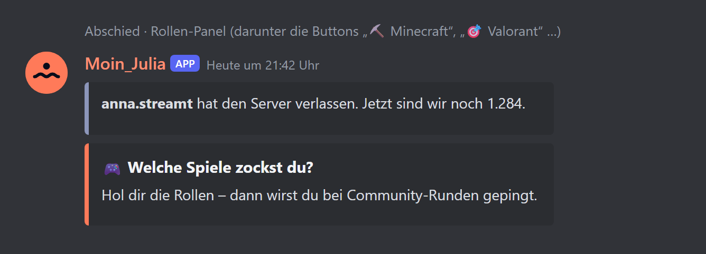

# 07 – Modul 4: Willkommen & Rollen

**Datum:** 08.10.2026 · **Version:** 0.7.0 · **Status:** gebaut und getestet (ohne echten Discord-Server)

## Was das Modul kann

### Embed-Builder (für alle Module)
- Text über dem Embed, Farbe, Titel, Beschreibung, kleines Bild (Profilbild/Server-Icon), großes Bild, bis zu 10 Felder, Fußzeile, Uhrzeit
- **Platzhalter:** `{user}` (Erwähnung), `{user.name}`, `{user.tag}`, `{user.id}`, `{server}`, `{memberCount}`
- **Live-Vorschau im Discord-Look**, die dieselbe Render-Funktion nutzt wie der Bot – was man sieht, kommt auch so in Discord an
- Wird ab jetzt von Tickets, Alerts, Panels usw. wiederverwendet

### Begrüßung
- **Willkommensnachricht** mit generiertem **Willkommensbild**: Profilbild mit Ring, Überschrift, Name (lange Namen werden automatisch kleiner), Unterzeile „Mitglied #1.284“ – 4 Stile oder eigenes Hintergrundbild
- **Abschiedsnachricht** (Bots ausgenommen)
- **DM** an neue Mitglieder (optional)
- Pingt **nur das neue Mitglied** an, nie @everyone oder Rollen

| Hafen bei Nacht | Koralle |
|---|---|
|  |  |
| **Mint** (langer Name) | **Schwarz & Gold** |
|  |  |

### Auto-Rollen
Getrennt für Menschen und Bots; nur Rollen, die es noch gibt.

### Rollen-Panels (Selbstbedienung)
- **Buttons** (5 pro Reihe, bis 25) oder **Auswahlmenü** mit Beschreibung pro Rolle, Emojis (auch eigene Server-Emojis)
- Modus **„mehrere“** oder **„nur eine“** (z. B. Pronomen, Farbrollen)
- Im Dashboard anlegen, Vorschau sehen, **„In Discord senden“** bzw. **„aktualisieren“** (bearbeitet die bestehende Nachricht)
- **Sicherheit:** Der Bot vergibt nur Rollen, die im Panel stehen – manipulierte Buttons können keine anderen Rollen holen

## Neu
- Datenbank: Tabelle `RolePanel` (Migration `20261008150000_role_panels`)
- Bot: `@napi-rs/canvas` für Bilder, Schriften Bricolage Grotesque und Manrope (SIL Open Font License, liegt bei) in `apps/bot/assets/fonts`
- Dashboard: `EmbedEditor`, `DiscordPreview`, `RolePanelEditor`

## Wie getestet

| Test | Ergebnis |
|---|---|
| Vorlagen: Platzhalter, Embed-Aufbau, leere Embeds weglassen, unsichere Bild-URLs (http) und falsche Farben abgelehnt, Standardtexte, Panel-Grenzen | ✓ 6/6 |
| Rollen-Panels: Emojis, Umschalten, „nur eine“, **fremde Rollen-IDs werden ignoriert**, Auswahlmenü, Button-Reihen à 5 | ✓ 5/5 |
| Ablauf Beitritt mit nachgebautem Server: Auto-Rolle (nur existierende), **Bild wird erzeugt und ins Embed gehängt**, nur das Mitglied gepingt, DM; Bots nur Bot-Rollen; Abschied | ✓ 3/3 |
| Willkommensbild in 4 Stilen gerendert (siehe oben) | ✓ |
| Klick-Test Dashboard: Begrüßung (Kanal, Stil, Live-Vorschau mit Platzhalter, speichern), Rollen-Panel anlegen/senden/löschen | ✓ 31/31 gesamt |
| Regression: Bot 76/76, Shared 11/11, DB 4/4, Update-Simulation 21/21 | ✓ |

**Hinweis Bildbibliothek:** Unter Windows sucht `@napi-rs/canvas` eine ICU-Datei im falschen Ordner (nur für meine lokalen Tests umgangen). Im Docker-Container (Linux) ist ICU fest eingebaut – das Linux-Paket wurde dafür geprüft.

## So sieht es in Discord aus (Vorschau)

**Bitte nach dem Test als Screenshot schicken:** eine Willkommensnachricht mit Bild (z. B. mit einem Zweit-Account beitreten).

## Bekannte Grenzen
- Rollen-Panels mit Reaktionen (Emoji-Reaktionen statt Buttons) gibt es bewusst nicht – Buttons sind zuverlässiger.
- Das Willkommensbild nutzt eine Schriftart mit lateinischen Zeichen; sehr exotische Namen (z. B. nur Emojis) werden ggf. als Kästchen gezeigt (→ IDEEN.md).
