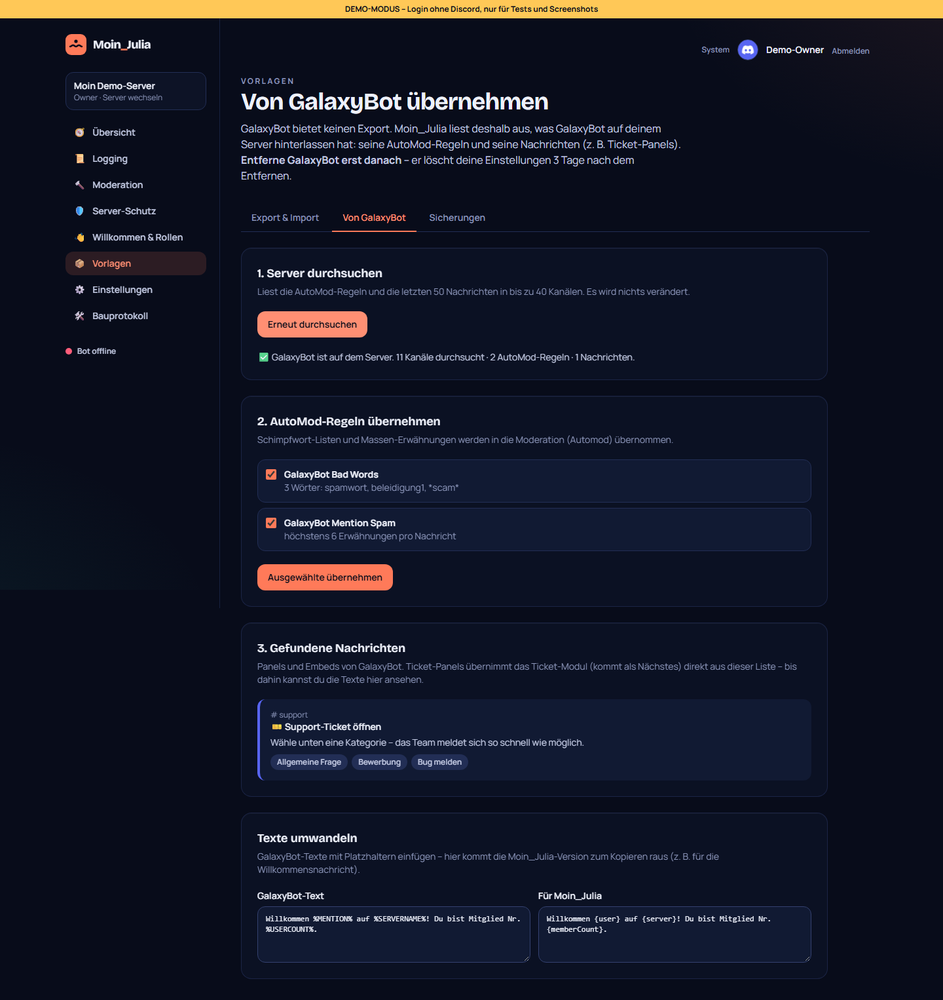

# 08 – Vorlagen: Export, Import & GalaxyBot-Übernahme

**Datum:** 08.10.2026 · **Version:** 0.8.0 · **Status:** gebaut und getestet

Wunsch von Philip: Bot-Einstellungen exportieren und auf anderen Servern oder bei Freunden importieren können – und die eigenen Sachen aus GalaxyBot übernehmen.

## Was gebaut wurde

Neuer Menüpunkt **„Vorlagen“** im Dashboard mit drei Reitern.

### Export & Import
- **Exportieren:** eine Vorlage-Datei (`moin-julia-vorlage-<server>-<datum>.json`) mit allen Modul-Einstellungen (inkl. An/Aus), Rollen-Panels und Bot-Sprache. **Nicht enthalten:** Tokens, API-Schlüssel, Moderations-Fälle oder andere personenbezogene Daten.
- Kanäle und Rollen stehen in der Datei **mit ihrem Namen**, damit sie woanders wiedergefunden werden.
- **Importieren** aus einer Datei **oder direkt von einem deiner anderen Server** (wenn der Bot dort ist und du Admin bist):
  1. Vorlage prüfen → Übersicht (Quelle, Datum, Module, Panels)
  2. Module auswählen, An/Aus-Zustand, Rollen-Panels und Sprache optional
  3. **Zuordnung:** Kanäle und Rollen werden per Name gesucht (Groß/Klein, Leer- und Bindestriche egal; bei Kanälen gleiche Art bevorzugt). Nicht Gefundenes wird gelb markiert und kann per Auswahl zugeordnet oder weggelassen werden.
  4. „Jetzt übernehmen“ – die Konfiguration wird mit dem Schema des jeweiligen Moduls geprüft und vervollständigt (auch Vorlagen älterer Versionen funktionieren).
- Rollen-Panels werden angelegt, aber nicht automatisch gesendet.
- Format mit Versionsnummer: Vorlagen aus neueren Versionen werden mit klarer Meldung abgelehnt („bitte erst updaten“).

### Sicherungen
- **Vor jedem Import und jeder Übernahme** speichert der Bot automatisch den bisherigen Stand.
- Die letzten 20 Sicherungen bleiben; jede lässt sich mit einem Klick wiederherstellen (vorher wird wiederum gesichert).

### Von GalaxyBot übernehmen
Recherche-Ergebnis: **GalaxyBot hat keinen Export** (nur eine kostenpflichtige API für „Plus“-Server). Deshalb liest Moin_Julia aus, was GalaxyBot sichtbar auf dem Server hinterlassen hat:
- **AutoMod-Regeln** von GalaxyBot (Schimpfwort-Listen, Massen-Erwähnungen) → per Klick in die Moderation übernehmen
- **Nachrichten von GalaxyBot** (Panels, Embeds inkl. Auswahl-Optionen wie Ticket-Kategorien) aus bis zu 40 Kanälen – das Ticket-Modul übernimmt Ticket-Panels später direkt aus dieser Liste
- **Text-Umwandler** für GalaxyBot-Platzhalter: `%MENTION%` → `{user}`, `%USERNAME%` → `{user.name}`, `%SERVERNAME%` → `{server}`, `%USERCOUNT%` → `{memberCount}`; unbekannte werden gemeldet
- Deutlicher Hinweis: **GalaxyBot erst nach der Übernahme entfernen** – er löscht die Einstellungen 3 Tage nach dem Entfernen

## Wie getestet

| Test | Ergebnis |
|---|---|
| Logik: IDs einsammeln/ersetzen (Weglassen entfernt Einträge aus Listen, User-IDs bleiben), Export nur benutzter Kanäle/Rollen, Rundreise Datei → lesen, fremde/kaputte/zu neue Dateien, Namens-Zuordnung, Schema-Prüfung beim Übertragen, GalaxyBot-Platzhalter | ✓ 8/8 |
| Klick-Test: Export herunterladen → dieselbe Datei importieren → alle Zuordnungen gefunden → übernehmen → Sicherung entstanden → wiederherstellen → GalaxyBot-Scan → Regeln übernehmen → Schimpfwörter und Erwähnungslimit stehen in der Moderation | ✓ 8/8 (Smoke-Test gesamt 39/39) |
| Regression: Bot 76/76, Shared 19/19, DB 4/4, Update-Simulation 21/21 | ✓ |
| **Gefunden und behoben:** Mein Abgleich-Skript hatte jeden Ordner namens `backups` ausgelassen – auch die neue Seite. Die Seite heißt jetzt „Sicherungen“, das Skript wurde korrigiert. | ✓ |

## Bekannte Grenzen
- Die GalaxyBot-Übernahme kann nur lesen, was in Discord sichtbar ist – Formular-Fragen, Rollen-Zuordnungen von Tickets oder interne Einstellungen kennt nur GalaxyBot selbst.
- Für Server mit GalaxyBot Plus wäre ein Import über deren API möglich (→ IDEEN.md).
- Neue Module (Tickets, Alerts …) werden automatisch Teil der Vorlagen, sobald sie gebaut sind.
