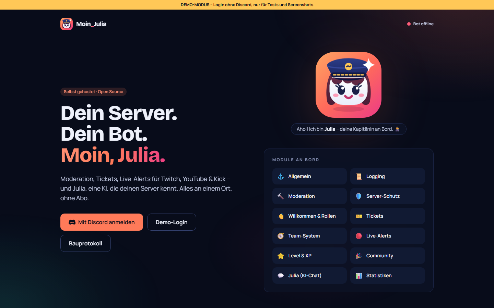
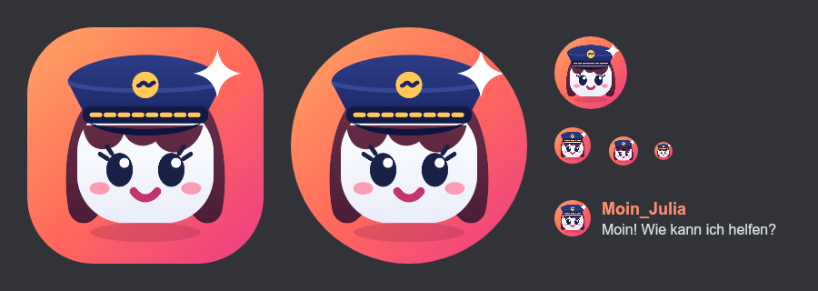
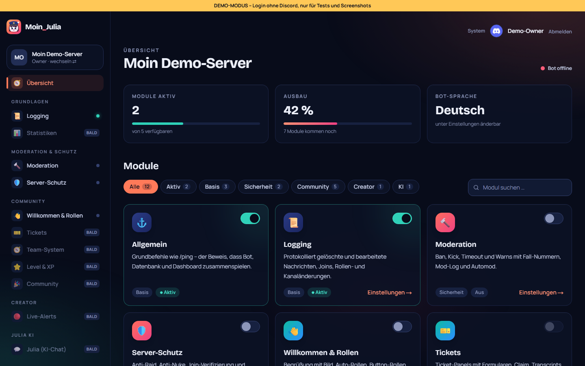
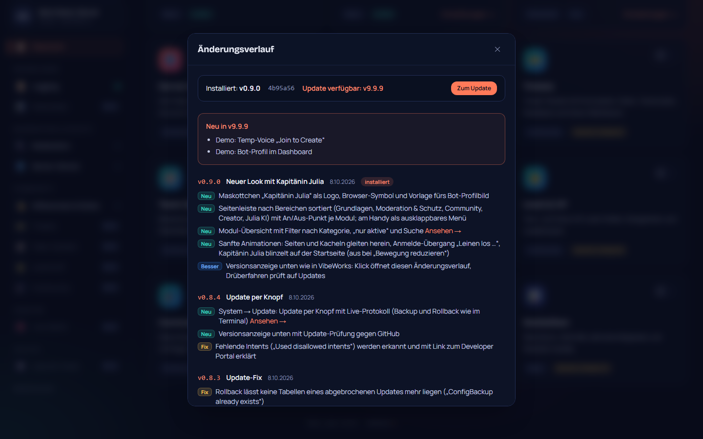
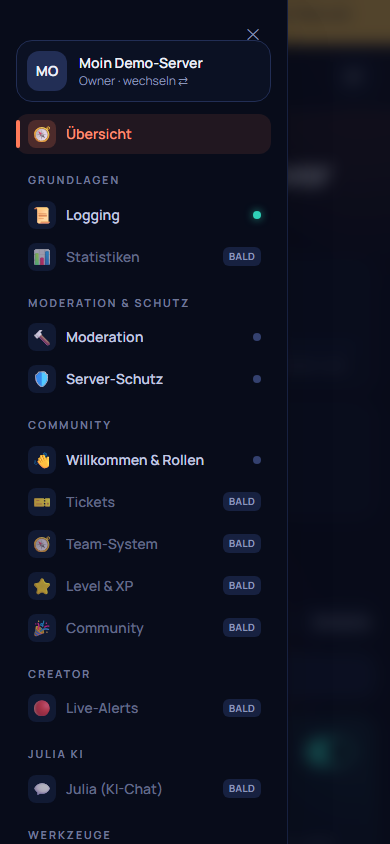

# 09 – Neuer Look mit Kapitänin Julia

**Datum:** 08.10.2026 · **Version:** 0.9.0 · **Status:** gebaut und getestet

Philip wünschte sich ein Dashboard, das so aufgeräumt ist wie bei GalaxyBot, dazu Animationen (auch beim Anmelden), ein Logo, das sich an den Profilbildern anderer Bots orientiert, und eine Versionsleiste wie in VibeWorks.

## Maskottchen „Kapitänin Julia“

- **Wie das Motiv entstand:**
  1. Ein erster Entwurf (Sprechblase mit Welle) wirkte wie eine Chat-App.
  2. Profilbilder bekannter Bots (MEE6, Dyno, Carl-bot) setzen fast alle auf ein **Maskottchen mit Gesicht**: kräftige Farben und klare Formen, die auch klein und rund zugeschnitten erkennbar sind.
  3. Daraus wurde Julia mit **Kapitänsmütze** (Moin – Hafen) und Funkeln für die KI. Auf Philips Wunsch ist sie eine Frau mit langen Haaren, Pony und Wimpern.
- **Wo es verwendet wird:**
  - `docs/branding/logo.svg` ist die Vorlage.
  - `apps/dashboard/src/app/icon.svg` ist das Browser-Symbol.
  - `docs/branding/bot-avatar-1024.png` ist das Bot-Profilbild (1024 px, randlos für Discords runden Zuschnitt). Dieselbe Datei liegt im Dashboard unter `/branding/bot-avatar.png`.
  - Im Dashboard ist es eine Komponente: Auf der Startseite springt Julia herein, blinzelt und das Funkeln glitzert; sonst glitzert es beim Drüberfahren.

## Dashboard

- **Seitenleiste nach Bereichen** wie bei großen Bots:
  - Gruppen: Grundlagen, Moderation & Schutz, Community, Creator, Julia KI und Werkzeuge.
  - Jedes Modul hat einen An/Aus-Punkt (grün leuchtend = aktiv).
  - Kommende Module sind ausgegraut mit „bald“ markiert, damit der Bauplan sichtbar ist.
  - Die aktive Seite hat eine Korallen-Leiste, die hereingleitet.
  - Server-Karte mit Icon und „wechseln“.
- **Handy:** Kopfzeile mit Menü-Knopf; die Leiste gleitet von links herein und schließt bei Seitenwechsel, Escape oder Tipp daneben.
- **Modul-Übersicht:** Filter „Alle / Aktiv / Kategorie“ (mit Anzahl) und Suche. Icon-Kacheln haben einen Farbverlauf je Kategorie, aktive Module ein grünes Leuchten. Die Kennzahlen zeigen Balken, die beim Laden wachsen.
- **Animationen:**
  - Seiten gleiten bei jedem Wechsel sanft herein, Kacheln gestaffelt.
  - Karten heben sich beim Drüberfahren, Schalter federn.
  - Ein Hintergrund aus zwei Farbflächen wandert langsam.
  - Auf der Server-Auswahl winkt die Hand.
  - Alles ist kurz und ruhig. Bei „Bewegung reduzieren“ im Betriebssystem ist alles still.
- **Anmelden:** Beim Klick auf „Mit Discord anmelden“ erscheint ein Übergang mit Kapitänin Julia, „Leinen los …“ und Ladekreis, bis Discord übernimmt.

## Versionsleiste wie in VibeWorks

- Unten mittig steht „Moin_Julia · v0.9.0 · Commit“. Fährt man darüber, erscheint ein kurzer Hinweis, ob es ein Update gibt.
- **Ein Klick öffnet den Änderungsverlauf:**
  - installierte Version und Commit,
  - der Update-Hinweis mit „Zum Update“,
  - alle Versionen mit farbigen Markierungen **Neu / Besser / Fix** und „Ansehen →“-Links zur passenden Seite.
- Quelle ist `packages/shared/src/changelog.ts`. Ein Test stellt sicher, dass der oberste Eintrag zur Datei `VERSION` passt und die Liste sauber sortiert ist.
- Den Commit gibt `moin-julia` beim Bauen als `GIT_COMMIT` mit.

## Wie getestet

| Test | Ergebnis |
|---|---|
| Klick-Test (inkl. Versionszeile → Änderungsverlauf) | ✓ 55/55 |
| Änderungsverlauf passt zu VERSION, sortiert, nie leer | ✓ 3/3 |
| Handy-Breite (390 px) auf Start, Server, Übersicht, Moderation, Willkommen, Vorlagen, System: keine Überbreite | ✓ |
| Regression: Bot 83, Shared 26, DB 4, Update-Simulation 27/27, Einrichtung 20/20, Admin-Übernahme 11/11 | ✓ |
| **Gefunden und behoben:** Das Logo in der Seitenleiste verlor seine Farben, weil zwei Logos auf der Seite dieselben Verlaufs-IDs nutzten und eines versteckt war. Jetzt hat jedes Logo eigene IDs. | ✓ |
| **Gefunden und behoben:** Die Übersicht war am Handy 745 px breit. Ursachen: Die Filter-Leiste dehnte die Rasterspalte, und die wandernde Hintergrundfläche ragte über den Rand. Beides ist begrenzt, die Reiter scrollen jetzt seitlich. | ✓ |
