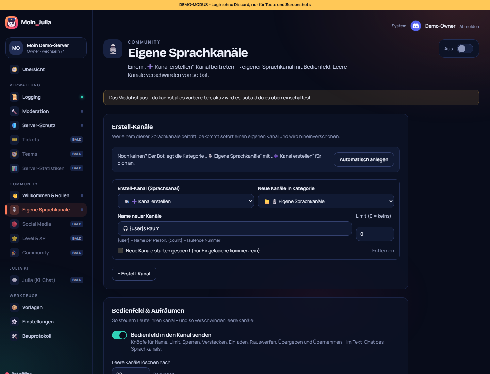

# 10 – Eigene Sprachkanäle („Join to Create“)

**Datum:** 08.10.2026 · **Version:** 0.10.0 · **Status:** gebaut und getestet

Philips Wunsch: „Wenn man einem Call joint, erstellt das automatisch einen anderen Call für die Person, und die kann ihn dann einrichten.“ Bei GalaxyBot heißt das **Custom Voice**.

## Was gebaut wurde

**Ablauf:**
1. Jemand betritt einen **Erstell-Kanal** („➕ Kanal erstellen“).
2. Der Bot legt sofort einen **eigenen Sprachkanal** an und verschiebt die Person hinein.
   - Name nach Vorlage, z. B. `🔊 {user}s Kanal`; `{count}` ist die laufende Nummer.
   - Er landet in der gewählten Kategorie, sonst neben dem Erstell-Kanal.
   - Die Rechte der Kategorie werden übernommen. Besitzer:in darf sprechen und streamen, der Bot darf verwalten.
   - Optional: Limit und „startet gesperrt“.
3. Im Text-Chat des Kanals erscheint das **Bedienfeld** mit diesen Knöpfen:
   - **Name:** Formular, Discord erlaubt 2 Umbenennungen pro 10 Minuten. Bei mehr kommt ein freundlicher Hinweis statt Hängen.
   - **Limit:** 0–99, 0 heißt unbegrenzt.
   - **Sperren / Öffnen:** Nur Eingeladene kommen rein.
   - **Verstecken / Zeigen:** Nur Eingeladene sehen den Kanal.
   - **Einladen:** bis zu 10 Personen auswählen.
   - **Rauswerfen:** trennt die Verbindung und sperrt den Zugang, bis man wieder einlädt.
   - **Übergeben:** Der Kanal gehört dann jemand anderem.
   - **Übernehmen:** geht nur, wenn die Besitzerin oder der Besitzer nicht mehr im Kanal ist.
4. Steuern darf nur die Besitzerin oder der Besitzer. Alle anderen bekommen einen freundlichen Hinweis.
5. Ist der Kanal leer, löscht der Bot ihn nach der eingestellten Wartezeit (Standard 10 s). Kommt vorher jemand zurück, bleibt er.
6. Wer schon einen eigenen Kanal hat und den Erstell-Kanal erneut betritt, landet wieder in seinem Kanal. Ein zweiter Kanal entsteht nicht.
7. **Nach einem Bot-Neustart** räumt der Bot leere Kanäle und verwaiste Einträge auf. Er merkt sich die Kanäle in der Datenbank (`TempVoiceChannel`).

**Besitzer-Rollen** (Philips Regel „geben und entziehen“): Rollen, die man bekommt, solange man einen eigenen Kanal besitzt. Ist der Kanal weg oder übergeben, verliert man sie automatisch wieder.

## Dashboard

- **„Automatisch anlegen“:** Der Bot erstellt die Kategorie „🎙️ Eigene Sprachkanäle“ mit „➕ Kanal erstellen“ und trägt sie gleich ein.
- **Bis zu 5 Erstell-Kanäle**, jeweils mit eigener Kategorie, Namensvorlage, Limit und „startet gesperrt“.
- Bedienfeld an/aus, Lösch-Wartezeit, Besitzer-Rollen.
- Kategorien stehen jetzt in den Kanal-Listen mit 📁. Oben auf Modul-Seiten steht der Bereich („Community“/„Verwaltung“) statt der Bauplan-Nummer.

## Wie getestet

| Test | Ergebnis |
|---|---|
| Logik: Erstell-Kanal erkennen, kein zweiter Kanal, nur Besitzer:in steuert, Übernehmen-Regel, Limit 0–99, Namensvorlage (max. 100 Zeichen), Besitzer-Rolle geben/entziehen, 8 Knöpfe mit Kanal-ID | ✓ 6/6 |
| Ablauf mit nachgebautem Server: Beitritt → Kanal (Name, Limit, Kategorie, gesperrt) + Verschieben + Bedienfeld + Rolle; leer → nach Wartezeit gelöscht + Rolle entzogen; Rückkehr vor Ablauf → bleibt; kein zweiter Kanal; Fremde dürfen nicht, Besitzer:in sperrt | ✓ 5/5 |
| Klick-Test: Seite lädt, Erstell-Kanal/Kategorie/Vorlage/Wartezeit speichern (bleibt direkt stehen und nach Neuladen), „Automatisch anlegen“ als Auftrag | ✓ 6/6 (gesamt 65/65) |
| Regression: Bot 103, Shared 26, DB 4, Handy-Breite 390 px | ✓ |

## Rechte

Der Bot braucht **Kanäle verwalten** und **Mitglieder verschieben**, für Besitzer-Rollen zusätzlich **Rollen verwalten**. Mit der Einladung als Administrator ist das alles dabei.

## Bekannte Grenzen
- Discord begrenzt Umbenennungen auf 2 pro 10 Minuten und Kanal.
- Der Live-Test in Discord folgt auf Philips Server.
