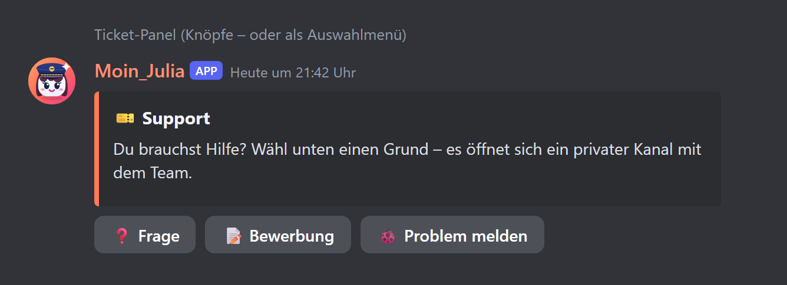
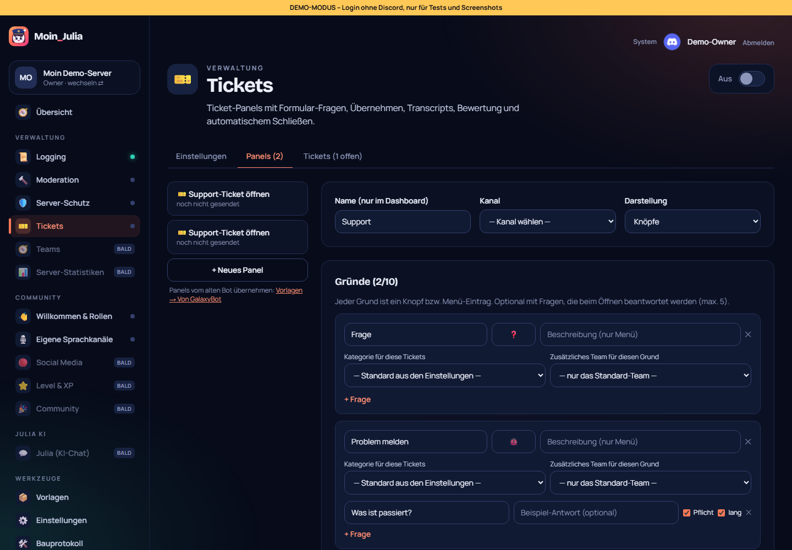
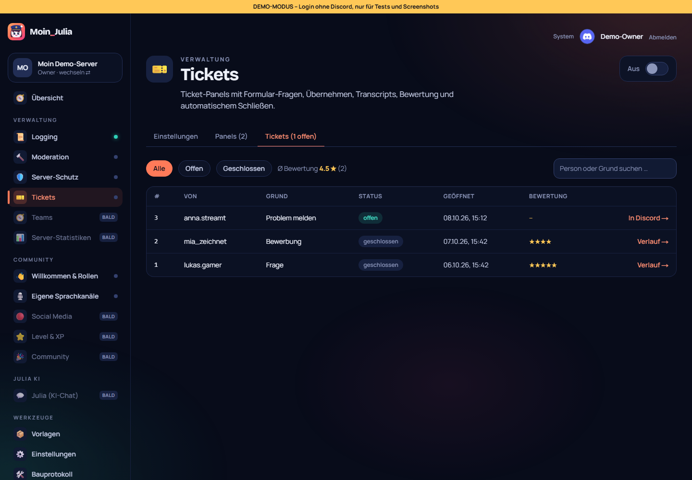

# 11 – Modul 5: Tickets

**Datum:** 08.10.2026 · **Version:** 0.11.0 · **Status:** gebaut und getestet

Ticket-System nach GalaxyBot-Vorbild, inklusive Übernahme der Ticket-Panels deines alten Bots.

## Ablauf in Discord
1. **Panel:** Eine Nachricht mit Knöpfen oder Auswahlmenü, ein Eintrag je **Grund** (z. B. Frage, Bewerbung, Problem melden).
2. **Optional Formular:** Bis zu 5 Fragen pro Grund (kurz oder lang, Pflicht oder optional). Die Antworten erscheinen im Ticket.
3. **Privater Kanal** `ticket-0042` (Vorlage mit `{nr}`/`{user}`):
   - **Wer ihn sieht:** nur die Person, das Team und der Bot.
   - **Wo er entsteht:** in der Kategorie aus den Einstellungen. Jeder Grund kann eine eigene Kategorie und ein zusätzliches Team haben.
   - **Was der Bot schreibt:** Begrüßung mit den Antworten, optional pingt er das Team.
4. **Knöpfe im Ticket:**
   - **Übernehmen:** nur fürs Team. Danach ist der Knopf gesperrt und alle sehen, wer sich kümmert.
   - **Schließen:** für Team und Person, mit optionalem Grund.
5. **Beim Schließen:**
   - Der Verlauf wird als **HTML-Transcript** gespeichert: Discord-Look, alle Inhalte escaped, keine Skripte.
   - Er geht in den **Log-Kanal** und optional **per DM** an die Person, dort mit einer **1–5-Sterne-Bewertung**.
   - Danach verschwindet der Kanal nach der eingestellten Wartezeit.
6. **Befehle:** `/ticket close [grund]`, `/ticket add @mitglied`, `/ticket remove @mitglied`.
7. **Weitere Regeln:**
   - **Limit:** höchstens N offene Tickets pro Person (Standard 1). Wer mehr will, bekommt einen Link zum offenen Ticket.
   - **Automatisch schließen:** bei Inaktivität nach X Stunden. Der Bot prüft das alle 10 Minuten.
   - **Von Hand gelöschte Ticket-Kanäle** gelten automatisch als geschlossen.

## Dashboard
- **Einstellungen:** Team-Rollen, Kategorie, Log-Kanal, Kanalname, Limit, Begrüßung, Transcript per DM, Bewertung, Lösch-Wartezeit, automatisch schließen.
- **Panels:** Editor mit Gründen (Emoji, Beschreibung, Kategorie, Team) und Fragen, Live-Vorschau mit den Knöpfen, „In Discord senden/aktualisieren“.
- **Tickets:** Liste mit Filter (alle/offen/geschlossen), Suche, Ø-Bewertung. Geschlossene Tickets öffnen den **Verlauf** in einem abgeschotteten Rahmen (`sandbox`, keine Skripte). Offene Tickets springen direkt in Discord.
- **Vom alten Bot übernehmen:** Unter Vorlagen → „Von GalaxyBot“ macht der Knopf **„Als Ticket-Panel übernehmen“** aus einem gefundenen Panel ein Ticket-Panel. Die Auswahl-Optionen werden zu Gründen, GalaxyBot-Platzhalter werden umgewandelt.

## Technik
- Neue Tabellen `TicketPanel` und `Ticket`, dazu `Guild.ticketCounter` für die fortlaufende Nummer. Die Migration ist idempotent.
- Der Bot-Kern leitet jetzt auch **Knöpfe in Direktnachrichten** an Module weiter (für die Bewertung).
- Kategorien (📁) stehen in den Kanal-Listen. Die Discord-Vorschau im Dashboard zeigt jetzt Kapitänin Julia als Absenderin.

## Wie getestet

| Test | Ergebnis |
|---|---|
| Logik: Team (Rolle, Grund-Team, Server verwalten), Limit, automatisch schließen, Formular-Antworten, Sterne, Kanalname (Umlaute, Sonderzeichen), Panel-Knöpfe/Menü, **Transcript gegen eingeschleusten Code** | ✓ 5/5 |
| Ablauf mit nachgebautem Server: öffnen → privater Kanal mit richtigen Rechten + Begrüßung + Log; Grund mit Fragen → erst Formular; Limit; schließen → Transcript, Log mit Datei, DM, Kanal gelöscht; Bewertung nur von der Person | ✓ 4/4 |
| Klick-Test: Einstellungen (bleiben direkt stehen), Panel mit 3 Gründen + Frage, senden, löschen, Liste, Filter, Verlauf im Sandbox-Rahmen, Übernahme vom alten Bot | ✓ 11 neue (gesamt 76/76) |
| Regression: Bot 112, Shared 26, DB 4, Einrichtung, Admin-Übernahme, Update-Simulation 27/27, Handy-Breite 390 px | ✓ |

## Bekannte Grenzen
- Ticket-Panels sind noch nicht Teil der Vorlagen (Export/Import), steht in IDEEN.md.
- Ein Voice-Warteraum (GalaxyBot „Support“) ist ein eigenes Modul und kommt später.
