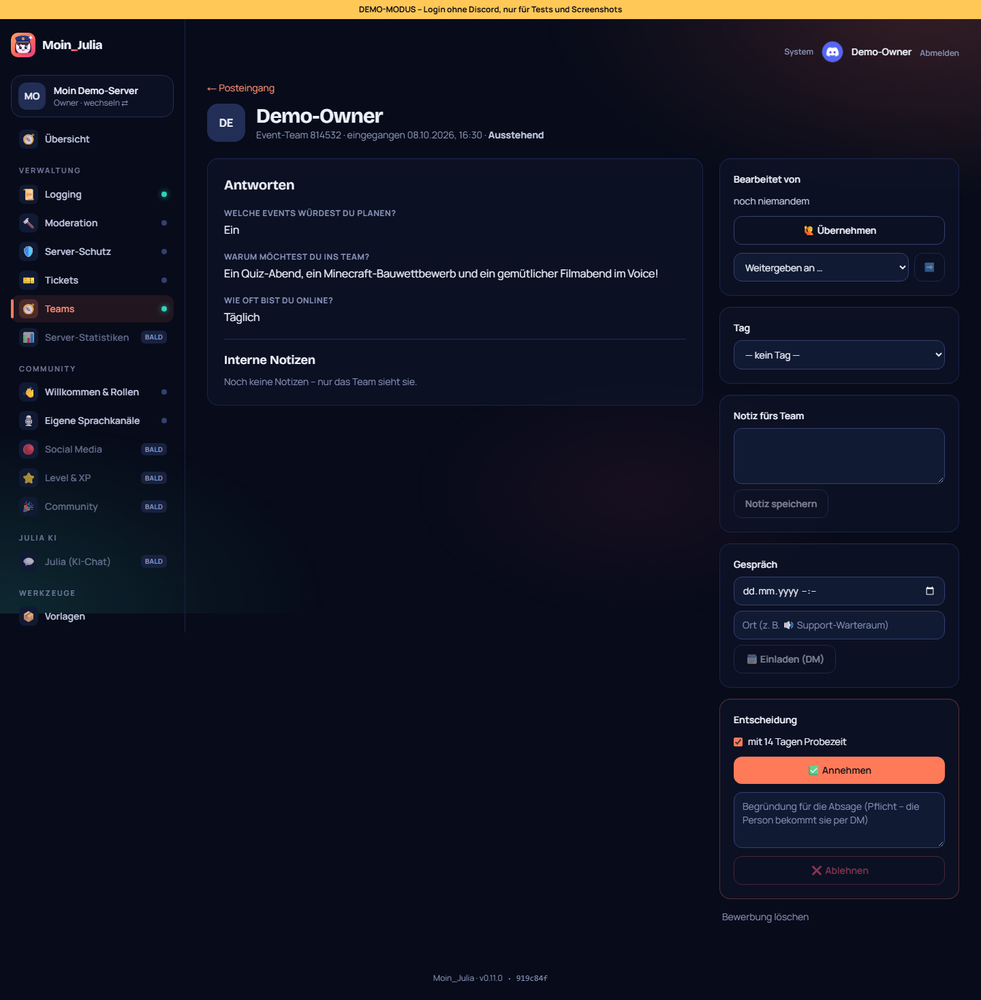
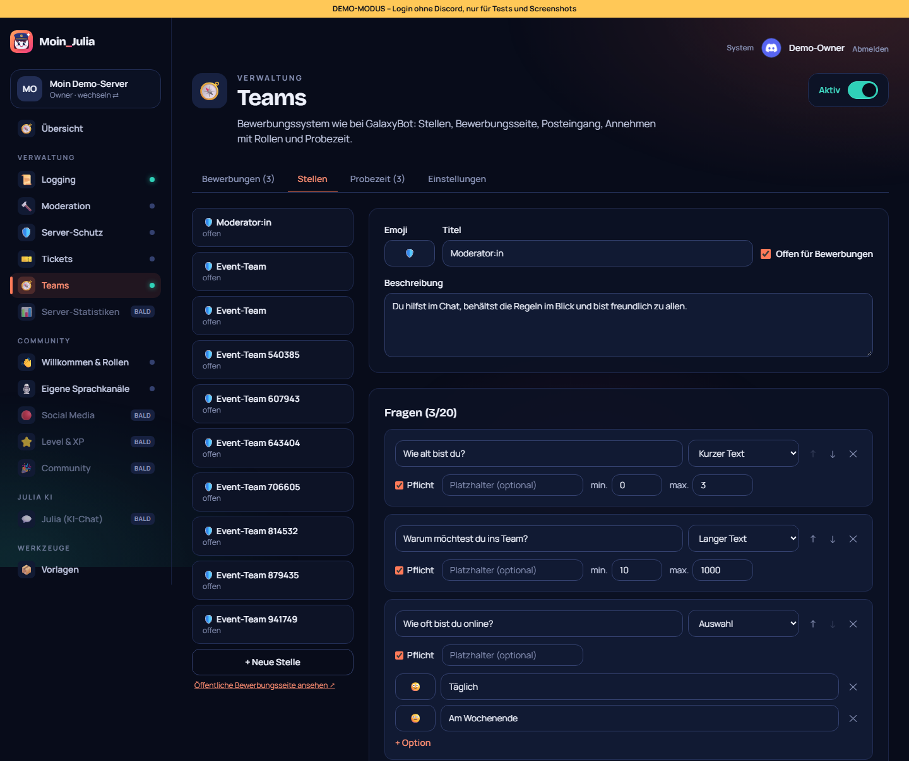
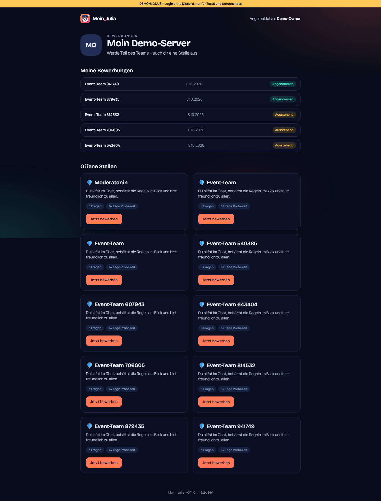
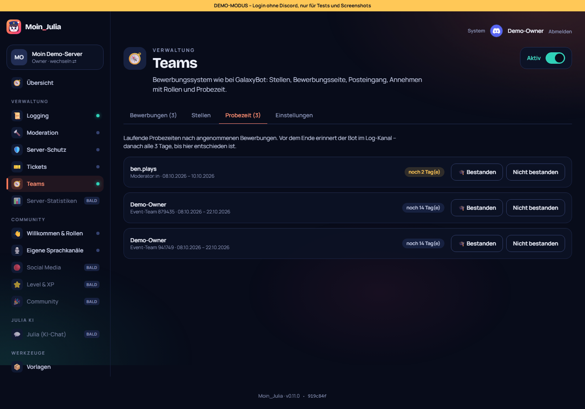

# 12 – Modul 6: Teams (Bewerbungssystem)

**Datum:** 08.10.2026 · **Version:** 0.12.0 · **Status:** gebaut und getestet

Bewerbungssystem nach GalaxyBot-Vorbild (Wunsch von Philip: „auch das Bewerbungssystem … so ähnlich“). Leute bewerben sich über eine **öffentliche Seite im Dashboard**, das Team bearbeitet die Bewerbungen im **Posteingang**, der Bot kümmert sich um Rollen, DMs und Erinnerungen.

## Ablauf
1. **Stellen anlegen** (Teams → Stellen):
   - **Inhalt:** Titel, Emoji, Beschreibung, offen/geschlossen.
   - **Fragen:** bis zu 20, als Kurztext, Langtext, Auswahl oder Bild-Upload. Jede Frage kann Pflicht sein und eine Mindest- und Höchstlänge haben.
   - **Bei Annahme:** Rollen **geben und entziehen**.
   - **Regeln:** Probezeit (Tage), Wartezeit nach einer Absage, Mindestalter von Account und Mitgliedschaft.
2. **Bewerben:**
   - **Wo:** auf `/bewerben/<server>`, Anmeldung mit Discord. Nach der Anmeldung geht es direkt zurück zur Stelle.
   - **Was die Seite verhindert:** eine zweite offene Bewerbung, eine neue Bewerbung während der Wartezeit und zu junge Accounts oder Mitgliedschaften.
   - **„Meine Bewerbungen“** zeigt den Status.
   - **In Discord:** Das **Panel** in Discord führt mit einem Knopf auf die Seite.
3. **Bot:** postet jede neue Bewerbung in den Log-Kanal und schickt der Person eine Eingangsbestätigung per DM.
4. **Posteingang (Dashboard):**
   - **Ansicht:** Reiter Ausstehend, Angenommen und Abgelehnt, 30 pro Seite.
   - **Bearbeiten:** Übernehmen oder an Prüfer:innen weitergeben, Tags (Geeignet, Ungeeignet, Überqualifiziert, Reserve), interne Notizen.
   - **Gesprächseinladung:** mit Zeit und Ort. Die Person bekommt sie per DM und sagt dort per Knopf zu oder ab.
   - **Annehmen:** Rollen werden gegeben und entzogen, optional mit Probezeit und Probe-Rolle. Die Person bekommt eine DM.
   - **Ablehnen:** nur mit Begründung, die per DM rausgeht.
   - **Löschen:** nur für Admins.
5. **Probezeit:**
   - **Erinnerung:** Der Bot erinnert im Log-Kanal N Tage vor dem Ende und danach alle 3 Tage.
   - **Entscheidung:** Auf der Probezeit-Seite: „Bestanden“ nimmt die Probe-Rolle weg, „Nicht bestanden“ entzieht die Stellen-Rollen.
6. **Prüfer-Rollen:** Diese Rollen dürfen Bewerbungen bearbeiten, auch ohne Admin-Rechte. Sie zählen dafür als Moderator:innen im Dashboard.

## Technik
- **Neue Tabellen:** `JobPosition`, `Application` und `Probation`. Die Migration ist idempotent.
- **Formular-Baustein:** Der Baustein (`forms.ts`, aus dem abgebrochenen Ticket-Umbau) prüft die Antworten auf der Webseite und im Bot gleich.
- **Bilder:** Bewerber:innen laden Bilder über eine eigene Route hoch, höchstens 20 pro Tag. Nur die eigenen Uploads können in eine Bewerbung.
- **Weg vom Dashboard zum Bot:** Das Dashboard sagt dem Bot per Modul-Aktion Bescheid (`new`, `accept`, `reject`, `interview`, `probation-*`, `panel`).

## Unterwegs gefunden und behoben
- **Erfolgsmeldung verschwand:** Nach dem Abschicken lud die Seite neu und zeigte sofort „schon beworben“, die Erfolgsmeldung sah man nie. Behoben.

## Wie getestet

| Test | Ergebnis |
|---|---|
| Logik: Sperrgründe (doppelt, Wartezeit, Account-/Mitgliedsalter), Antwortprüfung (Pflicht, Längen, Auswahl), Platzhalter, Erinnerungs-Zeitpunkte | ✓ 7 + 4 neu |
| Klick-Test: Modul an, Einstellungen (Log, Prüfer-Rolle bleibt stehen), Stelle anlegen, öffentliche Seite, bewerben, zweite Bewerbung gesperrt, „Meine Bewerbungen“, Übernehmen, Tag, Notiz, Gesprächseinladung, Annehmen mit Probezeit, Ablehnen nur mit Begründung, Probezeit-Übersicht | ✓ 13 neu (gesamt 89/89) |
| Regression: Bot 116, Shared 33, DB 4, Update-Simulation 27/27, Handy-Breite 390 px ohne seitliches Scrollen | ✓ |

## Bekannte Grenzen
- Das Mitgliedsalter wird beim Bewerben über Discord geprüft. Ist der Bot gerade nicht erreichbar, gilt die Prüfung als bestanden.
- Die Gesprächseinladung legt keinen Discord-Termin (Event) an, sie ist nur eine DM mit Zusage/Absage.
