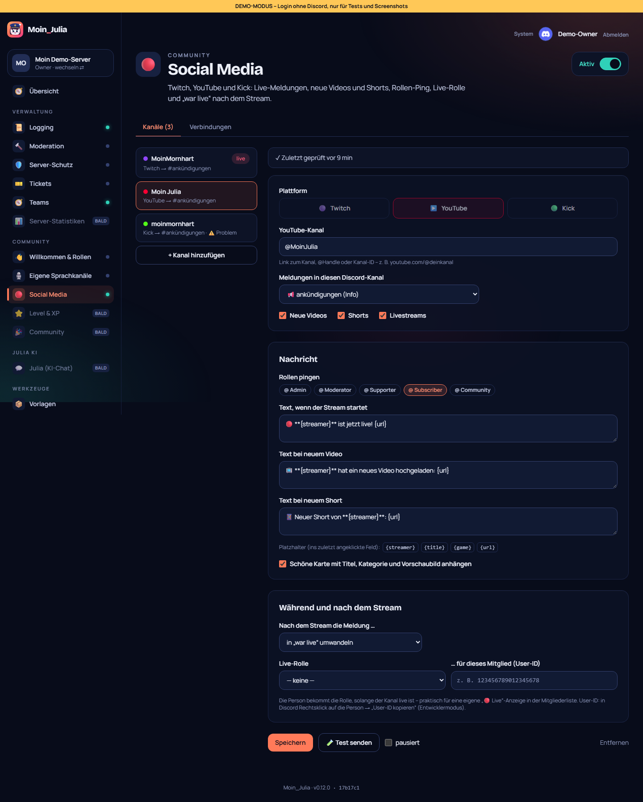
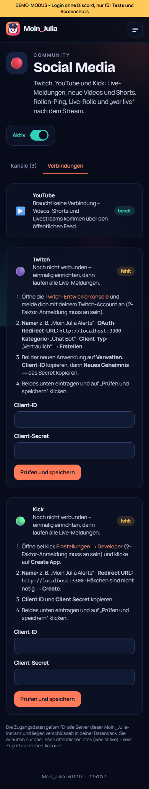

# 13 – Modul 7: Social Media (Live-Alerts)

**Datum:** 08.10.2026 · **Version:** 0.13.0 · **Status:** gebaut und getestet

Live-Meldungen und neue Videos wie bei GalaxyBot: Geht ein Kanal auf **Twitch** oder **Kick** live oder lädt jemand auf **YouTube** ein Video, einen Short oder einen Livestream hoch, meldet Moin_Julia das im Discord.

## Was es kann
- **Kanäle:** bis zu 50 pro Server. Jeder Kanal hat einen eigenen Discord-Zielkanal, Rollen-Ping, einen eigenen Text mit Platzhaltern (`{streamer}` `{title}` `{game}` `{url}`) und optional eine Karte mit Titel, Kategorie, Zuschauerzahl und Vorschaubild.
- **Eingabe:** Name, Link oder `@Handle` reichen. Das Dashboard schlägt den Kanal nach und zeigt den echten Namen.
- **YouTube ohne Schlüssel:**
  - **Neue Videos:** kommen über den öffentlichen RSS-Feed, der alle 5 Minuten abgefragt wird.
  - **Shorts:** werden erkannt (eigener Text).
  - **Livestreams:** werden während des Streams alle 2 Minuten geprüft.
  - **Beim ersten Abruf:** Moin_Julia merkt sich die vorhandenen Videos nur und meldet sie nicht, damit keine Flut alter Videos kommt.
- **Twitch und Kick:**
  - **Abfrage:** jede Minute, gebündelt für alle Kanäle.
  - **Einrichtung:** einmalig unter **Verbindungen**, mit Schritt-für-Schritt-Anleitung und Live-Prüfung der Zugangsdaten. Das darf nur der Instanz-Admin.
  - **Ablage:** Die Zugangsdaten liegen verschlüsselt in der DB und gelten für alle Server.
- **Nach dem Stream:** Die Meldung wird **in „war live“ umgewandelt** (mit Dauer), gelöscht oder bleibt stehen.
- **Live-Rolle:** Eine gewählte Person bekommt die Rolle, solange ihr Kanal live ist.
- **Bedienung im Dashboard:**
  - **Test senden:** zeigt die Meldung im echten Kanal, ohne jemanden zu pingen.
  - **Pausieren:** schaltet einen einzelnen Kanal vorübergehend stumm.
  - **Status:** Jeder Kanal zeigt „zuletzt geprüft“ bzw. das Problem in Klartext, z. B. „Twitch ist noch nicht verbunden“.

## Technik
- **Neue Tabelle:** `SocialFeed` (Einstellungen + Zustand des Bots). Die Migration ist idempotent.
- **Neue Einstellungen:** `kickClientId`/`kickClientSecret`.
- **Bot fragt nur ab:** Er braucht keinen offenen Port und keine Webhooks.
- **Fehlertoleranz:** Schlägt eine Abfrage fehl, gilt das **nicht** als „offline“. Ein laufender Stream wird also nicht fälschlich beendet.

## Wie getestet

| Test | Ergebnis |
|---|---|
| Logik: Eingaben erkennen (Twitch/Kick-Links, YouTube-Handle, Kanal-ID, Video-Link), Kanal-ID im HTML, RSS lesen, nur neue Videos (erster Lauf still, älteste zuerst), Live-Entscheidung, Dauer, Vorschaubild | ✓ 15 neu |
| Plattform-Abfragen gegen nachgebaute APIs: Twitch (Token einmal, gebündelt, Profilbilder, falsche Zugangsdaten), Kick (nur laufende Streams) | ✓ 3 |
| Ablauf im Bot mit nachgebautem Server: live → Meldung mit Ping + Live-Rolle → keine Doppelmeldung → Ende → „war live“ + Rolle weg; Abfragefehler beendet nichts; ohne Verbindung klarer Hinweis; YouTube erst still, dann Short + Video mit eigenen Texten; Test-Meldung ohne Pings | ✓ 5 |
| Echter Abruf bei YouTube von hier: @Handle → Kanal-ID, RSS mit 15 Videos, Shorts-Erkennung (200 vs. 303) | ✓ |
| Klick-Test: Modul an, Liste mit Live-Anzeige, ungültiger Name abgelehnt, YouTube per @Handle angelegt, Zielkanal bleibt stehen, Test senden, entfernen, Twitch verbinden (Secret nie im Klartext), Verbindung entfernen | ✓ 10 neu (gesamt 99/99) |
| Regression: Bot 130, Shared 39, DB 4, Einrichtung, Admin-Übernahme, Update-Simulation 27/27, Handy-Breite 390 px | ✓ |

## Bekannte Grenzen
- **Twitch und Kick sind nicht live getestet:** Dafür fehlen hier Zugangsdaten, getestet ist gegen nachgebaute APIs. Bei Kick ist die offizielle API noch jung, die Feldnamen stammen aus der Doku. Falls nach dem Verbinden etwas nicht klappt, steht der Fehler direkt am Kanal.
- **YouTube-Livestreams und Shorts:** Die Erkennung nutzt die öffentlichen YouTube-Seiten, nicht die offizielle API. Ändert YouTube dort etwas, kommen Livestreams eventuell als normales Video.
- **Verzögerung:** Meldungen kommen mit bis zu 1 Minute (Twitch/Kick) bzw. 5 Minuten (YouTube) Verzögerung. Schneller per Webhook steht in IDEEN.md.
- **Vorlagen:** Kanäle sind noch nicht Teil von Export/Import.
