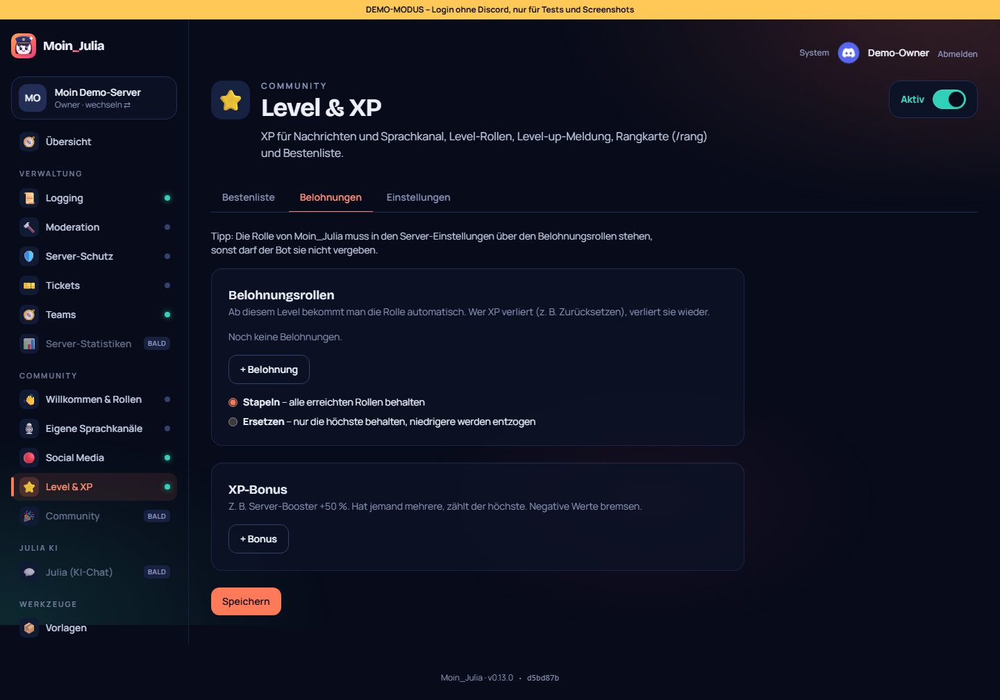
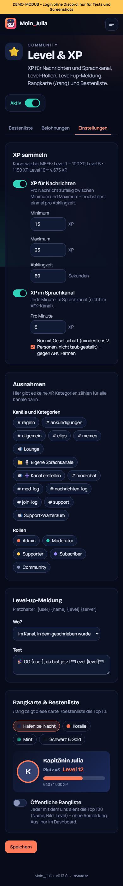

# 14 – Modul 8: Level & XP

**Datum:** 08.10.2026 · **Version:** 0.14.0 · **Status:** gebaut und getestet

Level-System wie bei MEE6 und GalaxyBot: Schreiben und Reden bringen XP, mit genug XP steigt man auf, gibt es Belohnungsrollen und landet auf der Bestenliste.

## Was es kann
- **XP für Nachrichten:**
  - **Menge:** pro Nachricht zufällig zwischen Minimum und Maximum (Standard 15–25).
  - **Abklingzeit:** höchstens einmal in der eingestellten Zeit (Standard 60 Sekunden), damit Spam nichts bringt.
- **XP im Sprachkanal:**
  - **Menge:** pro Minute (Standard 5).
  - **Gegen AFK-Farmen:** Es zählt nur, wer mindestens eine weitere Person im Kanal hat und nicht taub gestellt ist. Den AFK-Kanal gibt es nie.
- **Kurve:** wie bei MEE6. Level 1 kostet 100 XP, Level 5 ≈ 1.150 XP, Level 10 ≈ 4.675 XP.
- **Ausnahmen:** Kanäle, Kategorien (gelten für alle Kanäle darin) und Rollen ohne XP.
- **XP-Bonus für Rollen:** z. B. Booster +50 %. Hat jemand mehrere Bonus-Rollen, zählt der höchste. Negative Werte bremsen.
- **Belohnungsrollen** ab einem Level, in zwei Varianten:
  - **Stapeln:** Man behält alle erreichten Rollen.
  - **Ersetzen:** Man behält nur die höchste, niedrigere werden **entzogen**.
  - **Bei Änderungen:** Nach dem Speichern gleicht der Bot die Rollen bei allen ab.
- **Level-up-Meldung:**
  - **Wo:** im selben Kanal, in einem festen Kanal, per DM oder gar nicht.
  - **Text:** frei, mit Platzhaltern `{user}` `{name}` `{level}` `{server}`.
- **Befehle:**
  - `/rang [mitglied]`: Rangkarte als Bild (4 Farbstile wie beim Willkommensbild).
  - `/bestenliste`: Top 10. Auf Englisch heißen die Befehle `/rank` und `/leaderboard`.
- **Dashboard:**
  - **Bestenliste:** mit Suche (zeigt den echten Platz), Seiten zu je 50 und Kennzahlen.
  - **Verwalten:** „XP ändern“ pro Mitglied, z. B. zum Übernehmen vom alten Bot. „Alle XP zurücksetzen“ verlangt das Bestätigungswort.
- **Öffentliche Rangliste** unter `/rangliste/<server>`:
  - **Nur auf Wunsch:** standardmäßig aus.
  - **Inhalt:** nur Name, Bild, Level und XP der Top 100.
  - **Wenn aus:** Die Seite ist ganz verborgen (404).

## Technik
- **Neue Tabelle:** `MemberXp` (XP, Level, Nachrichten, Sprachminuten). Die Migration ist idempotent.
- **XP gutschreiben:** Das geschieht per `upsert` mit `increment`, damit gleichzeitige Nachrichten keine XP verschlucken.
- **Abklingzeit:** Sie liegt im Arbeitsspeicher, das spart einen DB-Zugriff pro Nachricht.
- **Rangkarte:** Sie nutzt Schriften und Farben des Willkommensbilds (`@napi-rs/canvas`).
- **Rollen:** Der Bot vergibt und entzieht nur Rollen, die er auch verwalten darf. Rollen über seiner eigenen werden übersprungen.

## Wie getestet

| Test | Ergebnis |
|---|---|
| Logik: Kurve, Level aus XP, Belohnungen stapeln/ersetzen, Bonus, Platzhalter, Abklingzeit, Ausnahmen, Voice-Regeln (allein, taub, AFK, Bots), Zufalls-XP | ✓ 6 + 3 neu |
| Ablauf im Bot mit nachgebautem Server: Aufstieg → Meldung im festen Kanal → Rolle; zweiter Aufstieg ersetzt die Rolle; DM-Modus; Voice-Runde nur mit Gesellschaft; Rangkarte als PNG | ✓ 4 neu |
| Klick-Test: Modul an, Bestenliste, Suche mit echtem Platz, XP setzen, Belohnung anlegen + entfernen, „fester Kanal“ ohne Kanal abgelehnt, Kanal bleibt gespeichert, öffentliche Rangliste an (ohne Anmeldung erreichbar) und aus (404) | ✓ 8 neu (gesamt 107/107, zweimal hintereinander) |
| Regression: Bot 137, Shared 45, DB 4, Einrichtung, Admin-Übernahme, Update-Simulation 27/27, Handy-Breite 390 px | ✓ |

## Unterwegs repariert
- **Smoke-Test:** Er lief nach vielen Wiederholungen nicht mehr durch, weil alle Demo-Bewerbungen abgelehnt waren. Jetzt liegt immer eine offene bereit.
- **Einrichtungs-Test:** Er stolperte über das Wort „Twitch“ im (versteckten) Änderungsverlauf. Er prüft jetzt gezielt, dass es keine Schlüssel-Felder gibt.

## Bekannte Grenzen
- **XP-Übernahme:** XP von MEE6/GalaxyBot lassen sich nicht automatisch übernehmen, die Bots bieten keine Schnittstelle. Einzelne Werte gehen über „XP ändern“.
- **Ausgetretene Mitglieder:** Sie bleiben in der Bestenliste, bis „Alle XP zurücksetzen“ genutzt wird.
