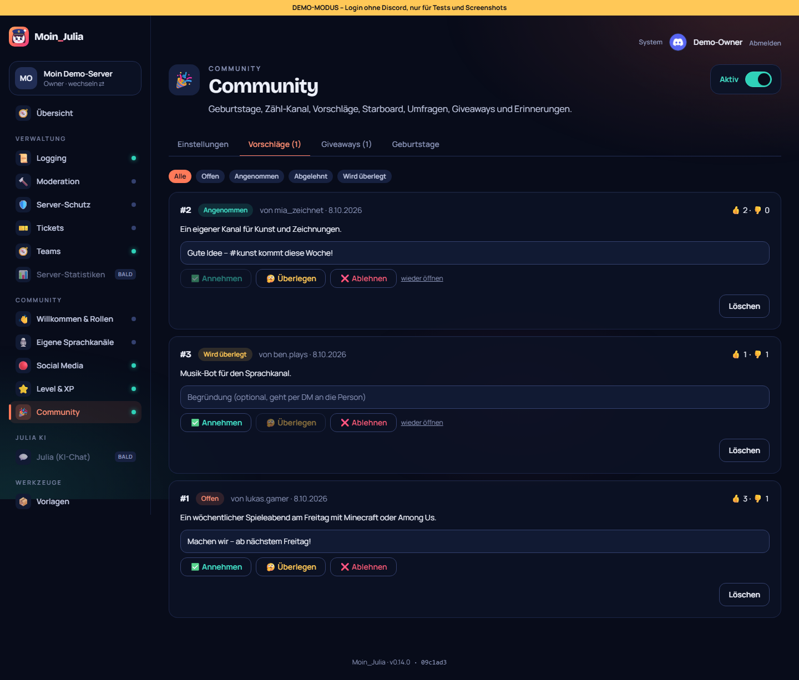
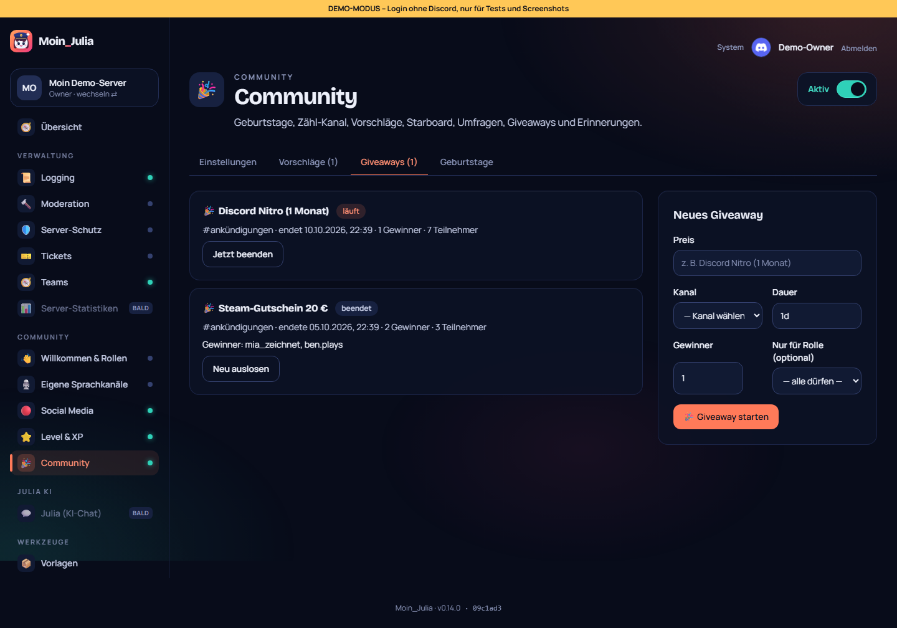
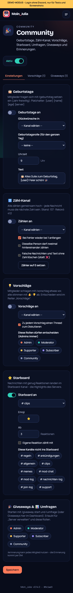

# 15 – Modul 9: Community

**Datum:** 08.10.2026 · **Version:** 0.15.0 · **Status:** gebaut und getestet

Sieben Community-Funktionen in einem Modul. Jede lässt sich einzeln einschalten.

## Funktionen
- **🎂 Geburtstage:**
  - **Eintragen:** `/geburtstag setzen tag monat [jahr]`, dazu `anzeigen` und `entfernen`.
  - **Glückwunsch:** Moin_Julia gratuliert zur eingestellten Uhrzeit (deutsche Zeit) im gewählten Kanal, einmal pro Jahr.
  - **Rolle:** optional eine Geburtstagsrolle für den ganzen Tag, die am nächsten Tag automatisch wieder entfernt wird.
  - **29. Februar:** wird in Nicht-Schaltjahren am 28. gefeiert.
  - **Datenschutz:** Das Geburtsjahr ist freiwillig (nur für `{age}`) und wird **anderen nie gezeigt**, weder in Discord noch im Dashboard.
- **🔢 Zähl-Kanal:**
  - **Regeln:** Alle zählen gemeinsam hoch, jede Nachricht muss die nächste Zahl sein. Richtig gibt ✅, jede Hunderter-Marke 💯.
  - **Fehler:** ❌ mit Hinweis, wer sich verzählt hat. Wahlweise geht es wieder bei 1 los. Zweimal hintereinander zählen ist abschaltbar. Falsche Nachrichten können gelöscht werden.
  - **Rekord:** wird gespeichert und im Dashboard gezeigt.
- **💡 Vorschläge:**
  - **Einreichen:** `/vorschlag text` postet eine Karte mit 👍/👎-Knöpfen. Nochmal klicken nimmt die Stimme zurück, die Seite wechseln geht auch. Optional entsteht ein Thread zum Diskutieren.
  - **Entscheiden:** im Dashboard (Annehmen, Überlegen, Ablehnen, wieder öffnen) mit Begründung.
  - **Danach:** Die Karte in Discord ändert Farbe und Status, die Person bekommt eine DM. Entscheiden dürfen Admins und eigene Team-Rollen.
- **⭐ Starboard:**
  - **Ablauf:** Ab N Reaktionen mit dem gewählten Emoji (auch eigene Server-Emojis) landet die Nachricht im Starboard-Kanal, mit Bild und „Zur Nachricht“-Knopf.
  - **Zahl aktuell:** Die Zahl wird nachgeführt. Fällt sie unter die Schwelle, verschwindet der Eintrag wieder.
  - **Regeln:** Eigene Reaktionen und Bots zählen nicht (eigene ist einschaltbar). Einzelne Kanäle lassen sich ausnehmen.
- **🎉 Giveaways:**
  - **Starten:** `/giveaway start preis dauer [gewinner] [rolle]` oder direkt im Dashboard.
  - **Teilnehmen:** per Knopf (nochmal klicken = austreten), optional nur mit bestimmter Rolle.
  - **Ende:** Gewinner werden automatisch und fair gezogen. `/giveaway beenden` und `/giveaway neu-auslosen` ziehen nie dieselben Gewinner erneut.
- **📊 Umfragen:** `/umfrage frage antworten [stunden] [mehrfach]` nutzt **Discords eigene Umfragen**. Discord zählt also selbst, und alle kennen die Bedienung.
- **⏰ Erinnerungen:** `/erinnerung wann text` (z. B. `2h`, `1d`) für alle Mitglieder. Die Erinnerung kommt per DM, höchstens 25 offene pro Person.

Giveaways und Umfragen dürfen Personen mit „Server verwalten“ und die eingestellten Manager-Rollen starten.

## Technik
- **Neue Tabellen:** `Birthday`, `CountingState`, `Suggestion`, `StarboardEntry`, `Giveaway`, `Reminder`, dazu `Guild.suggestionCounter`. Die Migration ist idempotent.
- **Neuer Intent:** `GuildMessageReactions` (nicht privilegiert, im Developer Portal ist nichts nötig) plus `Partials.Reaction`, damit auch Reaktionen auf ältere Nachrichten ankommen.
- **Gleichzeitigkeit:**
  - **Giveaway-Teilnahme:** wird **atomar** in der Datenbank umgeschaltet, gleichzeitige Klicks verlieren also niemanden.
  - **Beenden und Erinnerungen:** sind gegen doppelte Ausführung gesichert.
  - **Starboard:** legt den Eintrag zuerst an, damit zwei schnelle Reaktionen nicht doppelt posten.
- **Hintergrund-Runden:** Giveaways und Erinnerungen alle 30 Sekunden, Geburtstage alle 15 Minuten.

## Wie getestet

| Test | Ergebnis |
|---|---|
| Logik: Datumsprüfung (31.4., 29.2. mit/ohne Schaltjahr), Geburtstag heute, Tage bis zum Geburtstag, deutsche Zeitzone über Mitternacht, Zahlen lesen, Zählregeln, Gewinner ziehen, Stimmen zählen | ✓ 9 neu |
| Ablauf im Bot mit nachgebautem Server: Zählen (richtig, 💯, falsch → Neustart, doppelt, Text ohne Zahl), Geburtstag (zu früh, Glückwunsch mit Alter + Rolle, nicht doppelt, Rolle am Folgetag weg), Giveaway (nur einmal beenden, reroll ohne alte Gewinner), Umfrage-Antworten, Starboard-Emoji + Zählung, Erinnerung genau einmal | ✓ 9 neu |
| Klick-Test: Modul an, Zähl-Stand, Starboard ohne Kanal abgelehnt + Einstellungen bleiben, Vorschlag annehmen mit Begründung + Filter + wieder öffnen, Giveaway ohne Kanal / mit falscher Dauer abgelehnt + starten, Geburtstage heute oben, **Geburtsjahr erscheint nicht** | ✓ 11 neu (gesamt 118/118, zweimal hintereinander) |
| Regression: Bot 146, Shared 54, DB 4, Einrichtung, Admin-Übernahme, Update-Simulation 27/27, Handy-Breite 390 px | ✓ |

## Unterwegs gefunden
- **🏆 beim Zählen:** Die Rekord-Anzeige kam bei *jeder* Zahl über dem alten Rekord. Jetzt gibt es 💯 an jeder Hunderter-Marke.
- **Giveaway-Gewinner im Dashboard:** standen als Zahlen-IDs da. Jetzt stehen Namen dort, soweit bekannt.
- **Zufällig fehlschlagender Test:** Ein alter Test scheiterte gelegentlich an langsamem Laden. Er hat jetzt 30 s Zeit.

## Bekannte Grenzen
- **Giveaway-Teilnahme:** `/giveaway` erkennt keine Bots oder Zweit-Accounts.
- **Erinnerungen:** kommen nur, wenn die Person DMs vom Server erlaubt.
