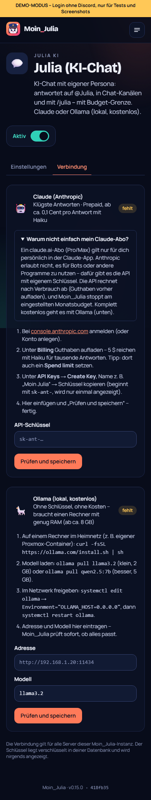

# 16 – Modul 10: Julia-KI (Basis)

**Datum:** 08.10.2026 · **Version:** 0.16.0 · **Status:** gebaut und getestet (ohne echten KI-Schlüssel, siehe unten)

Julia, die Kapitänin, kann jetzt im Discord mitreden.

## Was Julia kann
- **Wo sie antwortet:**
  - auf **@Julia** und auf Antworten zu ihren Nachrichten, überall (abschaltbar)
  - in **Chat-Kanälen** auf jede Nachricht
  - auf **`/julia frage text`**
- **Kontext:** Julia liest die letzten N Nachrichten im Kanal mit (Standard 10), damit sie weiß, worum es geht.
- **Persona:** Sie ist im Dashboard frei editierbar, mit Knopf „Standard wiederherstellen“.
- **Feste Regeln davor**, die sich nicht ändern lassen: Discord-Richtlinien, keine Massen-Pings und Schutz gegen „vergiss alle Anweisungen“. Chat-Nachrichten gehen als „[Name]: Text“ an das Modell. Namen werden dabei bereinigt, damit niemand sich als System ausgeben kann.
- **Grenzen:**
  - Pause pro Person, Höchstzahl pro Stunde und Sperr-Rollen.
  - **Monatsbudget mit harter Grenze:** Warnung im Log-Kanal ab X % und bei 100 %, danach antwortet Julia bis zum Monatsende nicht mehr.
  - **Chat-Kanäle bei erreichter Grenze:** Julia schweigt still, statt jede Nachricht mit „Limit“ zu beantworten.
- **Verbrauchsanzeige:** Kosten diesen Monat, Budget-Balken, Tokens, Cache-Anteil und Verlauf der letzten Monate. Dazu `/julia status` für Leute mit „Server verwalten“.
- **Julia testen** direkt im Dashboard, inklusive Kostenanzeige.
- **Antworten:** Massen-Pings werden entschärft, lange Antworten auf höchstens 2 Nachrichten verteilt.

## Anbieter

| | Claude (Anthropic) | Ollama |
|---|---|---|
| Kosten | Prepaid nach Verbrauch. Haiku 4.5: ca. 0,1–0,3 Cent pro Antwort | kostenlos |
| Qualität | sehr gut (Haiku), besser (Sonnet 5.5), am besten (Opus 5.5) | je nach Modell (llama3.2, qwen2.5 …) |
| Einrichtung | API-Schlüssel von console.anthropic.com | Ollama auf einem Rechner im Heimnetz |

**Entscheidung ohne Rückfrage (von Philip zu bestätigen):** Philip wollte Claude „ohne Token-Ding“ verbinden. Das geht leider nicht: Ein claude.ai-Abo darf laut Anthropic nicht für Bots genutzt werden, Programme brauchen einen API-Schlüssel. Ich habe deshalb beides eingebaut:
- **Claude-Schlüssel:** mit Schritt-für-Schritt-Anleitung, Erklärung „Warum nicht mein Abo?“ und Live-Prüfung.
- **Ollama:** komplett ohne Schlüssel und Kosten.

Standardmodell ist **Claude Haiku 4.5** (günstig und schnell, wie in der Recherche festgelegt). Sonnet und Opus sind wählbar und laufen mit wenig Denkaufwand (`effort: low`), weil Chat keine langen Überlegungen braucht.

## Technik
- **Offizielles SDK:** `@anthropic-ai/sdk`.
- **Prompt-Caching:** Regeln + Persona stehen vorne und werden gecacht, der Chatverlauf kommt dahinter.
- **Kosten:** aus `usage` (Input, Output, Cache) pro Modell in Mikro-Dollar berechnet.
- **Ablehnungen:** `stop_reason: refusal` wird erkannt und freundlich beantwortet.
- **Ollama:** über `POST /api/chat`. `<think>`-Abschnitte mancher Modelle werden entfernt, fehlende Modelle mit Hinweis `ollama pull …` gemeldet.
- **Neue Tabelle:** `JuliaUsage` (pro Server und Monat), dazu die Einstellungen `ollamaUrl`/`ollamaModel`. Der Anthropic-Schlüssel liegt verschlüsselt in der DB.
- **Wer was darf:** Die Verbindung kann nur der Instanz-Admin ändern, die Einstellungen Owner und Admins des Servers.

## Wie getestet

| Test | Ergebnis |
|---|---|
| Logik: Kostenrechnung je Modell, Budget-Stufen, Monat in deutscher Zeit, Gesprächsverlauf (Rollen, Zusammenfassen, Start mit user, Namen ohne eingeschmuggelte Klammern), Massen-Pings, Aufteilen langer Antworten | ✓ 7 neu |
| Bot mit nachgebautem Anbieter: Antwort + Kosten gebucht, Budget aufgebraucht (Hinweis bzw. still), Warnung bei 80 % und 100 % genau einmal, danach gesperrt, Pause + Sperr-Rolle, ohne Schlüssel „nicht verbunden“, Ollama kostenlos | ✓ 6 neu |
| Anbieter: Claude-Aufruf mit Caching und `effort: low` nur bei Sonnet/Opus, Ablehnung erkannt; Ollama ohne `<think>`, fehlendes Modell, nicht erreichbar | ✓ 3 neu |
| Klick-Test: Modul an, Verbrauch + Budget, Julia testen, Modell/Budget/Persona bleiben gespeichert, Standard-Persona, Erklärung „Abo“, falscher Schlüssel abgelehnt, Ollama verbinden + entfernen | ✓ 7 neu (gesamt 125/125, zweimal hintereinander) |
| Regression: Bot 155, Shared 61, DB 4, Einrichtung, Admin-Übernahme, Update-Simulation 27/27, Handy-Breite 390 px | ✓ |

## Bekannte Grenzen
- **Nicht live getestet:** Mir liegt kein Claude-Schlüssel vor, und Tokens sollen ohnehin nie im Chat landen. Der Aufruf folgt der offiziellen SDK-Anleitung und ist gegen eine Attrappe getestet. Bitte nach dem Verbinden einmal „Julia testen“ drücken.
- **Kein Gedächtnis pro Person:** Julia erinnert sich nur an den sichtbaren Kanalverlauf. Gedächtnis und Persona-Modi (`modus <Name>`) kommen in Modul 11.
- **Ollama und Docker:** Der Bot-Container erreicht Ollama über die IP im Heimnetz, nicht über `localhost`.
