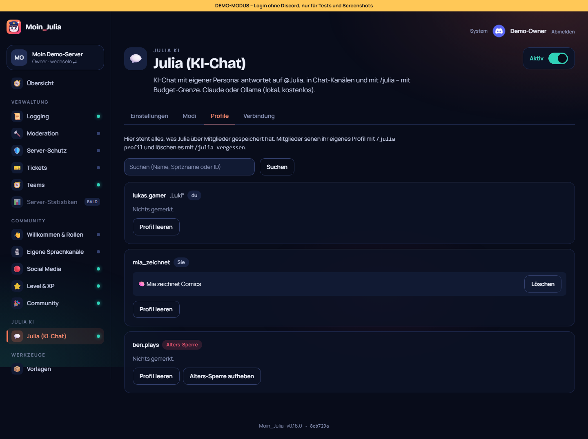

# 17 – Modul 11: Julia Persona, Modi & Profile

**Datum:** 08.10.2026 · **Version:** 0.17.0 · **Status:** gebaut und getestet

Julia bekommt mehrere Persönlichkeiten und ein Gedächtnis pro Person. Alles bleibt dabei einsehbar, löschbar und abgesichert.

## Modi (Wunsch von Philip)
- **Anlegen:** Im Dashboard unter Julia → **Modi** bekommt jeder Modus Name, Persona, Länge (kurz, mittel, ausführlich), Kreativität (sachlich, normal, verspielt) und optional ein eigenes Claude-Modell.
- **Umschalten im Chat:** `modus Seebär` (wenn Julia angesprochen ist) oder `/julia modus Seebär`. Das gilt **pro Kanal**, Threads erben vom Kanal. `modus Julia` geht zurück zum Standard.
- **Unbekannter Name:** Julia zeigt die Liste der Modi. `/julia modus` ohne Namen zeigt den aktuellen Modus.
- **Wer umschalten darf:** Admins („Server verwalten“) und freigegebene Rollen.
- **Was immer gilt:** Sicherheitsregeln, Flirt-Sperren und das Budget gelten in **jedem** Modus.
- **Wie gewünscht:** Es sind keine Beispiel-Modi eingebaut. „Julia“ und „Standard“ sind als Namen reserviert.
- **Löschen:** Wird ein Modus gelöscht, fallen Kanäle mit diesem Modus automatisch auf den Standard zurück. Im Dashboard siehst du, welcher Kanal gerade welchen Modus hat, und kannst ihn zurücksetzen.

## Profil pro Person
- `/julia spitzname`, `/julia anrede du|Sie|egal`.
- **Gedächtnis:**
  - **Wann Julia sich etwas merkt:** nur, wenn man sie **ausdrücklich bittet** („merk dir …“) oder mit `/julia merken`. Höchstens 20 Dinge pro Person, keine Passwörter, Adressen, Telefonnummern oder Gesundheitsdaten (Anweisung an das Modell).
  - **Speichern:** Julia setzt dafür eine unsichtbare Marke. Der Bot speichert sie, sie erscheint nie im Chat.
- `/julia profil` zeigt alles, `/julia vergessen` löscht alles.
- `/julia optout` heißt: Julia ignoriert die Person komplett. `/julia optin` macht das rückgängig.
- **Dashboard → Profile:** alle Profile mit Suche. Admins können einzelne Erinnerungen oder ganze Profile löschen.

## Flirt-Ton (aus der Recherche, mit allen Sicherungen)
- **Ton:** verspielt-charmant und **nie explizit**. Wird es anzüglich, lenkt Julia ab.
- **Wer entscheidet:** Ob geflirtet werden darf, entscheidet **der Bot-Code vor jeder Antwort**, nicht das Modell. Alle Punkte müssen erfüllt sein:
  1. **Freigabe:** im Dashboard eingeschaltet, mit gewählter 18+-Rolle.
  2. **Rolle:** Die Person hat diese Rolle.
  3. **Kanal:** Es ist ein **altersbeschränkter Kanal**. Seit 22.09.2026 sieht den nur, wer bei Discord als erwachsen verifiziert ist.
  4. **Opt-in:** Die Person hat mit `/julia flirty an alter:…` selbst zugestimmt.
  5. **Keine Alters-Sperre.**
- **Alters-Sperre:**
  - **Wodurch:** Wer bei `/julia flirty` ein Alter unter 18 angibt oder Julia im Chat etwas wie „ich bin 15“ schreibt, bekommt eine **dauerhafte Sperre**.
  - **Was bleibt:** `/julia vergessen` hebt sie nicht auf, nur der Instanz-Admin im Dashboard.
  - **Erkennung:** Die Texterkennung ignoriert Dinge wie „ich bin 15 Minuten zu spät“.

## Technik
- **Neue Tabellen:** `JuliaProfile` und `JuliaChannelMode`. Die Migration ist idempotent.
- **System-Prompt in zwei Teilen:**
  - **Fester Teil:** Regeln + Modus, wird gecacht.
  - **Teil pro Person:** Profil, Gedächtnis, Flirt-Freigabe. So bleibt Prompt-Caching wirksam, obwohl jede Person andere Infos mitbringt.
- **Namen und Spitznamen:** Klammern und Anführungszeichen werden entfernt, damit sich niemand über den eigenen Namen Anweisungen ins Prompt schmuggelt.

## Wie getestet

| Test | Ergebnis |
|---|---|
| Logik: Modi finden (inkl. Standard), „modus Name“ erkennen, Altersangaben (15, „erst 13“, „16 jahre alt“, „I'm 14“ – aber nicht „15 Minuten“, „2 Stunden“, „3 Tage“, „Level 15“), Flirt nur wenn alles passt, Gedächtnis-Marken, System-Prompt mit Profil/Flirt/ohne Gedächtnis | ✓ 6 neu |
| Bot mit nachgebautem Anbieter: Opt-out → still, Kanal-Modus (Persona + Modell), Gedächtnis speichern + Spitzname im Prompt, Gedächtnis aus, Flirt nur mit Rolle + NSFW + Opt-in, „ich bin 15“ sperrt dauerhaft | ✓ 5 neu |
| Klick-Test: Flirt ohne 18+-Rolle abgelehnt, Modus „Julia“ reserviert, Modus anlegen + löschen, Profile mit Spitzname/Gemerktem/Alters-Sperre, Erinnerung löschen | ✓ 6 neu (gesamt 131/131, zweimal hintereinander) |
| Regression: Bot 160, Shared 67, DB 4, Einrichtung, Admin-Übernahme, Update-Simulation 27/27, Handy-Breite 390 px | ✓ |

## Bekannte Grenzen
- **Altersangaben:** Die Erkennung im Chat ist eine Textregel und fängt nicht jede Formulierung. Die eigentliche Sicherung sind Rolle + altersbeschränkter Kanal + Opt-in.
- **Gedächtnis:** gilt pro Server, nicht serverübergreifend (Datensparsamkeit).
