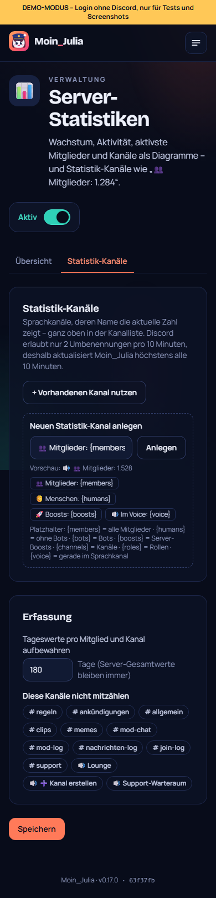

# 18 – Modul 12: Server-Statistiken

**Datum:** 08.10.2026 · **Version:** 0.18.0 · **Status:** gebaut und getestet

Wie läuft der Server? Moin_Julia zählt mit und zeigt es als Diagramme.

## Was es kann
- **Zeitraum:** 7, 30 oder 90 Tage.
- **Kennzahlen:**
  - **Mitglieder:** aktuell, mit Zuwachs im Zeitraum.
  - **Beitritte − Austritte.**
  - **Nachrichten und Sprachstunden:** jeweils mit Vergleich zum Zeitraum davor.
- **Diagramme:** Mitgliederzahl (Linie), Nachrichten pro Tag, Beitritte & Austritte, Sprachminuten pro Tag. Beim Drüberfahren zeigt jeder Wert die genaue Zahl.
- **Aktivste Mitglieder** (Nachrichten + Sprachstunden) und **aktivste Kanäle** (Threads zählen zum Kanal).
- **Statistik-Kanäle:**
  - **Was:** Sprachkanäle ganz oben, deren Name die aktuelle Zahl zeigt, z. B. „👥 Mitglieder: 1.284“.
  - **Platzhalter:** `{members}` `{humans}` `{bots}` `{boosts}` `{channels}` `{roles}` `{voice}`.
  - **Einrichten:** Einen neuen Kanal legst du mit einem Klick an (niemand kann beitreten), oder du nutzt einen vorhandenen. Eine Live-Vorschau zeigt den fertigen Namen.
- **Einstellungen:** einzelne Kanäle nicht mitzählen, Aufbewahrung der Tageswerte pro Mitglied/Kanal (Standard 180 Tage).

## Technik
- **Zählen im Speicher:**
  - **Speichern:** Die Zähler werden **einmal pro Minute gebündelt gespeichert**, also ein Eintrag pro Server, Kanal und Mitglied statt einer DB-Anfrage pro Nachricht.
  - **Mitgliederzahl:** Sie wird auch an Tagen ohne Aktivität festgehalten.
- **Sprachminuten:** Gezählt werden nur Menschen, nicht im AFK-Kanal und nicht in ignorierten Kanälen.
- **Statistik-Kanäle:** Umbenannt wird höchstens alle 10 Minuten und nur, wenn sich der Name ändert. Discord erlaubt 2 Umbenennungen pro 10 Minuten.
- **Neue Tabellen:** `GuildStatDay`, `ChannelStatDay`, `MemberStatDay`. Alte Tageswerte pro Kanal/Mitglied werden täglich aufgeräumt.
- **Diagramme:** reines SVG ohne zusätzliche Bibliothek, skalieren auf Handy-Breite.

## Unterwegs gefunden
- **Demo-Kanal-ID zu kurz:** Die erfundene Kanal-ID im Demo-Modus hatte nur 14 Ziffern. Der Fehler wurde nicht abgefangen, das Anlegen blieb stumm hängen. Beides behoben: Echte Fehler kommen jetzt als Meldung.

## Wie getestet

| Test | Ergebnis |
|---|---|
| Logik: Kanalnamen-Vorlagen (Tausenderpunkt, 100 Zeichen), Tage in deutscher Zeit, lückenlose Zeitreihen (auch über Monatsgrenzen), Veränderung in %, Standardwerte | ✓ 3 neu |
| Bot: Bündeln (ein Eintrag pro Server/Kanal/Mitglied, Puffer danach leer), Sprachminuten (nur Menschen, kein AFK, Tag auch ohne Aktivität), Statistik-Kanal (Name aus Vorlage, nur bei Änderung) | ✓ 3 neu |
| Klick-Test: Modul an, Diagramme gezeichnet, aktivste Mitglieder, 7-Tage-Zeitraum = 7 Säulen, Vorschau des Kanalnamens, Kanal anlegen + entfernen | ✓ 5 neu (gesamt 136/136, zweimal hintereinander) |
| Regression: Bot 163, Shared 70, DB 4, Einrichtung, Admin-Übernahme, Update-Simulation 27/27, Handy-Breite 390 px | ✓ |

## Bekannte Grenzen
- **Start bei null:** Gezählt wird ab dem Einschalten. Ältere Daten gibt es nicht, Discord liefert keine Vergangenheit.
- **Bot-Neustart:** Höchstens die Zähler der letzten Minute gehen verloren.
