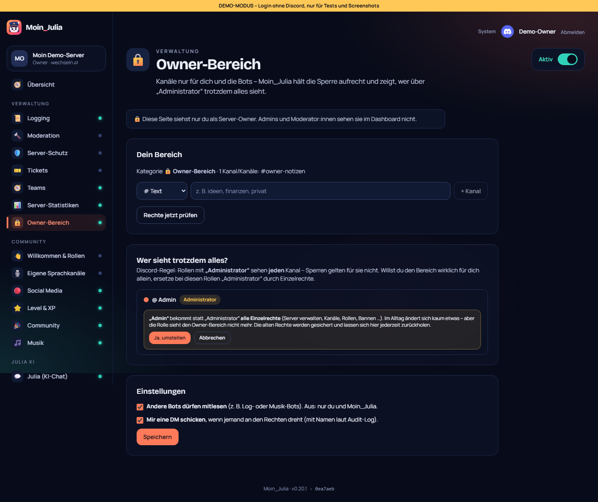

# 21 – Owner-Bereich

**Datum:** 09.10.2026 · **Version:** 0.21.0 · **Status:** gebaut und getestet (Rechte-Logik mit nachgebautem Server, echte Discord-Rechte erst auf Philips Server)

Wunsch von Philip: ein eigener Bereich, den **nur er als Owner und die Bots** sehen, weder Admins noch Manager.

## Was es kann
- **„🔒 Owner-Bereich anlegen“:**
  - **Kategorie:** Moin_Julia erstellt eine Kategorie mit dem Kanal `owner-notizen`. Weitere Text- und Sprachkanäle legst du per Klick an.
  - **Gesperrt:** @everyone und **jede einzelne Rolle** dürfen „Kanal ansehen“ nicht.
  - **Erlaubt:** du und die Bots. Andere Bots lassen sich ausschließen, dann bleibt nur Moin_Julia.
- **Wächter:**
  - **Anlässe:** jede Rechte-Änderung im Bereich, jede neue Rolle, jeder neue Bot.
  - **Prüfung:** Moin_Julia prüft die Rechte. Weicht etwas ab (z. B. eine Rolle bekommt „Kanal ansehen“), stellt sie den Soll-Zustand **sofort wieder her**.
  - **Meldung:** Du bekommst eine **DM, wer es war** (laut Audit-Log).
- **Unsichtbar für alle außer dir:** Admins und Mods sehen den Bereich im Dashboard nirgends.
  - **Wo nicht:** weder in der Seitenleiste noch in der Modul-Übersicht. Ein direkter Aufruf ergibt 404.
  - **Schalten:** Einschalten können sie ihn auch nicht.
  - **Vorlagen und Sicherungen:** Er steht weder in Exporten (sonst könnte ein Admin über einen Export davon erfahren) noch wird er beim Import verändert.

## Die Discord-Grenze – und die Lösung
Rollen mit **„Administrator“** sehen in Discord **jeden** Kanal, Sperren gelten für sie nicht. Das hatte ich Philip vorab erklärt, er wollte den Bereich trotzdem.

Darum zeigt die Seite **„Wer sieht trotzdem alles?“** mit allen Rollen, die „Administrator“ haben. Pro Rolle gibt es **„Administrator ersetzen“**:
- **Was passiert:** Die Rolle bekommt stattdessen **alle Einzelrechte** (Server verwalten, Kanäle, Rollen, Bannen …). Im Alltag ändert sich kaum etwas, aber sie sieht den Owner-Bereich nicht mehr.
- **Erst bestätigen:** Vorher kommt eine Erklärung mit Bestätigungsknopf.
- **Rückgängig:** Die **alten Rechte werden gesichert** und lassen sich mit einem Klick zurückholen.
- **Fehler:** Steht die Rolle über Moin_Julia, scheitert es mit verständlicher Meldung, wie man es behebt.

Hinweis: Wer „Kanäle verwalten“ oder „Rollen verwalten“ hat, *kann* die Sperre ändern. Moin_Julia stellt sie dann aber sofort zurück und meldet es dir.

## Technik
- **Soll-Rechte:** Sie werden als reine Funktion berechnet und mit dem Ist-Zustand verglichen (`config/owner.ts`).
  - **Gefährlich:** jede fremde Freigabe und jedes fehlende Verbot.
  - **Harmlos:** zusätzliche Verbote. Sie lösen nichts aus.
- **Keine Endlosschleife:** Prüfungen werden gebündelt (2 Sekunden), damit Moin_Julias eigene Änderungen keine Schleife auslösen.
- **Rollen von Bots:** Integrations-Rollen werden nicht gesperrt, ihre Bots sind ja erlaubt.
- **„Administrator“ ersetzen:** Das macht der Bot. Er kennt über discord.js die vollständige, aktuelle Rechteliste. Sicherung und Ergebnis landen in der Tabelle `OwnerRoleBackup`.
- **Neu:** `ownerOnly` im Modul-Katalog sowie ein Demo-Login als Admin (`/api/auth/demo?als=admin`), damit die Unsichtbarkeit getestet werden kann.

## Wie getestet

| Test | Ergebnis |
|---|---|
| Logik: Soll-Rechte (alle Rollen gesperrt, Owner + Bots erlaubt, Moin_Julia verwaltet, Bots ausschließbar), Abweichungen erkennen (fehlendes Verbot, fremde Freigabe), zusätzliche Verbote ignorieren | ✓ 2 neu |
| Bot mit nachgebautem Server: richtige Rechte → nichts tun; Rolle freigeschaltet → zurückstellen + DM mit Verursacher; Bot-Rollen nicht gesperrt; Administrator ersetzen + wiederherstellen; Rolle über Moin_Julia → verständlicher Fehler | ✓ 5 neu |
| Klick-Test: Owner sieht Bereich, anlegen, Kanal sichtbar, Admin-Rollen gelistet, Bestätigung vor dem Ersetzen; **als Admin:** nicht in der Seitenleiste, nicht in der Übersicht, direkter Aufruf 404 | ✓ 8 neu (gesamt 152/152, auch ab frischem Zustand) |
| Qualitäts-Rundgang (42 Seiten × 2) und Regression: Bot 177, Shared 85, DB 4, Einrichtung, Admin-Übernahme, Update-Simulation 27/27 | ✓ |

## Bekannte Grenzen
- **Echte Discord-Rechte:** Das Setzen der Rechte lässt sich ohne echten Bot nicht testen. Bitte nach dem Update einmal „Owner-Bereich anlegen“ und dann mit einem zweiten Account prüfen.
- **Server-Owner kann man nicht aussperren:** Discord gibt dem Owner immer alle Rechte, das ist hier ja gewollt.
