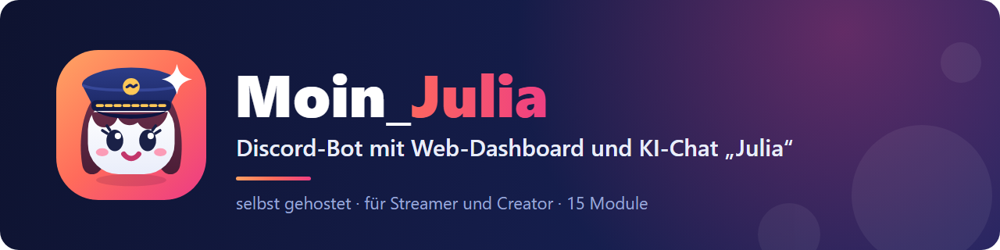

# 22 – README auf Deutsch und Englisch

**Datum:** 09.10.2026 · **Version:** 0.21.1 · **Status:** fertig

Wunsch von Philip: Die README soll optisch schön sein, mit Banner, Badges, Screenshots, Feature-Tabelle und Schnellstart. Es soll sie auf Deutsch und auf Englisch geben, mit Sprachumschalter oben, und QUICKSTART ebenso.

## Was neu ist
- **Banner** (`docs/branding/banner-de.svg` und `banner-en.svg`): Kapitänin Julia, Name, Untertitel. Das Logo ist direkt eingebettet, weil GitHub in SVG-Bildern keine nachgeladenen Dateien anzeigt.
- **Sprachumschalter** oben in `README.md` ↔ `README.en.md` und `QUICKSTART.md` ↔ `QUICKSTART.en.md`.
- **Badges:** Die **Version wird live aus der Datei `VERSION`** gelesen (shields.io), muss also nie von Hand angepasst werden. Dazu kommen Badges für discord.js, Next.js, Node, Docker, Proxmox und Claude/Ollama.
- **Screenshot-Galerie** mit 8 echten Bildern (Übersicht, Julia, Musik, Statistiken, Level, Teams, Rangkarte, Einrichtung).
- **Feature-Tabelle** mit allen 15 Modulen und den Extras (GalaxyBot-Übernahme, Vorlagen, Bilder, Bot-Profil, Rangliste, Update-Knopf).
- **Schnellstart in 3 Schritten**, darunter wie bisher die ausführliche Anleitung (Discord-Anwendung, Konfiguration, Docker, Verwaltung, Domain, Entwicklung).
- **Aufgeräumt:** Der alte Hinweis „Stand: Grundgerüst (v0.2.0)“ ist raus. Der Intent-Hinweis sagt jetzt, welche Module die Intents brauchen.
- **Englische Fassung:** Sie sagt ehrlich, dass Dashboard und Installer deutsch sind, nur die Bot-Antworten gibt es auf Deutsch und Englisch. Deutsche Knopf-Texte stehen mit Übersetzung in Klammern dabei.

## Wie geprüft
- Alle lokalen Links und Bilder in den vier Dateien existieren (Skript-Prüfung), alle Anker der Inhaltsliste passen zu Überschriften.
- Banner im Browser gerendert (siehe oben), Versions-Badge bei shields.io abgerufen: zeigt „0.21.0“ aus `VERSION`.
- Aussagen gegen den Code geprüft (z. B. Bot-Profil liegt unter System, `/rang` heißt auf Englisch `/rank`).

## Offen – von Philip zu entscheiden
- **Lizenz:** Das Repo hat noch keine `LICENSE`-Datei. Ohne Lizenz darf rechtlich niemand den Code verwenden oder ändern, auch wenn er öffentlich ist. Darum gibt es noch kein Lizenz-Badge. Übliche Wahl: MIT (alles erlaubt) oder AGPL-3.0 (Änderungen müssen offen bleiben).
