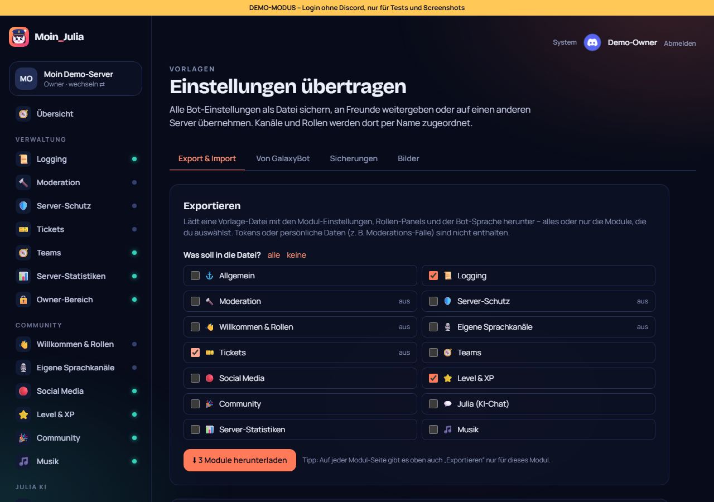
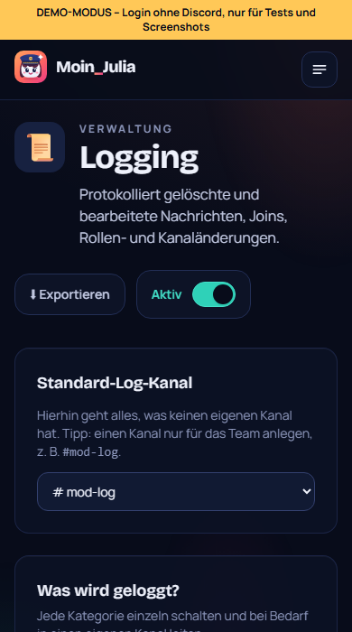

# 24 – Einzelne Module exportieren

**Datum:** 09.10.2026 · **Version:** 0.23.0 · **Status:** gebaut und getestet

Philips Wunsch: „mach mal bitte, dass man auch nur einzelne Module exportieren kann“.

## Was neu ist
- **Vorlagen → Exportieren:**
  - **Auswahl:** Alle Module mit gespeicherten Einstellungen erscheinen als Häkchen. „alle“ und „keine“ setzen die Auswahl in einem Klick, ausgeschaltete Module sind mit „aus“ markiert.
  - **Rollen-Panels:** Sie lassen sich getrennt mitnehmen oder weglassen.
  - **Knopf:** Er zeigt, was herunterkommt: „Alles herunterladen“ oder „3 Module herunterladen“.
- **Auf jeder Modul-Seite:** Oben neben dem An/Aus-Schalter steht „⬇ Exportieren“ für nur dieses Modul.

  

- **Datei:** In einem Teil-Export stehen nur die Kanäle und Rollen, die diese Module wirklich benutzen. Der Dateiname zeigt den Inhalt, z. B. `…-logging-2026-10-09.json` oder `…-3-module-….json`.
- **Import:** Eine Teil-Vorlage bietet beim Übernehmen nur ihre eigenen Module an. Die anderen Einstellungen des Ziel-Servers bleiben unverändert.
- **Owner-Bereich:** Er ist wie bisher nie in einer Vorlage.

## Technik
- `exportGuild(guildId, { modules, panels })`: Ohne Auswahl wird wie bisher alles exportiert. Sicherungen vor einem Import sichern weiterhin alles.
- **Export-Adresse:** `…/vorlagen/export?modul=logging&modul=level&panels=0`. Unbekannte Module und der Owner-Bereich werden ignoriert, nur Owner und Admins dürfen exportieren.
- **Rollen-Panels:** Standardmäßig nur dabei, wenn alles oder „Willkommen & Rollen“ exportiert wird.

## Wie getestet

| Test | Ergebnis |
|---|---|
| Klick-Test: Auswahl (Logging + Level) → Datei enthält genau diese 2 Module, Dateiname „-2-module-“; Modul-Seite → nur Logging, ohne Panels, nur dessen Kanäle; Teil-Vorlage importieren → nur Logging angeboten; Owner-Bereich nie in der Vorlage | ✓ 7 neu (148/148) |
| Qualitäts-Rundgang (42 Seiten × Desktop/Handy, axe) | ✓ |
