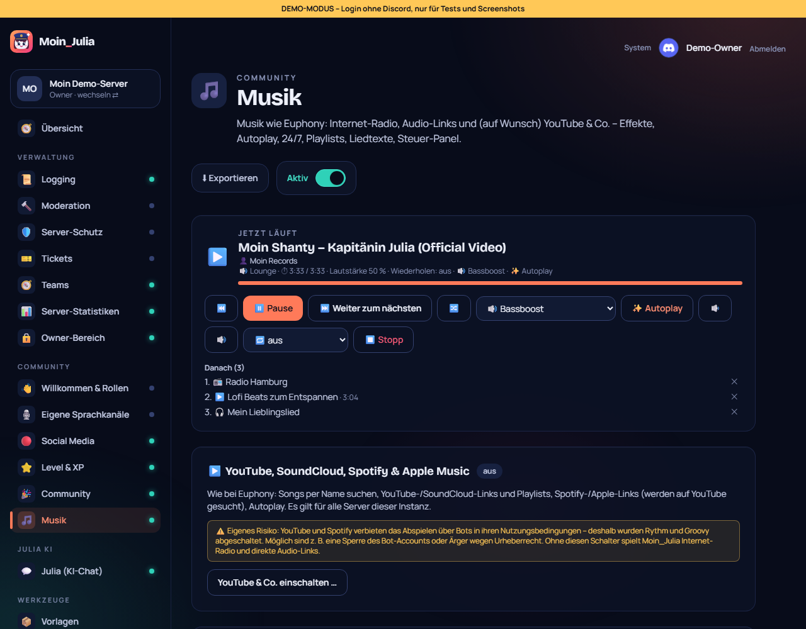
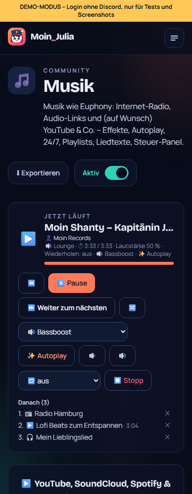

# 26 – Musik genau wie Euphony

**Datum:** 09.10.2026 · **Version:** 0.24.0 · **Status:** gebaut und getestet (die Sprachverbindung zu Discord selbst ist nur auf einem echten Server testbar)

Philips Wunsch: „Mach es genau so mit der Musik wie es Euphony macht.“ Auf meine Rückfrage hat er sich entschieden, YouTube auf **eigenes Risiko** mit zu nehmen.

## Was neu ist

### Quellen
- **YouTube & SoundCloud:**
  - Songs per Name suchen, beim Tippen von `/musik play` gibt es Vorschläge mit Länge und Kanal.
  - Video-, Playlist- und SoundCloud-Links funktionieren auch.
- **Spotify & Apple Music:** Links werden erkannt. Moin_Julia liest Künstler und Titel von der öffentlichen Seite und sucht den Song auf YouTube, wie es Euphony macht.
- **Wie gehabt:** Internet-Radio (50.000+ Sender) und direkte Audio-Links.
- **Nur mit Freigabe:** „YouTube & Co.“ schaltet ausschließlich der **Instanz-Admin** im Dashboard ein, mit Risiko-Hinweis und Bestätigung. Standard ist **aus**. YouTube und Spotify verbieten das Abspielen über Bots in ihren Nutzungsbedingungen. Ohne Freigabe erklärt der Bot das bei solchen Links.

### Funktionen wie Euphony
| Funktion | Befehl / Knopf |
|---|---|
| Audio-Effekte: Bassboost, Nightcore, Vaporwave, 8D, Karaoke, Schneller, Langsamer, Tremolo, Vibrato, Echo | `/musik effekt`, Auswahlmenü im Panel und im Dashboard |
| Autoplay: Ist die Schlange leer, geht es mit passenden Titeln weiter (YouTube-Mix) | `/musik autoplay`, Dashboard |
| 24/7-Modus: bleibt im Sprachkanal | Dashboard-Einstellung |
| Vote-Skip: Wer kein DJ ist, braucht 2/3 der Zuhörer. Den eigenen Wunsch darf man immer überspringen. | ⏭️ / `/musik skip` |
| Zurück, Mischen, Titel entfernen, zu Platz springen, spulen | ⏮️ 🔀, `/musik zurueck`, `shuffle`, `entfernen`, `springen`, `spulen 1:30` |
| Playlists pro Person: speichern, laden, Liste, löschen | `/musik playlist …` |
| Lieblingssongs: aktueller Titel mit einem Klick | ❤️ / `/musik like` (landet in der Playlist „❤️ Lieblingssongs“) |
| Liedtexte, synchron zur aktuellen Stelle (lrclib.net, frei) | 📜 / `/musik lyrics`, 🔄 aktualisiert |
| Warteschlange wiederherstellen (nach Stopp oder Neustart, 7 Tage) | `/musik wiederherstellen` |
| Panel mit Cover, Künstler, Fortschrittsbalken (alle 15 s aktualisiert), Effekt, Autoplay, 24/7 | `/musik panel` |

Im **Dashboard** zeigt „Jetzt läuft“ Cover, Künstler und Fortschritt. Die Steuerung dort kann jetzt auch Zurück, Mischen, Effekt, Autoplay und das Entfernen einzelner Titel.

## Technik und Sicherheit
- **yt-dlp:**
  - Es läuft nur für YouTube-/SoundCloud-Adressen, die vorher geprüft werden.
  - Es schreibt den Ton auf stdout; ffmpeg bekommt ihn per Pipe, Effekte laufen als ffmpeg-Filter.
  - Gestartet wird es ohne Schlüssel aus der `.env` (nur `PATH` und `HOME`).
- **Docker-Image:**
  - yt-dlp (x86 oder ARM) liegt in einem eigenen Ordner, der dem Bot gehört.
  - Der Bot prüft beim Start und täglich auf Updates (`yt-dlp -U`), weil YouTube oft etwas ändert. Das passiert nur, wenn die Freigabe an ist.
- **Spotify/Apple:** Abgefragt werden nur `open.spotify.com` und `music.apple.com`. Wer dabei auf einen anderen Host weiterleitet, wird ignoriert.
- **Gespeicherte Titel:** Playlists und Wiederherstellen prüfen jeden Titel neu. YouTube-Titel spielen nur mit Freigabe; Links laufen wieder durch den Heimnetz-Schutz.
- **Neu in der Datenbank:** Tabelle `MusicPlaylist`, Instanz-Einstellung `musicYoutube`, Modul-Einstellungen `autoplay`, `stay247` und `voteSkip`.

## Wie getestet

| Test | Ergebnis |
|---|---|
| Live: YouTube-Suche (2 s), Playlist, Autoplay-Mix, Stream mit Nightcore-Effekt → Ogg/Opus, Spotify-Link → „Rick Astley Never Gonna Give You Up“, Liedtext mit 170 synchronen Zeilen | ✓ |
| Echtes ffmpeg: alle 10 Effekte erzeugen gültiges Ogg/Opus | ✓ |
| Unit-Tests: Warteschlange (zurück, springen, entfernen, mischen, voll), Vote-Skip, yt-dlp-Einträge, Video-IDs, Spotify/Apple (auch fremder Host), Liedtext-Suche, Zeitangaben, Fortschrittsbalken, synchrone Liedtexte | ✓ 16 neu |
| Klick-Test: Fortschritt und Künstler, Effekt/Autoplay/Zurück steuern, YouTube-Schalter nur mit Risiko-Hinweis und Bestätigung, mit YouTube: Favorit, Autoplay, 24/7 und Vote-Skip gespeichert | ✓ 5 neu (153/153) |
| Qualitäts-Rundgang (42 Seiten × 2). Gefunden und behoben: seitliches Scrollen am Handy (Grid-Spalte) und ein Hydration-Fehler (Uhrzeit vom Server) | ✓ |

## Bekannte Grenzen
- **Discord-Sprachkanal:** Die echte Wiedergabe dort lässt sich nur auf einem echten Server testen.
- **Nicht nachgebaut:** Crossfade, „Voice Lines“, Last.fm und mehrere Bot-Instanzen (bei Euphony Premium).
- **Spotify-/Apple-Playlists und -Alben:** Die gehen noch nicht, nur einzelne Titel (Idee in `IDEEN.md`).
