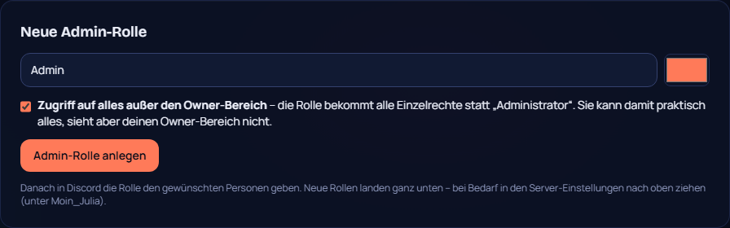
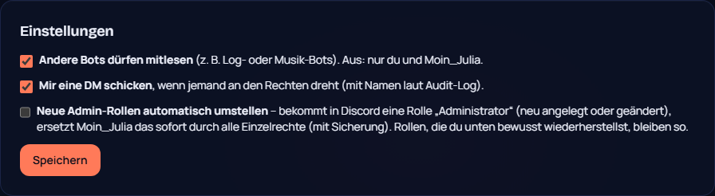

# 27 – Admin-Rolle ohne Owner-Zugriff

**Datum:** 09.10.2026 · **Version:** 0.25.0 · **Status:** gebaut und getestet (echte Discord-Rollen nur auf einem echten Server testbar)

Philips Wunsch: „Wenn ich einen Admin erstelle, noch anklicken können, dass er auf alles Zugriff hat außer auf den Owner-Bereich.“

Discord selbst kann man kein Häkchen hinzufügen. Darum gibt es zwei Wege, die zusammen jeden Fall abdecken.

## 1. Neue Admin-Rolle im Owner-Bereich

- **Eingaben:** Name und Farbe wählen, dann das Häkchen **„Zugriff auf alles außer den Owner-Bereich“** (Standard: an).
- **Mit Häkchen:** Moin_Julia legt die Rolle mit **allen Einzelrechten** an (Server verwalten, Kanäle, Rollen, Bannen …) statt „Administrator“. Die Rolle kann praktisch alles, sieht den Owner-Bereich aber nicht.
- **Ohne Häkchen:** Die Rolle bekommt „Administrator“. Eine Warnung erklärt, dass sie dann auch den Owner-Bereich sieht.
- **Danach:** Die Rolle in Discord den gewünschten Personen geben.

## 2. Automatisch umstellen (für Rollen, die direkt in Discord angelegt werden)

- **Neue Einstellung „Neue Admin-Rollen automatisch umstellen“:** Bekommt in Discord eine Rolle „Administrator“, ob neu angelegt oder geändert, ersetzt Moin_Julia das **sofort** durch alle Einzelrechte.
- **Sicherung und Hinweis:** Die alten Rechte werden gesichert und lassen sich im Dashboard wiederherstellen. Du bekommst eine DM, wenn die DM-Einstellung an ist.
- **Bewusst Administrator behalten:** Stellst du eine Rolle über „Sicherungen“ bewusst wieder her, lässt Moin_Julia sie ab dann in Ruhe.
- **Ausnahmen:** Bot-Rollen (Integrationen) und @everyone werden nie angefasst.
- **Standard: aus.** Erst einschalten, wenn du es willst.

## Technik
- **Gemeinsame Funktion:** `allButAdministrator(guild)` liefert alle Rechte außer Administrator, begrenzt auf das, was Moin_Julia selbst hat. Rechte, die der Bot nicht besitzt, darf er laut Discord nicht vergeben.
- **Ereignisse:** `roleCreate` und `roleUpdate` (Administrator neu dazugekommen) lösen das automatische Umstellen aus. Moin_Julias eigene Änderung erzeugt keine Schleife, weil sie Administrator entfernt.
- **Aktion vom Dashboard:** `adminrole:<Name>:<1|0>:<Farbe>`. Den Namen prüft `cleanRoleName` (ohne Steuerzeichen, höchstens 100 Zeichen).
- **Nur der Server-Owner** darf diese Aktionen auslösen.

## Wie getestet

| Test | Ergebnis |
|---|---|
| Bot: mit Häkchen kein Administrator, aber Server verwalten; Rechte, die Moin_Julia selbst fehlen, werden nicht vergeben; ohne Häkchen Administrator | ✓ |
| Bot: automatisches Umstellen sichert, entfernt Administrator, DM an den Owner; nicht wenn aus, nicht bei Bot-Rollen, nicht bei bewusst wiederhergestellten Rollen | ✓ 3 neu |
| Klick-Test: Häkchen vorausgewählt, Rolle anlegen, Warnung ohne Häkchen, automatisches Umstellen speichern | ✓ 4 neu (157/157) |
| Qualitäts-Rundgang (42 Seiten × 2) | ✓ |

**Bitte auf deinem Server testen:** Eine Admin-Rolle anlegen, einem zweiten Account geben und prüfen, dass der den Owner-Bereich nicht sieht.
