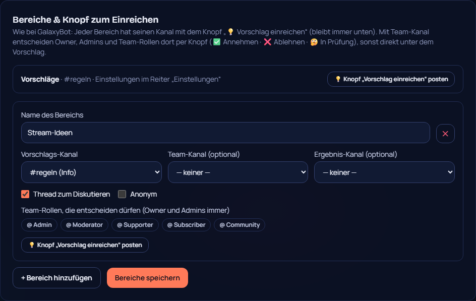

# 28 – Vorschläge wie GalaxyBot

**Datum:** 09.10.2026 · **Version:** 0.26.0 · **Status:** gebaut und getestet (Discord-Knöpfe und Formulare nur auf einem echten Server testbar)

Philips Wunsch: „Mehrere Vorschlags-Bereiche, und als Admin oder Owner in einem Discord-Kanal abstimmen wie bei GalaxyBot – und im Kanal einen Button, um einen Vorschlag einzureichen.“

## Was neu ist
- **Mehrere Bereiche:** Neben dem Hauptbereich sind bis zu 9 weitere möglich, z. B. „Server-Ideen“, „Stream-Ideen“, „Bugs“. Jeder Bereich hat:
  - einen eigenen Vorschlags-Kanal,
  - optional einen **Team-Kanal** und einen **Ergebnis-Kanal**,
  - eigene Team-Rollen,
  - Thread an/aus und anonym an/aus.
- **Knopf „💡 Vorschlag einreichen“:**
  - Er kommt per Klick im Dashboard in den Kanal.
  - Dahinter öffnet sich ein Formular.
  - Nach jedem neuen Vorschlag wird der Knopf wieder **ganz unten** gepostet, damit er nie nach oben wegrutscht.
  - `/vorschlag` geht weiterhin, jetzt mit Auswahl des Bereichs.
- **Entscheiden direkt in Discord:**
  - Owner, Admins, Community-Manager und die Team-Rollen des Bereichs entscheiden mit **✅ Annehmen · ❌ Ablehnen · 🤔 In Prüfung**.
  - Ein Formular fragt eine optionale Begründung ab.
  - **Mit Team-Kanal** stehen die Knöpfe dort, zusammen mit den aktuellen 👍/👎-Stimmen und einem Link zum Vorschlag. Mitglieder sehen die Knöpfe nicht.
  - **Ohne Team-Kanal** stehen sie direkt unter dem Vorschlag. Klicken dürfen dann nur Berechtigte, alle anderen bekommen eine kurze Erklärung.
- **Nach der Entscheidung:**
  - Die Vorschlag-Nachricht zeigt Status, Begründung und wer entschieden hat.
  - Die einreichende Person bekommt eine DM.
  - Angenommene und abgelehnte Vorschläge landen zusätzlich im Ergebnis-Kanal.
- **Dashboard:** Hauptbereich unter „Einstellungen“ (Name, Team-Kanal, Ergebnis-Kanal, anonym). Weitere Bereiche und der Knopf „posten“ stehen im Reiter „Vorschläge“. Jeder Vorschlag zeigt dort seinen Bereich.

## Technik
- **Konfiguration:** Die bisherigen Einstellungen sind der Bereich `main`. Bestehende Server laufen unverändert weiter. Weitere Bereiche stehen in `suggestions.boards`.
- **Neu in der Datenbank:** `Suggestion.boardId` und `Suggestion.staffMessageId`.
- **Knopf ganz unten halten:** Die Nachricht mit dem Knopf merkt sich der Bot in Redis.
- **Rechte-Prüfung im Bot:** `canDecide` lässt Owner, „Server verwalten“, Manager-Rollen und die Team-Rollen des Bereichs entscheiden. Das Dashboard prüft die Team-Rollen des Bereichs, zu dem der Vorschlag gehört.

## Nebenbei gefunden
Der Änderungsverlauf von v0.25.0 enthielt einen Link auf den **Owner-Bereich**. Den Verlauf sehen auch Admins, und so hätten sie vom Bereich erfahren. Der Klick-Test hat das bemerkt. Der Link ist raus, und ein neuer Test verhindert solche Links künftig.

## Wie getestet

| Test | Ergebnis |
|---|---|
| Shared: Hauptbereich und weitere Bereiche, alte Einstellungen gültig, Standard-Bereich ohne Hauptkanal | ✓ |
| Bot: Knopf gehört zum Bereich; Entscheidungs-Knöpfe unter dem Vorschlag nur ohne Team-Kanal und nur solange offen; anonym ohne Name/Bild; Rechte (Owner, Admin, Manager, Team-Rolle, fremde Rolle) | ✓ 4 neu |
| Änderungsverlauf verlinkt nie auf Owner-only-Bereiche | ✓ neu |
| Klick-Test: Team-Kanal speichern, weiteren Bereich anlegen, Knopf „Vorschlag einreichen“ posten | ✓ 3 neu (160/160) |
| Qualitäts-Rundgang (42 Seiten × 2) | ✓ |

**Bitte auf deinem Server testen:**
1. Im Dashboard „Knopf posten“ klicken.
2. In Discord einen Vorschlag über den Knopf einreichen.
3. Im Team-Kanal annehmen.
