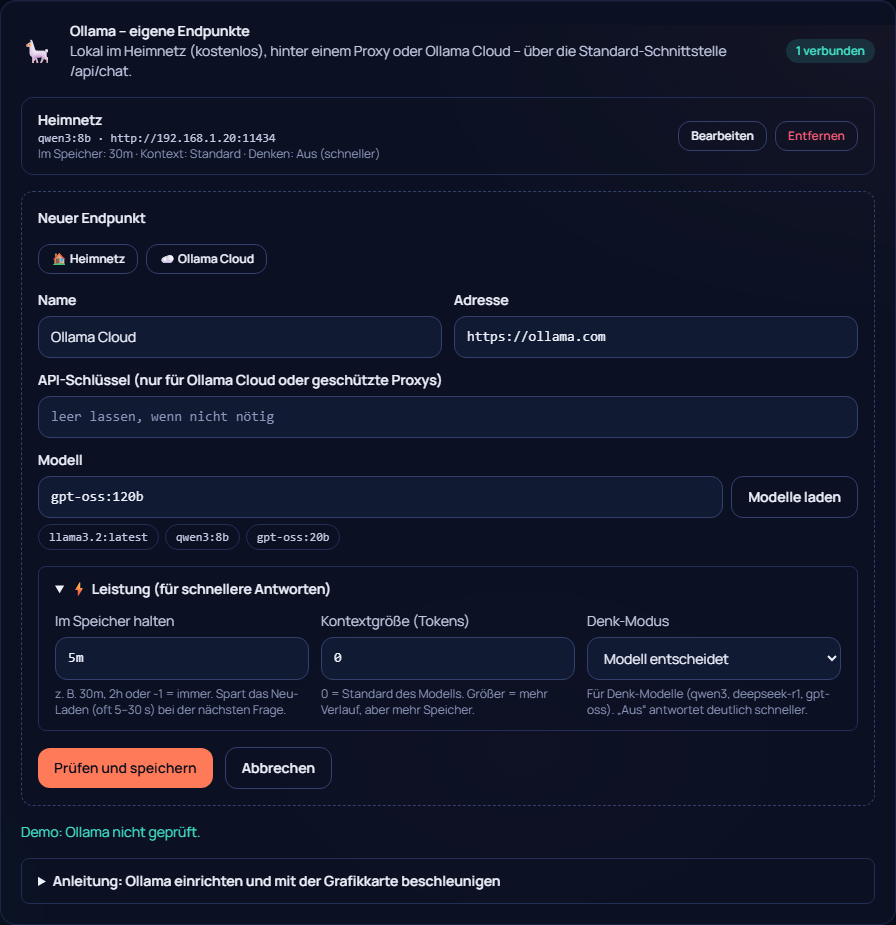

# 29 – Eigene Ollama-Endpunkte (und warum kein WebGPU)

**Datum:** 10.10.2026 · **Version:** 0.27.0 · **Status:** gebaut und getestet (gegen nachgebautes Ollama; echtes Ollama bitte bei dir testen)

Philips Auftrag: „Benutzerdefinierte Ollama-Endpunkte über die Standard-REST-API (/api/chat) fehlerfrei anbinden und verwalten“ und „WebGPU-Support für die KI-Inferenz, um die Performance maximal zu steigern“.

## Was neu ist
- **Mehrere Ollama-Endpunkte** (bis 10) statt einer festen Adresse:
  - lokal im Heimnetz,
  - hinter einem Reverse-Proxy (auch mit Pfad wie `https://ki.example.de/ollama`),
  - oder **Ollama Cloud** (`https://ollama.com` mit API-Schlüssel als `Authorization: Bearer`).
- **Modelle laden:** Fragt `/api/tags` und `/api/version` ab und zeigt die Modelle zum Anklicken.
- **Prüfen beim Speichern:** Moin_Julia prüft, ob das Modell wirklich da ist. `llama3.2` passt nur noch zu `llama3.2`/`:latest`, nicht mehr fälschlich zu `llama3.2:1b`.
- **Leistung pro Endpunkt:**
  - **Im Speicher halten** (`keep_alive`, Standard 30 Minuten): Das Modell muss nicht vor jeder Frage neu geladen werden, das spart oft 5–30 Sekunden.
  - **Kontextgröße** (`num_ctx`).
  - **Denk-Modus** (`think`): aus, an, oder bei gpt-oss die Stufen low/medium/high. Kennt ein Modell den Denk-Modus nicht, wiederholt Moin_Julia die Anfrage automatisch ohne.
- **Pro Discord-Server** wählbar, welcher Endpunkt genutzt wird (Julia → Einstellungen). **Pro Modus** kann ein anderes Modell gelten, z. B. ein großes für „Seebär“.
- **Schlüssel:** Sie liegen verschlüsselt in der Datenbank und erscheinen nie im Browser. Beim Bearbeiten heißt ein leeres Feld „behalten“.
- **Bestehende Installationen:** Die alte Einzel-Einstellung wird automatisch zum Endpunkt „Standard“.
- **Verständliche Fehler:**
  - Schlüssel falsch
  - Modell fehlt, mit dem passenden `ollama pull`
  - falscher Proxy-Pfad
  - „antwortet, aber kein Ollama“ (z. B. eine Login-Seite)
  - nicht erreichbar

## Warum kein WebGPU – und was stattdessen schneller macht
Ich habe den Stand 2026 geprüft:
- **Wo WebGPU heute läuft:** im **Browser** (WebLLM, Transformers.js, wllama).
- **Warum es hier nichts bringt:**
  - Julias Antworten in Discord entstehen aber im **Bot-Container** auf deinem Proxmox. Der ist ein LXC ohne durchgereichte Grafikkarte und ohne Bildschirm.
  - WebGPU in Node.js (Dawn) bräuchte genau diese GPU samt Treibern im Container. Ohne sie fällt es auf langsame Software-Berechnung zurück.
  - Eine Browser-KI im Dashboard würde nur im Fenster dessen rechnen, der es offen hat, nie für Discord.

**Was wirklich beschleunigt:**
- **Ollama auf einem Rechner mit Grafikkarte:** Ollama nutzt NVIDIA (CUDA), AMD (ROCm) und über Vulkan viele weitere Karten automatisch. Bildlich: Die Grafikkarte ist eine Fabrik mit tausenden kleinen Arbeitern, die gleichzeitig rechnen, statt weniger, die nacheinander rechnen.
- **„Im Speicher halten“:** Das Modell bleibt geladen, wie ein Werkzeug, das auf dem Tisch liegen bleibt, statt jedes Mal aus dem Keller geholt zu werden.
- **Denk-Modus aus** bei Plaudermodellen.
- **Kleineres Modell** für schnelle Chats (z. B. `llama3.2`), ein großes nur für einen bestimmten Modus.

Die Anleitung im Dashboard erklärt, wie man prüft, ob die GPU genutzt wird: `ollama ps` zeigt „100% GPU“. **Von Philip zu bestätigen.**

## Nebenbei behoben (aus dem Bug-Hunting)
- **Warn-Kanal:** Speichern der Julia-Einstellungen mit Ollama löschte den Warn-Kanal für das Budget, weil das Feld dann nicht im Formular steht.
- **Modus-IDs:** Ein neu angelegter Modus konnte die ID eines gelöschten erben. Ein Kanal, der noch auf den alten Modus stand, lief dann plötzlich mit der neuen Persona. Jetzt sind IDs eindeutig.
- **Dashboard-Test mit Ollama:** zeigte `[[merken: …]]` und abgeschnittenes Nachdenken an.

## Wie getestet

| Test | Ergebnis |
|---|---|
| Shared (nachgebautes Ollama): Endpunkte lesen inkl. Übernahme der alten Einstellung, Auswahl Server/Modus, Schlüssel nie öffentlich, Proxy-Pfade, Anfrage-Aufbau (keep_alive Text/Zahl, num_ctx, think), Bearer-Schlüssel, automatischer Neuversuch ohne Denk-Modus, alle Fehlerarten, Modelle + Version | ✓ 11 neu |
| Bot: richtiger Endpunkt + Modus-Modell, Fehler (Modell, Schlüssel, nicht erreichbar) | ✓ |
| Klick-Test: Heimnetz-Vorlage, Modelle laden + anklicken, Denk-Modus, Cloud mit Schlüssel (Schlüssel nie im Browser), Auswahl pro Server, Entfernen | ✓ 4 neu (162/162) |
| Qualitäts-Rundgang (42 Seiten × 2), Handy ohne seitliches Scrollen | ✓ |
