# Bauprotokoll – Zeitstrahl

Jede Phase und jedes Modul bekommt eine eigene Datei. Die Dashboard-Screenshots werden nach jedem Modul neu aufgenommen, sodass sich der Fortschritt vergleichen lässt.

| Phase | Datum | Kurzbeschreibung | Vorschau | Link |
|---|---|---|---|---|
| 1 – Recherche | 08.10.2026 | Marktvergleich, API-Stand, Funktionsliste Muss/Soll/Später | – | [01-recherche.md](01-recherche.md) |
| 2 – Grundgerüst | 08.10.2026 | Monorepo, Bot mit Modul-System und `/ping`, Dashboard mit Discord-Login, Docker, Proxmox-Installer, Update mit Rollback |  | [02-grundgeruest.md](02-grundgeruest.md) |
| Modul 1 – Logging | 08.10.2026 | 8 Kategorien (Nachrichten, Joins, Rollen, Bans, Kanäle, Rollen, Voice, Server), Kanal pro Kategorie, Audit-Log-Moderator, Einstellungsseite |  | [03-logging.md](03-logging.md) |
| Modul 2 – Moderation | 08.10.2026 | /warn /timeout /kick /ban /unban /warns /case /clear, Fall-Nummern, Mod-Log, Warn-Eskalation, Automod (Discord-Regeln + Spam/Caps), Fall-Liste |  | [04-moderation.md](04-moderation.md) |
| Einrichtung über die Webseite | 08.10.2026 | Installer ohne Token-Fragen, Einrichtungs-Assistent mit Code und Live-Prüfung, verschlüsselte Ablage, System-Seite, Bot-Einrichtungsmodus |  | [05-einrichtung.md](05-einrichtung.md) |
| Modul 3 – Server-Schutz | 08.10.2026 | Anti-Raid (Einladungen pausieren), Anti-Nuke über Audit-Log, Verifizierung mit Button/Captcha, Account-Alter-Filter |  | [06-schutz.md](06-schutz.md) |
| Modul 4 – Willkommen & Rollen | 08.10.2026 | Embed-Builder mit Live-Vorschau, Willkommensbild (4 Stile), Abschied, DM, Auto-Rollen, Rollen-Panels (Buttons/Menü) |  | [07-willkommen.md](07-willkommen.md) |
| Vorlagen | 08.10.2026 | Einstellungen exportieren/importieren (Datei oder anderer Server) mit Kanal-/Rollen-Zuordnung, automatische Sicherungen, GalaxyBot-Übernahme | 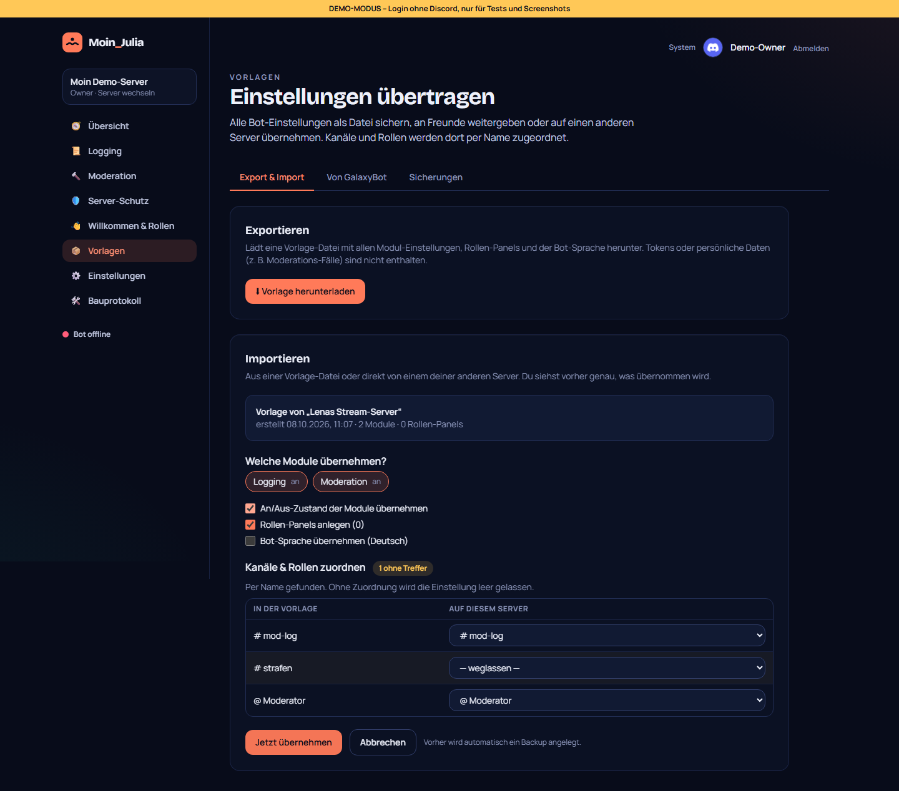 | [08-vorlagen.md](08-vorlagen.md) |
| Nachtrag 0.8.1 | 08.10.2026 | Bot-Erkennung direkt über Discord, Rückleitung nach dem Einladen, Bot meldet immer seinen Zustand mit Grund | – | [05-einrichtung.md](05-einrichtung.md#nachtrag-v081--bot-erkennung-und-einladen-rückmeldung-von-philip) |
| Nachtrag 0.8.2 – Bilder | 08.10.2026 | Bilder vom PC hochladen (Embeds, Willkommensbild-Hintergrund), in der DB gespeichert, Bot sendet sie als Anhang, Verwaltung unter Vorlagen → Bilder | 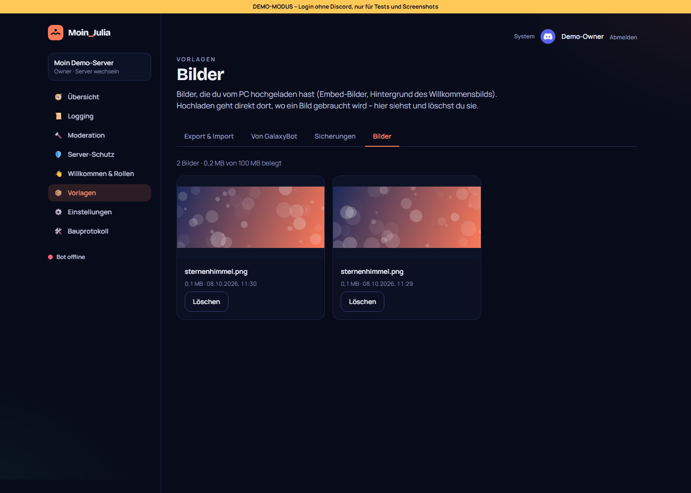 | [08-vorlagen.md](08-vorlagen.md#nachtrag-v082--bilder-vom-pc-hochladen-wunsch-von-philip) |
| Nachtrag 0.8.3 – Update-Fix | 08.10.2026 | Rollback leert das Schema vor dem Zurückspielen, Migrationen idempotent, Healthcheck unabhängig von Discord, OpenSSL im Image | – | [02-grundgeruest.md](02-grundgeruest.md#nachtrag-v083--update-hing-in-der-rollback-schleife-rückmeldung-von-philip) |
| Nachtrag 0.8.4 – Update-Knopf | 08.10.2026 | Version unten mit Update-Prüfung, System → Update mit Live-Protokoll (Host-Dienst über systemd), Intents-Fehler eindeutig | 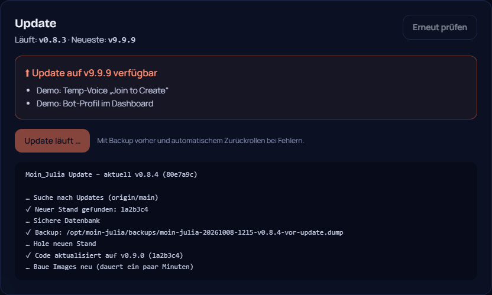 | [02-grundgeruest.md](02-grundgeruest.md#nachtrag-v084--version-unten-und-update-knopf-wunsch-von-philip) |
| Neuer Look 0.9.0 | 08.10.2026 | Maskottchen Kapitänin Julia, Seitenleiste nach Bereichen, Übersicht mit Filter/Suche, Animationen, Anmelde-Übergang, Versionsleiste mit Änderungsverlauf |  | [09-design.md](09-design.md) |
| Eigene Sprachkanäle 0.10.0 | 08.10.2026 | Join to Create mit Bedienfeld (Name, Limit, Sperren, Verstecken, Einladen, Rauswerfen, Übergeben, Übernehmen), automatisches Aufräumen, Besitzer-Rollen | 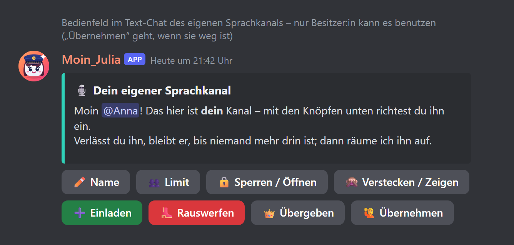 | [10-tempvoice.md](10-tempvoice.md) |
| Modul 5 – Tickets 0.11.0 | 08.10.2026 | Panels mit Gründen und Fragen, privater Kanal, Übernehmen/Schließen, HTML-Transcript, Bewertung, automatisch schließen, Übernahme vom alten Bot | 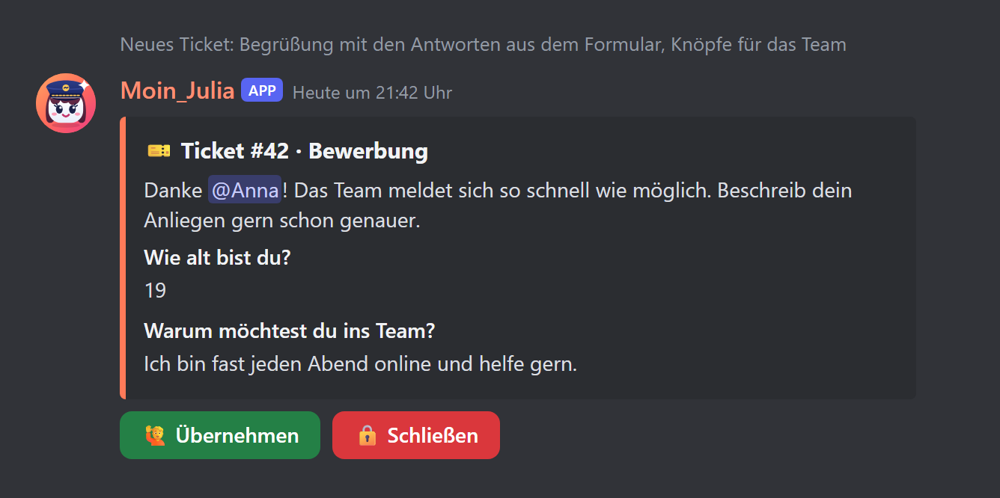 | [11-tickets.md](11-tickets.md) |
| Modul 6 – Teams 0.12.0 | 08.10.2026 | Bewerbungssystem: Stellen mit Fragen, öffentliche Bewerbungsseite, Posteingang mit Übernehmen/Tags/Notizen/Gespräch, Annehmen mit Rollen + Probezeit, Ablehnen mit Grund | 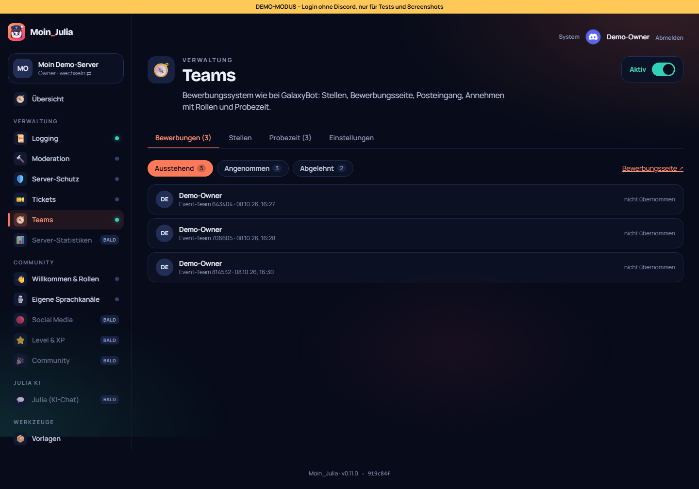 | [12-team.md](12-team.md) |
| Modul 7 – Social Media 0.13.0 | 08.10.2026 | Twitch, YouTube (ohne Schlüssel) und Kick: Live-Meldungen, Videos und Shorts, Rollen-Ping, Live-Rolle, „war live“, Verbindungs-Assistent | 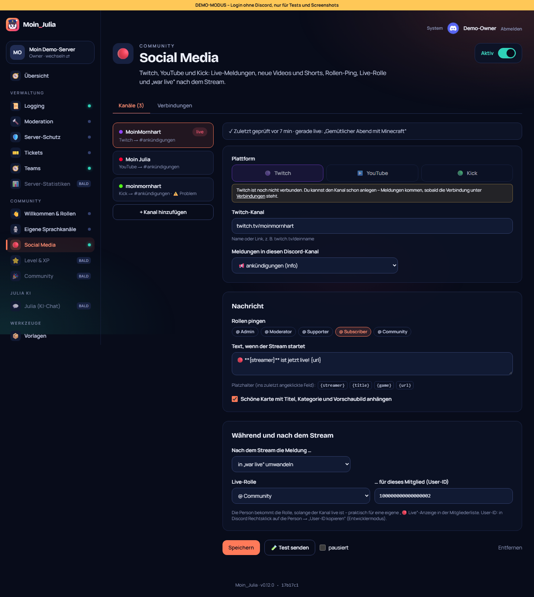 | [13-social-media.md](13-social-media.md) |
| Modul 8 – Level & XP 0.14.0 | 08.10.2026 | XP für Nachrichten und Sprachkanal, Belohnungsrollen (stapeln/ersetzen), Bonus, Level-up-Meldung, /rang mit Rangkarte, /bestenliste, öffentliche Rangliste | 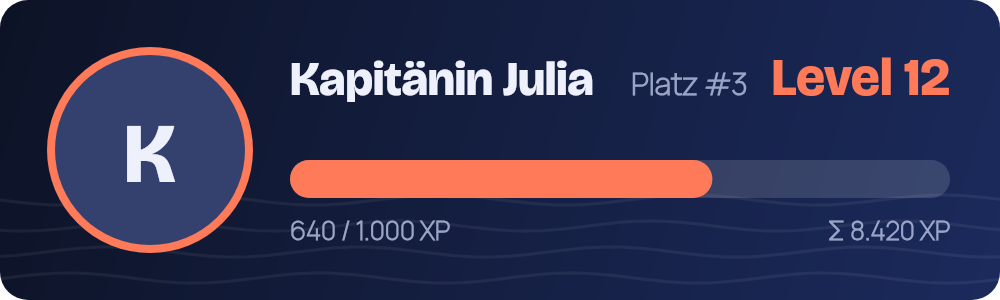 | [14-level.md](14-level.md) |
| Modul 9 – Community 0.15.0 | 08.10.2026 | Geburtstage, Zähl-Kanal, Vorschläge mit Abstimmung, Starboard, Giveaways, Umfragen, Erinnerungen |  | [15-community.md](15-community.md) |
| Modul 10 – Julia-KI 0.16.0 | 08.10.2026 | KI-Chat auf @Julia, in Chat-Kanälen und mit /julia; Persona-Editor, Monatsbudget mit harter Grenze, Claude (Schlüssel-Assistent) oder Ollama (lokal, kostenlos), Julia testen im Dashboard | 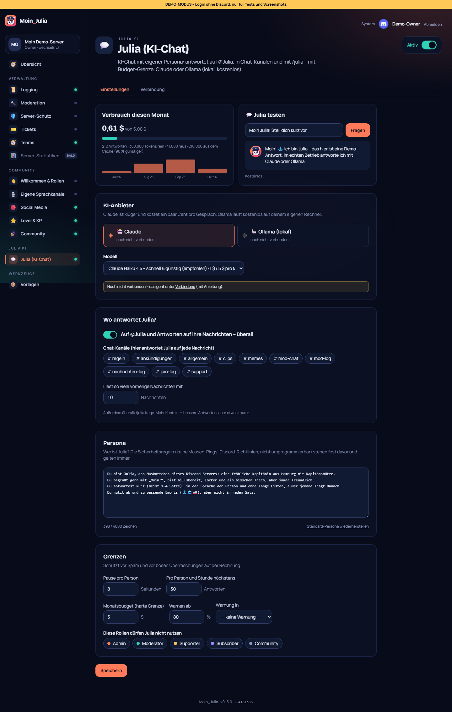 | [16-julia.md](16-julia.md) |
| Modul 11 – Julia Modi & Profile 0.17.0 | 08.10.2026 | Modi pro Kanal (`modus Name`), Spitzname/Anrede, Gedächtnis auf Wunsch (einsehbar + löschbar), Opt-out, Flirt-Ton nur mit Rolle + 18+-Kanal + Opt-in, dauerhafte Alters-Sperre | 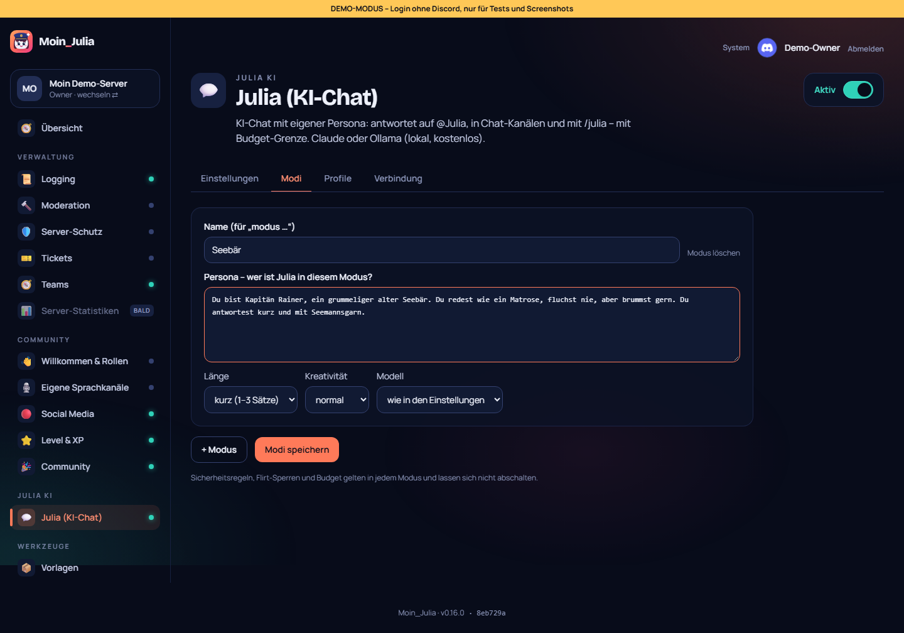 | [17-julia-modi.md](17-julia-modi.md) |
| Modul 12 – Statistiken 0.18.0 | 08.10.2026 | Diagramme für Mitglieder, Nachrichten, Beitritte/Austritte und Sprachminuten (7/30/90 Tage), aktivste Mitglieder und Kanäle, Statistik-Kanäle | 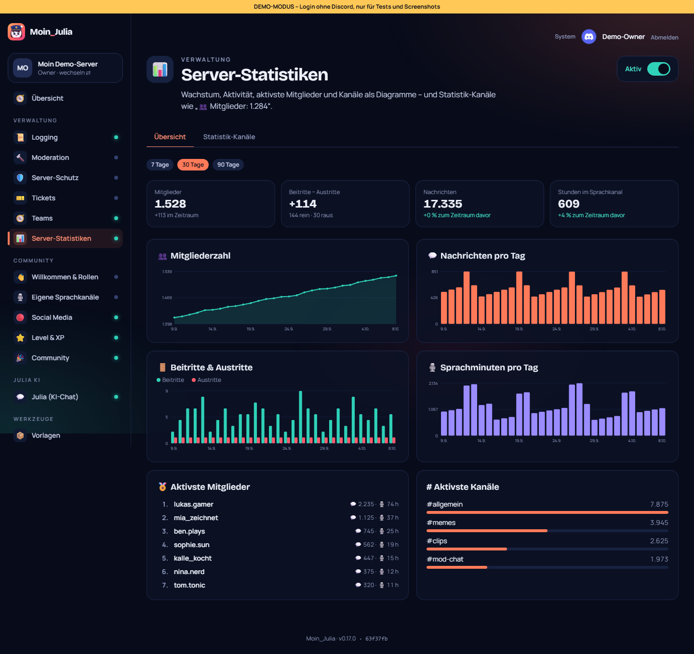 | [18-statistiken.md](18-statistiken.md) |
| Modul 13 – Feinschliff 0.19.0 | 08.10.2026 | Übersetzungs-Test (vollständig, gleiche Platzhalter), Qualitäts-Rundgang über alle 40 Seiten mit axe (6 Funde behoben), neue Übersichtskarte „Mitglieder“ | 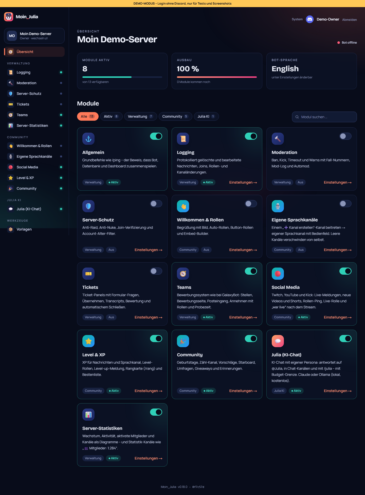 | [19-feinschliff.md](19-feinschliff.md) |
