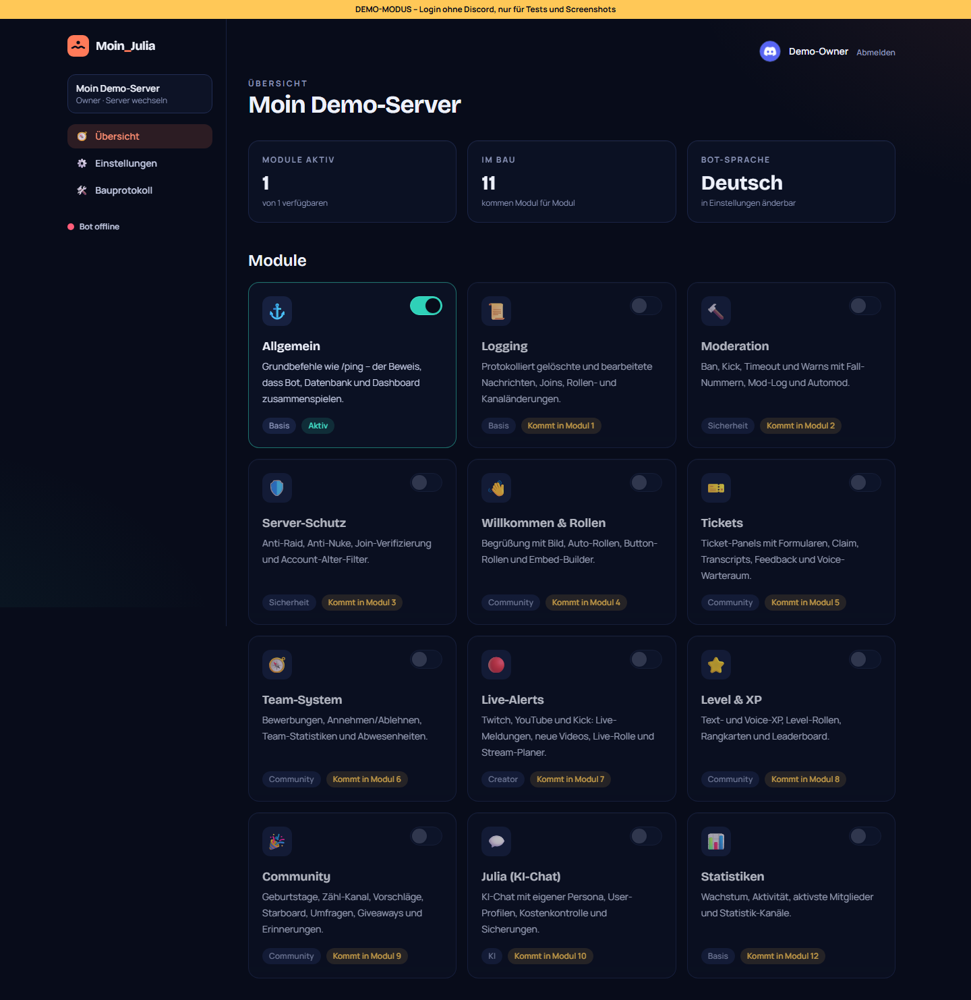
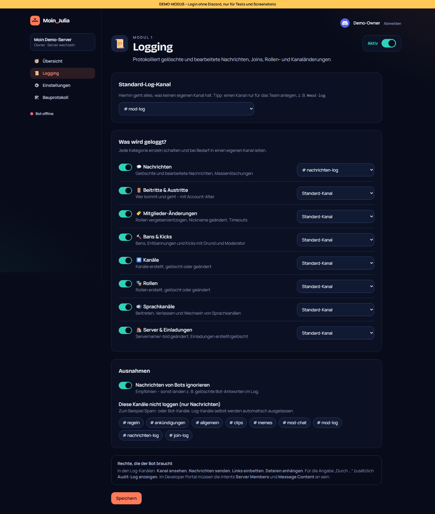
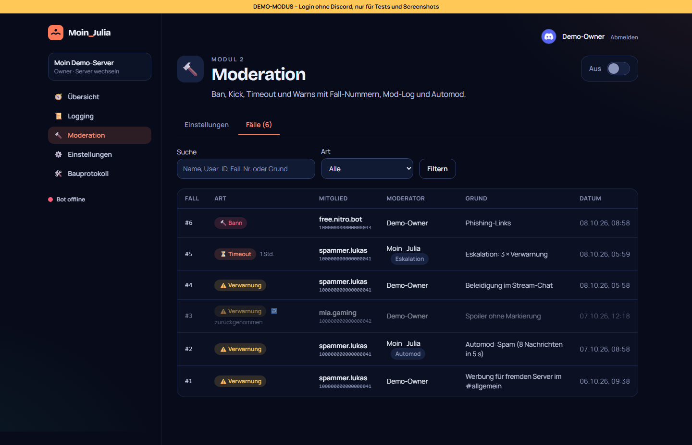
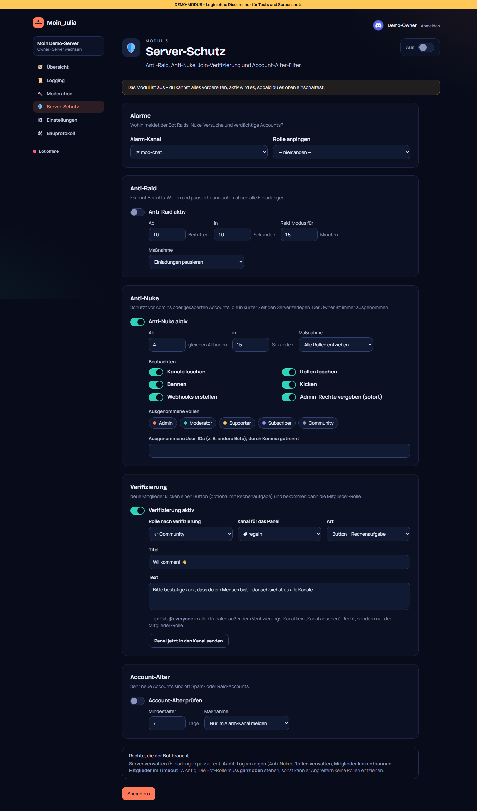

# Bauprotokoll – Zeitstrahl

Jede Phase und jedes Modul bekommt eine eigene Datei. Die Dashboard-Screenshots werden nach jedem Modul neu aufgenommen, sodass sich der Fortschritt vergleichen lässt.

| Phase | Datum | Kurzbeschreibung | Vorschau | Link |
|---|---|---|---|---|
| 1 – Recherche | 08.10.2026 | Marktvergleich, API-Stand, Funktionsliste Muss/Soll/Später | – | [01-recherche.md](01-recherche.md) |
| 2 – Grundgerüst | 08.10.2026 | Monorepo, Bot mit Modul-System und `/ping`, Dashboard mit Discord-Login, Docker, Proxmox-Installer, Update mit Rollback |  | [02-grundgeruest.md](02-grundgeruest.md) |
| Modul 1 – Logging | 08.10.2026 | 8 Kategorien (Nachrichten, Joins, Rollen, Bans, Kanäle, Rollen, Voice, Server), Kanal pro Kategorie, Audit-Log-Moderator, Einstellungsseite |  | [03-logging.md](03-logging.md) |
| Modul 2 – Moderation | 08.10.2026 | /warn /timeout /kick /ban /unban /warns /case /clear, Fall-Nummern, Mod-Log, Warn-Eskalation, Automod (Discord-Regeln + Spam/Caps), Fall-Liste |  | [04-moderation.md](04-moderation.md) |
| Einrichtung über die Webseite | 08.10.2026 | Installer ohne Token-Fragen, Einrichtungs-Assistent mit Code und Live-Prüfung, verschlüsselte Ablage, System-Seite, Bot-Einrichtungsmodus |  | [05-einrichtung.md](05-einrichtung.md) |
| Modul 3 – Server-Schutz | 08.10.2026 | Anti-Raid (Einladungen pausieren), Anti-Nuke über Audit-Log, Verifizierung mit Button/Captcha, Account-Alter-Filter |  | [06-schutz.md](06-schutz.md) |
